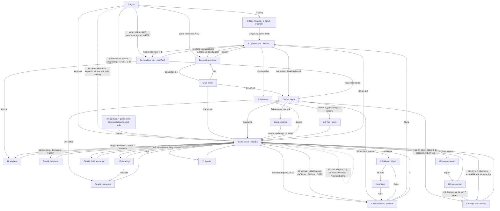

# UX akışları — Minik Usta

Sahip: design-lead · Sürüm: **Faz 2R (2026-10-07)** — ana sayfa v2 (§3, R2-09), değişken boyut yerleşimi (§5.8, R2-02), kalan blok ve tam örtü (§5.9, R2-01), kazanma v2 (§6.1), hafif öğretici (§13, R2-10); **Faz 2R çapraz inceleme kapanışı** (aynı gün; `docs/review_inbox/design-lead-2R-closure.md`: H/Hy/Hs yerleşimi, güçlendirici akışları K-33/K-36/K-38, hedefsiz yuva, Söküm, kalan blok formülü, öğretici tablosu = LEVELS §2); önceki: Faz 1 revizyonu (2026-10-04; R-01…R-24), Faz 2 boşlukları 1 ve 3 (2026-10-06) · Kaynak:
`docs/BRIEF.md` §4, §8, §10, §11 · Görsel tarifler: `docs/ART_DIRECTION.md` · Animasyonlar: `docs/JUICE.md` · Metinler:
`docs/STORY.md` · Ölçüler: `src/theme/tokens.json` · Sayılar (fiyat, ödül, tavan): `config/economy.json`,
`config/events.json` — bu belgedeki sayılar **örnektir**, ekran değeri her zaman config'ten okunur.

**Kapsam etiketleri** (BUSINESS §12.1): **[MVP]** web MVP'de var · **[MVP-lite]** sade sürüm · **[Sonra]** MVP'de yok,
yeri ayrılmış · **[Mağaza]** yalnız Capacitor/mağaza sürümü. Etiketsiz satırlar MVP'dir.

---

## 0. Ölçü sistemi

### 0.1 Tasarım çözünürlüğü ve telefona eşleme

- Tasarım tuvali **1080×1920 px** (dikey). Tüm wireframe koordinatları bu tuvalde, sol üst (0, 0).
- **Telefona eşleme:** 375 pt genişlikte 1 pt = 2,88 px; 390 pt'de 1 pt = 2,77 px. Yani 1080 px genişlik = telefonun
  tam genişliği. Örnek: 120 px hücre = 41,7 pt (375) / 43,3 pt (390); 172 px güçlendirici yuvası = 60 / 62 pt.
- **44 pt kuralı — her genişlikte 128 px (karar 2026-10-06):** en küçük dokunma hedefi **her ekran genişliğinde 128
  px** tasarım pikselidir; token `touch.minTargetPx = 128`, genişliğe göre değişmez. Karşılığı 375 pt'de 44,4 pt, 390
  pt'de 46,2 pt, **360 dp'de 42,7 dp** (TECH §14.1 profili 360×800); 360'taki 42,7 dp bilerek kabul edilir. Gerekçe:
  44 pt Apple'ın iOS sayısıdır ve 375/390 pt'de sağlanır; 360 dp Android/web profilidir ve orada Android'in kendi
  önerisi 48 dp = 144 px'tir. 132 px'e çıkmak (360'ta tam 44 dp) yalnız 1,3 dp kazandırır, 48 dp'yi yine karşılamaz,
  buna karşılık 96 / 112 px görsellerin payını büyütür (Usta Serisi şeridinin payı tahta kenarına taşar). Bunun yerine
  **sık dokunulan hedefler 144 px tabanındadır** (360 dp'de ≥ 48 dp, 375 pt'de ≥ 50 pt). Kapalı liste: birincil,
  ikincil ve nötr düğmeler, eşit çift düğmeler, pencere seçenekleri (920×152), güçlendirici yuvaları (172), blok
  hücresi + pay (180), Bölüm düğmesi (176), alt navigasyon sekmeleri (176), sayısal tuşlar (§2.3). Listede olmayan her
  hedef 128 px tabanındadır (duraklat, kapat, üst çubuk öğeleri, ayar dişlisi, açık/kapalı anahtarları, Usta Serisi
  şeridi, Vinç döndürme okları, ara sahne "Geç", metin düğme; Faz 2R: Boya Fırçası renk seçicisi kalktı, §5.2). WCAG 2.5.8 (AA, 24 CSS px)
  her profilde sağlanır (360'ta 42,7 CSS px). Görseli daha küçük olan öğeler (blok hücresi 120 px) görünmez **dokunma
  payı** (`touch.hitSlopPx = 30`, 0,25 hücre) ile 180 px'e çıkar; birden çok bloğun payı aynı noktayı kapsarsa dokunuş
  merkezine en yakın hücreye gider.
- **Ölçekleme — FIT ve EXPAND (R-06; EXPAND önerisi P-4, proje sahibine soruldu):** Brif FIT diyor: tuval 1080×1920
  sabit, uzun ekranda üst/alt bant (390×844'te toplam 151 pt) arka plan rengiyle dolar. Öneri EXPAND: genişlik 1080
  sabit, yükseklik `H` ekran oranına göre **1920–2400 px** (Phaser `Scale.EXPAND`). Düzen **iki kipte de aynı çapa
  sözleşmesiyle** çalışır (`tokens.layout._doc`):
  - **Üst grup** (`layout.top.*`, y üstten): duraklat, panorama, hedefler, hamle sayacı, ana ekran üst çubuğu.
  - **Alt grup** (`layout.bottom.*`, y alttan, `*BottomPx`): Tuna köşesi, güçlendirici çubuğu, alt navigasyon,
    "Bölüm N" düğmesi.
  - **Tahta grubu** (`layout.board.*`): vinç alanı + tahta + durum şeridi; y değerleri 1920 içindir, `H > 1920` iken
    `(H − 1920) × board.expandShare (0,5)` kadar aşağı kayar. FIT'te `H = 1920` → kayma 0.
  - **Pencereler** alttan çapalanır: panel alt kenarı `y = H − layout.popup.panelBottomPx` (296); seçenek düğmeleri
    panelin alt kenarından `optionsBottomInsetPx` (64) yukarıda alttan üste dizilir (`layout.popup.*`). FIT'te 3 alt
    alta seçenek y 1056–1560 (rahat bölge, §0.2), tek düğme 1408–1560 (birincil y ≥ 1400); EXPAND'de panel alt kenarla
    birlikte aşağı iner ve seçenekler yine alt %45'te kalır. Dikey ortalama kullanılmaz: ortalanan kısa ya da çok
    seçenekli pencerede ilk düğme esneme bölgesine (y < 1056) çıkıyordu. En uzun pencere (bölüm öncesi, h 1280) FIT'te
    y 344'ten başlar.
  - Arka planlar (Faz 2R, ART §7): ana sayfa ve kazanma sahnesi elle yazılmış SVG'dir (R2-08), 1080×1920 alanı 0,5
    ölçekte (540×960) raster edilip ×2 çizilir; 1920'nin üstündeki fazla yükseklik (en çok 480 px) prosedürel gök
    gradyanıyla dolar. Oyun ekranının arka planı prosedürel çivit gradyandır (R2-12), doku değildir.
  Bu belgedeki wireframe'ler `H = 1920`'yi gösterir; 2337 px'te (390×844, EXPAND) tahta 208 px aşağı kayar ve başparmak
  bölgesine yaklaşır. Ekran görüntüleri iki profilde de incelenir (`ios67` 1290×2796, `android` 1080×1920; TECH §12).
- Güvenli alan (çentik): `index.html` oyun kabını `env(safe-area-inset-*)` ile içeri alıyor; tasarım tuvali zaten güvenli
  alanın içindedir. Ek olarak üstte 24 px, altta 24 px kenar boşluğu.

### 0.2 Başparmak bölgesi

```
 y=0    ┌──────────────────────────────┐
        │  ZOR ERİŞİM  (üst %30)       │  duraklat, geç, kapat (×) — bilinçli olarak zor:
 y=576  ├──────────────────────────────┤  yanlışlıkla basılmasın
        │  ESNEME  (%30–%55)           │  tahtanın üst satırları, vinç alanı (imza "yukarı" hareketi)
 y=1056 ├──────────────────────────────┤
        │  RAHAT  (alt %45)            │  Oyna, Devam, güçlendiriciler, alt navigasyon,
        │                              │  pencere birincil düğmeleri, +5 hamle, bloklar (alt satırlar)
 y=1920 └──────────────────────────────┘
```

Kural: her ekranın **birincil eylemi y ≥ 1400** (alt %27) ve en az 144 px yüksekliktedir (sık hedef tabanı, §0.1). Kapat/Geç/Duraklat gibi
geri dönüşü olan ikincil eylemler üst köşelerde durabilir. Tahta istisnadır: imza hareket "yukarı" gerektirir;
blok parmağın 1,2 hücre üstünde göründüğü için parmak bloğun altında, daha rahat bölgede kalır.

### 0.3 Ortak kalıplar

| Kalıp | Tarif |
| ----- | ----- |
| Birincil düğme | yeşil, en az 560×160 px, 3B dudak 12 px, metin `font.size.button` (56 px) beyaz + kontur |
| İkincil düğme | turuncu, 400×144 px |
| Nötr düğme | dolgulu krem (`ui.neutral` / `neutralLip`), yazı `ui.ink`; ikincil düğmeyle **aynı boyda** kullanılır. "Hayır, teşekkürler", "Reklam izle", "Çık" gibi seçenekler bu kalıptır |
| Eşit çift düğme | iki seçenek yan yana, **eşit boy 440×152** (aralarında 40 px, toplam 920 = `layout.popup` genişliği); biri yeşil ya da turuncu, öbürü krem. Birincil düğmenin "en az 560×160" kuralının **bilinçli istisnasıdır** (eşitlik kuralı, R-15); yükseklik ≥ 128 px ve rahat bölge (y ≥ 1056) şartı geçerlidir. Kullanım: çıkış onayı (Kal / Çık), günlük ödül (Topla / Reklam ×2), kural kartı (Katıl / Şimdi değil), Usta Modu / Tekrar turu kartı (Başla / Şimdi değil) |
| Görsel + pay (dokunma alanı) | Kısa kenarı 128 px'ten küçük **her** dokunulabilir öğe görünmez pay ile en az 128 px'e tamamlanır (`touch.minTargetPx`; her genişlikte 128 px, §0.1); pay iki yana eşit eklenir (112 px → her yanda 8 px; 96 px → 16 px; 88 px → 20 px). Pay komşu hedefin payıyla çakışırsa dokunuş merkezine en yakın hedefe gider (blok payı kuralıyla aynı). Bu belgedeki "+ pay" notları bu kuraldır |
| Metin düğme | dolgusuz, `ui.inkSoft`, alt çizgi yok, dokunma alanı ≥ 128 px yükseklik. **Satın alma ya da reklam penceresinde reddetme seçeneği olarak kullanılmaz** (R-15) |
| Fiyat etiketi (`PriceLabel`) | Altınla fiyatlanan **her** düğmede iki satır: üstte altın simgesi (`icon_coin` görüntüsü, 1 em; wireframe'lerdeki "●" bu simgedir, fontta karakter olarak yoktur) + "900" (`font.size.button`), altta gerçek para karşılığı yerel para biriminde: TR "≈ 81 TL", EN "≈ $1.79" (`font.size.caption`; asla altından büyük değil; mağaza sürümünde para birimi mağaza yerel ayarından). 2. satırın rengi zemine göre: **renkli düğmede (turuncu, yeşil) `ui.ink`** (turuncu üstünde 6,5:1, yeşil üstünde 5,3:1), krem zeminde `ui.inkSoft` (6,5:1). Bu satır R-15'in görünür olmasını istediği bilgidir; 4,5:1 altına inmez. Karşılık `config/economy.json`'daki referans fiyattan (Avuç paketi birim fiyatı) hesaplanır; web MVP'de yanında "test sürümü" etiketi (E9). Tek bileşen, bütün pencerelerde aynı (E2) |
| Teklif penceresi kuralı (R-15) | Seçenekler **eşit boyutlu** (920×152, alt alta, `layout.popup.*`); hiyerarşi yalnız renkle (turuncu / krem / krem). Döngüsel dikkat animasyonu, geri sayım, "son şans", kayıp vurgusu, kalan oyuncu sayısı yok. × kapat her zaman var ve "Hayır" ile aynı sonucu verir |
| Bot satırı (R-14) | Avatar = blok renklerinden birinde kask + küçük alet simgesi (`chr_bridge_helmet_bot_*`), ad `npc.apprentice.*` (STORY §7.4) + küçük "çırak" rozeti (`ui.botBadge`). Bayrak, çevrimiçi ışığı, alt çizgili kullanıcı adı yok. Oyuncu satırı "Sen" + Tuna kaskı |
| Kapat (×) | kırmızı daire Ø 112 px görsel + 16 px pay = 144 px hedef; pencerenin sağ üst köşesine 40 px taşar |
| Pencere | krem panel, kenar 12 px `panelEdge`, köşe 48 px, arkada `ui.overlay` %55; açılış 220 ms (JUICE) |
| Rozet | Ø 56 px kırmızı (#E8473B) daire, beyaz sayı ya da "!" |
| Kilitli öğe | %55 gri (`ui.disabled`) + asma kilit 64 px + açılış bölümü ("Bölüm 15"); dokununca 1,2 s ipucu balonu `common.unlockAt` ("15. bölümde açılır"; JUICE #73). **Adedi olan kilitli öğe** (açılış bölümünden önce ödül ya da paketle gelen güçlendirici, META §4): sağ üst köşede **gri adet rozeti** Ø 56 px, `ui.badgeLocked` dolgu + beyaz sayı (7,1:1; kırmızı `ui.badge` değil). Adet 0 ise rozet yok. Kilitliyken "+" gösterilmez. **Durum önceliği (Faz 2R, EN-2R-11, BUSINESS E12): kilitli > hedefsiz > adet 0** |
| Hedefsiz yuva (Faz 2R, K-36, K-38, BUSINESS E12) | Bölüm içi güçlendiricinin o anki durumda geçerli hedefi yoksa (Çekiç: K-36 hedef kümesi boş; Boya Fırçası: sahada hücre sayısı eşit ve rengi farklı iki uygun malzeme bloğu yok) yuva **gri** (`kit.buttonColor.grey`), ikon α 0,55, adet rozeti gri (`ui.badgeLocked`) ve **"+" gösterilmez** (adet 0 olsa da). Dokununca yuva 2 px titrer ve yuvanın üstünde 1,2 s balon: `booster.hammer.noTarget` "Burada kırılacak yük yok." / `booster.brush.noTarget` "Renk takası için eş blok yok."; mini satın alma penceresi açılmaz, `offer_shown` gönderilmez (ANALYTICS v6). Hedef durumu her hamle sonunda ve her güçlendirici/Mala mini hattından sonra yeniden hesaplanır (çekirdek `boosterTargets`); hedef oluşunca yuva 200 ms'de normale döner. Vinç ve Geri Al bu kalıbı kullanmaz (Vinç'in sahada her zaman hedefi vardır; Geri Al'ın kendi gri durumu §5.2) |
| Yükleniyor | bloklardan dönen mini vinç döngüsü (96 px) + 0,4 s gecikmeyle görünür (kısa yüklemede titreşim olmasın) |
| Hata | krem panel + Kepçe "kafası karışık" + kısa metin + "Tekrar dene"; kırmızı çarpı ve suçlayıcı dil yok |
| Boş durum | Kepçe kazıyor illüstrasyonu + tek satır açıklama + (varsa) eyleme götüren düğme |
| Geri | Android geri tuşu / tarayıcı geri = en üstteki pencereyi kapat; oyun ekranında = Duraklat penceresi |
| Animasyon sırasında girdi (R-12) | Oyuncu animasyon sürerken yeni blok **tutabilir**: tutma anında tahtayı değiştiren bekleyen animasyonlar son karesine atlar (parçacık ve ses kendi hızında sürer), sürükleme gerçek durumdan başlar. Girdi yalnız **dilim kayması (600 ms), kamyon teslimatı (700 ms), Kamyon Yardımı ve Söküm (K-30, Faz 2R: #21a zincir/ıslaklık 600, #21c yeniden dizme 900, #107 Söküm 600; JUICE #21, #107)** sırasında kilitlidir; bu sırada dokunuş diziyi 3× hızlandırır. Faz 1'deki "malzeme teslimatı 700" varyantı (#21b) kaldırıldı (R2-05). Ayrıntı: JUICE §0 kural 3 |
| Hacimli düğme (v2, Faz 2R) | Bütün düğmeler ART §14.1 kitinden: 6 px kontur + 14 px kalınlık + gradyan yüz + parlama bandı; basılınca 10 px iner. Renk → rol ART §2.6 (yeşil birincil, turuncu satın alma, mavi araç, krem nötr, kırmızı kapat, gri pasif). Boyut kuralları bu tablodaki gibi |
| Pencere başlığı (v2) | Başlık panelin içinde değil, üst kenara oturan şeritte (ART §14.3, turuncu; kazanma altın); panel ahşap çerçeveli (ART §14.2) |
| Kilitli sekme (v2) | Alt gezinmede ikon %55 + 48 px asma kilit + sekme adı soluk; dokununca kilit 3 kez sallanır ve sekmenin üstünde 1,2 s `common.comingSoon` "Yakında" balonu (JUICE #73). Sekme değişmez |
| Öğretici balonu ve eldiven (v2) | Karartmasız, dokunmayı engellemeyen; ayrıntı §13.1. Balon ve eldiven dokunuş almaz (altındaki öğeye geçer) |

---

## 1. Açılış (Splash / yükleme)

```
y    0 ┌────────────────────────────────────┐
       │            gökyüzü #7FD3F7          │
  300  │      ▣ ▣   bloklar yukarıdan       │  oyun adı logosu (`app.title`) 8 bloktan inşa olur
  420  │   ┌──────────────────────────┐     │  logo kutusu 880×360, merkez (540, 560)
       │   │   L i f t  &  L a n d    │     │
  740  │   └──────────────────────────┘     │
  900  │        ☺ Tuna      🐕 Kepçe          │  Tuna kaskını düzeltir, Kepçe havlar (840×520 sahne)
 1420  │   ══════════════════════════      │  zemin çizgisi
 1560  │   ⌐▀▀▀▀▀▀▀▀▀▀▀▀▀▀▀▀▀▀▀▀▀▀▀▀▀▀▀¬     │  yükleme: vinç kolu 840 px; kanca bloğu soldan sağa taşır
 1640  │   [▣]──────────────▶               │  blok konumu = yükleme yüzdesi
 1840  │          Sürüm 0.1.0  (34 px)      │  `app.version`
 1920  └────────────────────────────────────┘
```

| Öğe | Konum / boyut | Not |
| --- | ------------- | --- |
| Logo | 880×360, merkez (540, 560) | 8 blok (W Y G R O C B P) düşer ve oyun adı yazısının arkasında kutuları oluşturur; yazı Baloo 2 800, 120 px. **Ad marka sabitinden** (`app.title` i18n) gelir; çalışma değeri "Lift & Land" (D-068 aday sırası 1, STORY §0-10, §7.6) marka araması bitene kadar yer tutucudur. Ad **büyük harfe çevrilmez**, yazıldığı biçimde çizilir (TR yerelinde `upper` "LİFT" yazardı; ART §8). Düzen 8–12 harflik adlara ölçeklenir: blok sayısı = harf grubu sayısı (en çok 8), yazı 880 px'e sığmazsa 120 → 96 px |
| Tuna + Kepçe sahnesi | 840×520, merkez (540, 1160) | Tuna kaskını düzeltir (0,6 s), Kepçe havlar (0,4 s). **[MVP-lite]**: karakter animasyonu Sonra; MVP'de durağan poz |
| Yükleme vinci | 840×200, y 1540–1740 | taşınan blok x = 120 + 720 × yüzde |
| Sürüm | merkez (540, 1840), 34 px `ui.inkSoft` | `app.version` "Sürüm {version}" (`package.json` sürümü) |

Durumlar:

- **Yükleniyor:** varsayılan. Animasyon en az 1,5 s (logo tamamlansın), yükleme bitince en fazla 0,3 s bekleyip geçer.
- **Hata (kayıt bozuk / doku üretimi başarısız):** vinç durur, panel `error.boot` "Bir şeyler takıldı. Yeniden deneyelim mi?" +
  `common.retry` "Tekrar dene" (y 1600). Kayıt bozuksa yedek kayıt yüklenir (code-lead), oyuncuya teknik ayrıntı gösterilmez.
- **Boş / kilitli:** yok.
- **Geri dönen oyuncu:** splash → Ana ekran (FTUE değilse).
- **Yarım kalan bölüm (R-13):** kayıtta `inLevel` varsa splash → doğrudan **oyun ekranı**, bölüm kaldığı hamleden
  kurulur ve **Duraklat penceresi açık** gelir (başlık `resume.title` "Kaldığın yerden devam", birincil `common.continue`
  "Devam"; üstte 1,5 s şerit `resume.strip` "Bölüm {n} · hamlelerin kayıtlı", JUICE #87). Can gitmez, seri
  bozulmaz; G-H sayacı ve animasyonlar sıfırdan başlar. Ayrıntı §5.1. **Üç istisna (GDD K-43 madde 3–4, D-022):**
  (a) `inLevel.outcomeWindow = 'outOfMoves'` ise Duraklat penceresi **açılmaz**; tahta kurulur ve doğrudan §7
  Pencere 1 **aynı teklif numarasıyla** ("Teklif n/3", aynı fiyat basamağı; reklam düğmesi §7 kuralıyla, yalnız 1.
  teklifte) açılır; kaçış yolu yoktur (× = "Hayır, teşekkürler"). (b) Kazanma ekranındayken kapanmışsa ödüller kazanma
  anında verilmiştir ve `inLevel` silinmiştir: splash → **Ana ekran**; kazanma ekranı yeniden gösterilmez, ödül tekrar
  verilmez (TECH §11.1 tek davranış). Kazanmayla dolan bölüm / Usta Sandığı penceresi açılmadan kapanmışsa ana ekran
  açılışında §3.1 sandık penceresi bir kez açılır. (c) **Güncellemeyle geçersiz kalan deneme (K-43 madde 4, E-45):**
  `inLevel.levelHash` ya da `rulesVersion` uygulamadakinden farklıysa oyun ekranı **açılmaz**, tahta kurulmaz; deneme
  oynanmamış sayılır ve iade açılış kaydında yapılmıştır (TECH §11.1 `voidAttempt`). Splash → **Ana ekran** (normal
  giriş; Bölüm 1–2'de o anki FTUE düzeniyle) + tek düğmeli **güncelleme penceresi** (aşağıda). Pencere ana ekranın bu
  açılışında her şeyden önce gelir; bekleyen ara sahne (§8) ve sandık penceresi "Tamam"dan sonra kendi kurallarıyla
  oynar. Oyuncu aynı bölümü Bölüm düğmesiyle yeniden başlatır (seri bonusu tüketilmemiştir, §4'te yine görünür).
  Elenme, kayıp, "deneme yandı" ya da suçlama dili yok; kırmızı yok, `tut.ctx.resume` gösterilmez.

  ```
         │  OYUN GÜNCELLENDİ                  │  resume.void.title (h1); × yok, geri tuşu = "Tamam"
         │  Bölüm 18 baştan başlayacak.        │  resume.void.body (body): "Bölüm {n} baştan başlayacak.
         │  Harcadıkların geri verildi.        │    Harcadıkların geri verildi."
         │    ♥ 1    🔨 1    ● 1.350           │  iade satırı: yalnız > 0 kalemler, 96 px ikon + adet (aşağıda)
         │  Köprüdeki yerin korundu.           │  resume.void.bridge (caption, ui.inkSoft); yalnız Köprü denemesinde
         │  ┌──────────────────────────────┐  │
         │  │            TAMAM             │  │  common.ok; birincil yeşil 920×152, y 1408–1560 (§0.1)
         │  └──────────────────────────────┘  │
  ```

  İade satırı (TECH §11.1 iade listesinin görünür hali; sıra sabit): `icon_life` + "1" (ayrılan can; sınırsız can
  süresinde can ayrılmadıysa yok) · oyun öncesi ve bölüm içi güçlendirici ikonları + adet (aynı güçlendirici
  toplanır; Altın Mala yok, Mala Başlangıcı `icon_trowel_start`) · `{coin}{n}` (`offerSpendCoins` > 0 ise). Reklamla
  alınan +5 ve ömür ilk teklif hediyesi geri verilmediği için satırda görünmez; hakkında metin de yazılmaz. "Tamam" →
  satırdaki ikonlar üst çubuğa uçar (JUICE #74; altın > 0 ise sikke dalgası) ve pencere kapanır (JUICE #87 (c)).
  Pencere bir kez gösterilir: içeriği `voidAttempt` ile aynı atomik kayıtta bekleyen bildirim olarak yazılır, "Tamam"la
  silinir; "Tamam"dan önce uygulama kapanırsa sonraki açılışta aynı içerikle yeniden gelir (iade tekrar yapılmaz).
- **Ses:** ses kilidi açılmadan istenen sesler **atılır**, kuyruğa alınmaz (TECH §11.6); açılış sesleri süstür.

---

## 2. İlk oturum (FTUE)

Akış: **Açılış → 3 panelli giriş hikayesi (otomatik ilerler, atlanabilir) → doğrudan Bölüm 1 → Kazanma → Ana ekran →
ilk yıldızı harcama → ilk ara sahne → Bölüm 2 düğmesi.** (Sıra brif FTUE'sidir, R-09.) İlk oturumda bölüm öncesi
pencere **gösterilmez** (Bölüm 1–2); Bölüm 3'ten itibaren gösterilir (3–11 arası pencere sade: seri göstergesi yok; oyun öncesi
güçlendiriciler 12 / 16 / 20'de açıldığı için üç yuva **kilitli yuva** durumundadır, sandık ya da günlük ödülden gelen
adet gri rozetle görünür, §4). Pencere atlansa da can bölüm başında **ayrılır** ve kazanınca iade edilir (META §2); üst
çubukta bu ayırma gösterilmez.

### 2.1 "≤ 10 saniye ve ≤ 3 dokunuş" kanıtı

Ölçüm başlangıcı: uygulamanın ilk karesi (Capacitor'da native splash bitişi; web'de `DOMContentLoaded`). Bitiş: Bölüm 1
tahtasının etkileşime açıldığı kare.

| # | Adım | Süre (s) | Gerekli dokunuş | Kümülatif süre | Not |
| - | ---- | -------- | --------------- | -------------- | --- |
| 1 | Açılış animasyonu + yükleme | 2,0 (en az 1,5) | 0 | 2,0 | **Kritik yol yalnız:** font 38 KB (`document.fonts.load` bitmeden metin oluşturulmaz) + 3 giriş paneli (≤ 300 KB WebP/SVG yer tutucu). Doku pişirme, `level_001` derlemesi ve ses ön-çizimi panellerin **arkasında** yapılır (code-lead önerisi); diğer 44 panel tembel yüklenir. Bütçe: orta telefonda ≤ 2,0 s. |
| 2 | Giriş paneli 1 (otomatik) | 1,8 | 0 | 3,8 | Her panel 1,8 s sonra kendiliğinden geçer; dokunmak hemen geçirir. |
| 3 | Giriş paneli 2 (otomatik) | 1,8 | 0 | 5,6 | |
| 4 | Giriş paneli 3 (otomatik) | 1,8 | 0 | 7,4 | |
| 5 | Geçiş (panel → tahta, 0,4 s) + Bölüm 1 tahtasının ilk yükleme düşüşü (0,4 s, §5.1 "ilk yükleme"; etkileşim düşüş bitince açılır) | 0,8 | 0 | **8,2** | Usta Dede kenar balonu ve eldiven, tahta etkileşime açıldıktan 600 ms sonra gelir (`tutorial.startDelayMs`, §13.1); karartma yok, oyuncu hemen oynayabilir. |

- **Dokunuş:** gerekli dokunuş **0**. Oyuncu panelleri dokunarak hızlandırırsa en fazla 3 dokunuş (her panel 1) ya da
  "Geç" (`common.skip`) ile **1 dokunuş**; her durumda ≤ 3. ✓
- **Süre:** dokunmadan 8,2 s; panelleri dokunarak geçen oyuncu ~4–5 s. Yükleme bütçesi 2,0 s'yi 1,8 s aşsa bile 10 s
  içinde kalır (açılış animasyonu yüklemeyi örter; paneller yükleme bitmeden başlamaz). ✓
- **Ses kilidi:** tarayıcılar sesi ilk kullanıcı dokunuşuna kadar engeller. İlk dokunuş (panel ya da blok) sesi açar;
  dokunmadan geçen oyuncu ilk bloğu tuttuğunda sesi duyar. Ayrı bir "Başlamak için dokun" ekranı **yok**.
- **Varsayım:** web sürümünde ilk ziyaret ağ indirmesi bu ölçümün dışındadır (paket boyutu bütçesi code-lead'in;
  öneri ≤ 1,5 MB gzip ilk yük). Kurulu uygulama ve tekrar ziyaret için yukarıdaki tablo geçerlidir.
- **Ölçüm kapısı:** iddia `npm run perf`'te otomatik doğrulanır (soğuk başlangıç, 4× CPU yavaşlatma; web ilk ziyaret
  için ayrıca "Fast 4G"); gezinme başlangıcı → `window.__levelInteractive` ≤ 10 s. Phaser paket ayrıştırması (0,3–0,8 s,
  tahmin) 1,8 s'lik payın içindedir; aşılırsa önce panel süresi 1,8 → 1,5 s'ye iner.

### 2.2 FTUE adımları (Bölüm 1 sonrası)

| # | Ekran | Ne olur | Vurgu / el | Dokunuş |
| - | ----- | ------- | ---------- | ------- |
| 6 | Kazanma | Kısa kazanma gösterisi (≤ 3 s), yıldız ana ekrana uçar | "Devam" (`common.continue`) düğmesi nabız | 1 (Devam) |
| 7 | Ana ekran (v2, §3) | İlk açılış: üst çubuk, alan şeridi + ilerleme, ozalit hayaletli yapı, "Bölüm 2" ve alt gezinme (Ana Sayfa dışındaki sekmeler kilitli); kenar ikonlarından yalnız **bölüm sandığı** görünür (halka 1/10, §3), diğerleri gizli. Yıldız sayacı 1'i gösterir | görev balonu varsa (META görev sistemi) eldiven dokunma animasyonu + kenar balonu `tut.meta.task` (§13.1; karartma yok); yoksa "Bölüm 2" düğmesinde parlama süpürmesi (JUICE #98) | 1 (görev balonu) ya da 0 |
| 8 | Görev penceresi | `town.ch1.t1.name` ("Ağaç basamakları") + maliyet (★ META'dan) | "Yap ★1" düğmesi | 1 |
| 9 | Görev sahnesi | Ağaç ev basamakları yükselir (≤ 2 s), `town.ch1.t1.scene` balonu | — | 0 |
| 10 | İlk ara sahne (Bölüm 1 başlangıç) | 4 panel (STORY: `story.ch1.start`) | dokununca ilerler, "Geç" | 1–4 |
| 11 | Ana ekran | Alt gezinme ilk açılıştan görünür (kilitli sekmeler "Yakında", Faz 2R); kenar ikonları açıldıkça belirir (bkz. §3) | "Bölüm 2" düğmesi nabız + parlama süpürmesi | 1 |

İlk oturumun "önce oyun, sonra meta" sırası: ilk meta dokunuşu, ilk kazanmadan sonradır.

**Faz 2R dikey dilimi (Bölüm 1–10; META §10, PL-2R-18):** görev sistemi dilimde yoktur (Faz 4). Adım 8 (görev
penceresi) ve 9 (görev sahnesi) atlanır. Sıra: 6 Kazanma "Devam" → **10 ara sahne `story.ch1.start`** (Bölüm 1
kazanıldıktan sonraki ilk ana sayfa girişinden önce, bir kez) → 7 ana sayfa ilk açılışı (yapı katmanı 1/10 açılır,
JUICE #102) → 11 "Bölüm 2". Her kazanma 1 ★ verir, yıldız sayacı görünür, yapı ilerlemesi = kazanılmış farklı bölüm / 10.
`story.ch1.end` Bölüm 10 kazanıldıktan sonraki ilk ana sayfa girişinden önce bir kez oynar.

### 2.3 Yaş ve onay ekranı **[Mağaza]** (R-23, BUSINESS S12)

Web MVP'de yok; akıştaki yeri şimdiden ayrılır. Konum: **Bölüm 3 Kazanma "Devam" → Yaş → Onay (CMP) → Ana ekran.**
Hiçbir reklam/analitik SDK bu adımdan önce başlamaz (code-lead `ConsentService`). FTUE ölçümü (Bölüm 1'e ≤ 10 s, ≤ 3
dokunuş) etkilenmez.

```
y  200 │   Doğum yılın                      │  h1, ortada; karakter, ödül, ipucu yok
  420  │   ┌──┐┌──┐┌──┐┌──┐                 │  4 haneli boş alan (varsayılan yok, kaydırma çarkı yok)
  560  │   └──┘└──┘└──┘└──┘                 │
  900  │   [1][2][3]                        │  sayısal tuş takımı, her tuş 160×144 (sık hedef, §0.1), aralık 24, alt yarıda
       │   [4][5][6]   [7][8][9]   [⌫][0]   │
 1640  │   ┌──────────── DEVAM ───────────┐ │  birincil; 4 hane girilince etkin
```

Nötr metin; "18" ya da yaş eşiği ipucu yok. Geçersiz yıl (gelecekte ya da 120 yıldan eski) → alan 2 px titrer +
"Yılı kontrol eder misin?" (suçlayıcı değil).

---

## 3. Ana ekran — ana sayfa v2 (Faz 2R, R2-09)

Royal Match örüntüsünde tek ekran: **üstte sayaçlar, ortada inşa edilen yapı, altta büyük "Bölüm N" ve alt gezinme.**
Ekranın tek birincil eylemi "Bölüm N"dir (§0.2). İçerik (görev, yıldız maliyeti, sandık, etkinlik) META'dan; sunum
burada. Ölçüler `tokens.layout.home` (1080×1920 tasarım tuvali; EXPAND'de "orta grup" `(H − 1920) × 0,5` aşağı kayar,
alt grup alta çapalı). Görsel: ART §7.2 (kasaba), §14 (kit). Önce blockout (ART §13).

```
y    0 ┌────────────────────────────────────┐   arka plan bg_home_town (SVG, 0,5 ölçek raster; üstte prosedürel gök)
   40  │(♥ 5 Dolu)(● 1.250 (+))(★ 3)   [⚙] │   ÜST ÇUBUK h 96: can 290 · altın 330 · yıldız 220 · ayar 120×120
  136  │                                    │
  176  │      ◣[    AĞAÇ EV     ]◢          │   ALAN ŞERİDİ 560×104 (turuncu ribbon), town.ch<n>.title
  280  │                                    │
  312  │    [■■■■■■■■■□□□□□□□  3/7  ]★      │   İLERLEME ÇUBUĞU 600×48, x 240; görev 3/7 (META)
  360  │                                    │
  420  │┌──┐     ┌ ─ ─ ─ ─ ─ ┐  (★1)  ┌──┐ │   kenar ikonları 152×152: sol x 24 (Köprü, Lig), sağ x 904 (sandık, günlük, kumbara)
       ││Kö│     ╎ ozalit    ╎ görev  │Sa│ │   GÖREV BALONU Ø 184, yapının sağ üstü
  600  │└──┘     ╎ hayaleti  ╎ balonu └──┘ │
       │          ┌─────────┐              │   YAPI town_ch1_treehouse: merkez x 540, taban y 1180, en çok 760×820
  880  │ ☺Tuna    │ yapılan │              │   KARAKTER Tuna + Kepçe 300×360, x 60, taban y 1240 (yapının önünde)
       │ 🐕       │ katlar  │              │
 1180  │──────────┴─────────┴──────────────│   yapı tabanı (çimen)
 1400  │   [ZOR]                            │   zorluk etiketi 240×80 düğmenin sol üstüne taşar (varsa)
 1480  │   ┌────────────────────────────┐   │
       │   │        BÖLÜM 12            │   │   BÖLÜM DÜĞMESİ 720×176 yeşil, alttan 264 (y 1480–1656)
 1656  │   └────────────────────────────┘   │
 1720  ├──────┬──────┬────────┬──────┬──────┤
       │ 🔒   │ 🔒   │ ▲ANA▲  │ 🔒   │ 🔒   │   ALT GEZİNME h 176, alttan 24; 5 × 216
       │Mağaza│ Lig  │ SAYFA  │Takım │Albüm │   seçili sekme 24 px yukarı taşar
 1896  └──────┴──────┴────────┴──────┴──────┘
```

EXPAND (390×844 → H = 2337): üst çubuk, alan şeridi ve ilerleme yerinde; yapı, görev balonu ve karakter 208 px aşağı
(taban y 1388); Bölüm düğmesi y 1897–2073; alt gezinme y 2137–2313. Yapı ile düğme arasında ≥ 300 px çimen kalır.

| Öğe | Konum / boyut (FIT) | Görsel | Davranış |
| --- | ------------------- | ------ | -------- |
| Can kapsülü | (24, 40) 290×96 + üst/alt 16 px pay → 128 | ART §14.5; `icon_life` 112 px sol uçtan 16 px taşar; sayı + yenilenme sayacı ("29:12") ya da `hud.livesFull` "Dolu" | Dokun → Can penceresi (§3.1). Sınırsız can süresinde `icon_life_unlimited` + geri sayım |
| Altın kapsülü | (338, 40) 330×96 + pay | `icon_coin` + sayı (TR "1.250") + Ø 68 yeşil artı | Kapsül ya da artı → Mağaza; Mağaza kilitliyse (Faz 2R) "Yakında" balonu |
| Yıldız kapsülü | (692, 40) 220×96 + pay | `icon_star` + sayı | Dokun → görev penceresi (META varsa); yoksa yapıya kısa parlama (JUICE #102'nin 300 ms'lik ön izlemesi) |
| Ayarlar | (936, 36) 120×120 + 4 px pay → 128 | mavi kit düğmesi + `icon_settings` | Dokun → Ayarlar (Faz 4); Faz 2R'de Mola penceresinin ses / müzik / titreşim satırlarıyla aynı pencere, başlık `settings.title` |
| Alan şeridi | merkez x 540, y 176, 560×104 | turuncu ribbon, `town.ch<n>.title` ("Ağaç Ev") | Etkileşimsiz |
| İlerleme çubuğu | (240, 312) 600×48 | ART §14.6; dilim sayısı = görev sayısı (7) | Değer = META görev ilerlemesi (`{n}/{max}`, `common.count`). **Faz 2R yedeği (görev sistemi yoksa):** tamamlanan bölüm / hikaye bölümündeki bölüm sayısı (ör. 3/10), dilim 10 |
| Yapı | merkez x 540, taban y 1180; en çok 760×820 | `town_ch<n>_<yapı>` şeffaf görsel; yapılmamış kısım ozalit hayaleti + iskele, yapılan kısım tam renk (ART §7.2) | Açılan oran = ilerleme oranı; alttan üste `setCrop` (JUICE #102). Dokununca yapı 1,0 → 1,03 zıplar (işlevsiz) |
| Görev balonu | Ø 184, yapının sağ üst köşesi (x 540 + 190, y taban − 760) | beyaz daire + 6 px kontur + kuyruk; içinde `icon_star` + maliyet | Yeterli yıldız varsa 2 s'de bir zıplar; dokun → görev penceresi. Görev yoksa gösterilmez |
| Karakter köşesi | (60, 880) 300×360 | `chr_tuna_bust` + önünde `chr_kepce_bust` (%70 ölçek) | Dokununca tek el sallama / kuyruk sallama (işlevsiz) |
| Kenar ikonları | sol x 24, sağ x 904; y 420 + k·180; 152×152 | krem kit düğmesi + ikon + rozet | **Sağ kenar (yukarıdan aşağı, k = 0, 1, 2): bölüm sandığı, günlük ödül, kumbara · sol kenar (k = 0, 1): Sallanan Köprü, Usta Ligi.** **Bölüm sandığı Bölüm 1'den itibaren her zaman görünür** (META §8.2, BUSINESS E1; PL-2R-09): `icon_chest` + çevresinde ilerleme halkası (8 px, `kit.progress` dolgu gradyanı, 10 dilim) + altında `common.count` "n/10" (34 px, beyaz + koyu kontur); dokununca sandık penceresi **önizleme** kipinde açılır (§3.1: içerik ikonları + "{n} bölüm sonra açılır" `chest.preview`, "Aç" yerine tek düğme `common.ok`); dolunca halka altın, ikon 2 s'de bir zıplar, dokununca açılış penceresi. Diğerleri açılana kadar **gizli** (sürpriz): Sallanan Köprü (15), Usta Ligi (25), günlük ödül (2. takvim günü), kumbara (20; ikon `icon_piggy`, altında doluluk "{coin}{n}", dokununca Mağaza'nın kumbara kartı). Gizli ikonun yuvası boş kalır, sıradaki ikon yukarı kaymaz (yerler sabit) |
| Bölüm düğmesi | 720×176, alttan 264 | yeşil kit düğmesi, yazı 80 px "Parlak başlık" (`home.play`, upper) | Dokun → §4 bölüm öncesi pencere (N ≥ 3) ya da doğrudan oyun (Bölüm 1–2). Boşta 4 s'de bir parlama süpürmesi (JUICE #98) |
| Zorluk etiketi | 240×80, düğmenin sol üstüne 24 px taşar | kırmızı "ZOR" / mor "ÇOK ZOR" (+ ikaz şeridi) | Etkileşimsiz |
| Alt gezinme | alttan 24, h 176, 5 × 216 | ART §14.7 | Mağaza · Lig · **Ana Sayfa** · Takım · Albüm. **Faz 2R: Ana Sayfa dışındaki dört sekme kilitli** (`common.comingSoon`); META'daki açılış bölümleri gelince Mağaza (5) ve Lig (25) açılır; Takım ve Albüm MVP'de kalıcı kilitli (R-19) |

**Geçişler:**

| Olay | Geçiş | JUICE |
| ---- | ----- | ----- |
| Kazanma "Devam" → ana sayfa | ana sayfa girişi: üst çubuk 24 px yukarıdan kayarak + solarak, düğme 0,9 → 1,0, alt gezinme 40 px aşağıdan (350 ms); ardından yıldız uçuşu → yıldız kapsülü, ilerleme dolumu, yapı katmanı açılışı (yeni ilerleme varsa) | #99 → #59 → #101 → #102 |
| Bölüm düğmesi → oyun | düğme basma (#69, #97) → kasaba 1,0 → 1,06 ölçek + beyaz örtü %0 → %100 (300 ms) → oyun ekranı ilk yükleme (§5.1) | #100 |
| Soğuk açılış → ana sayfa | açılış → ana sayfa girişi (#99); yıldız uçuşu yok | #99 |
| Kilitli sekmeye dokunma | kilit sallanır + "Yakında" balonu 1,2 s; sekme değişmez | #73 |
| Pencere açma (can, görev, sandık) | pencere girişi + şerit düşüşü | #70, #106 |

**Durumlar:**

- **İlk açılış (Bölüm 1 kazanıldıktan sonra, FTUE §2.2):** kenar ikonlarından yalnız bölüm sandığı görünür (halka
  1/10); yapı ozalit hayaleti, ilk katman açılır (Faz 2R dilimi: 1/10); "Bölüm 2" düğmesi nabız + parlama süpürmesi. Görev sistemi varsa görev balonunda eldiven + `tut.meta.task` kenar
  balonu (§13.1; karartma yok).
- **Görev yok / hepsi bitti:** görev balonu yerine yapının üstünde "Yeni yapılar yolda" (`home.empty`) küçük şeridi
  (mavi ribbon, 480×80).
- **Yükleniyor:** kasaba görseli ≤ 300 ms içinde gelmezse prosedürel yedek (ART §7.4 ch1 renkleri: gök gradyanı + 3
  tepe katmanı + ev siluetleri) çizilir, görsel gelince 200 ms çapraz solmayla değişir. Üst çubuk ve düğme hemen
  görünür.
- **Hata (görsel yüklenemedi):** prosedürel yedek kalır; oyuncuya hata gösterilmez. Etkinlik verisi üretilemezse ikon gri
  + "!" rozeti; dokununca "Etkinlik şu an hazır değil. Biraz sonra bak."
- **Kilitli:** kilitli kenar ikonları gösterilmez (sürpriz açılış; bölüm sandığı istisnadır, her zaman görünür); kilitli
  sekmeler görünür ("Yakında").
- **Faz 2R dikey dilimi (Bölüm 1–10; META §10, PL-2R-18):** görev balonu ve görev penceresi yok; ilerleme çubuğu =
  kazanılmış farklı bölüm / 10 (10 dilim), yapı katmanı her yeni kazanmada açılır (JUICE #102, ART §7.2 kırpma);
  yıldız kapsülüne dokunma yapıya 300 ms parlama verir. Kenar ikonu yalnız bölüm sandığıdır (Bölüm 10 içeriği META §8.2;
  Termos kilitli adet rozetiyle gelir, §3.1). Mağaza sekmesi kilitli: altın kapsülünün "+"sı "Yakında" balonu verir;
  altın yetmeyen her satın alma düğmesi "Altın al" yerine aynı yerde aynı boyda **gri pasif** `common.notEnoughCoins`
  "Altın yetmiyor" düğmesi olur (dokununca 2 px titrer, hiçbir yere gitmez; reklam seçeneği ve ömür ilk ücretsiz
  teklifi değişmez). Bölüm 10'dan sonra **1–10 döngüsü** (§6): öğretici yok, ★ kapsülü yok, ödül yalnız kazanma
  tabanı altını; sandık halkası 10/10'da açılmış (✓) kalır.
- **Başlangıç sahnesi bekleniyor (N ≥ 2, META §1):** `story.ch(N−1).end` oynadı, `story.chN.start` henüz oynamadı →
  yapı alanı tamamlanmış N−1 yapısını gösterir (ilerleme 7/7, altın şerit), **görev balonu yok**. Ana ekranın bir
  sonraki açılışında önce `story.chN.start`, sonra yeni alanın şeridi, ilerlemesi (0/7) ve hayaleti gelir (§8).
- **Can yok:** Bölüm düğmesi gri değil (oyuncu yine dokunabilir) → Can penceresi (§3.1); can kapsülündeki sayaç
  geri sayımı gösterir.
- **Güncellemeyle geçersiz deneme dönüşü (K-43 madde 4, E-45):** açılışta yarım bölüm sürüm uyuşmazlığıyla
  kapandıysa ana ekran normal düzeniyle gelir ve önce `resume.void` güncelleme penceresi açılır (§1 (c)); Bölüm
  düğmesi aynı bölümü gösterir.
- **İçerik sonu (Bölüm 50 bitti; D-026, META §8.5, `economy.json → masterMode.variant`):** iki düzen de MVP'dir ve
  50'den sonra **Bölüm düğmesi hep oynanabilir kalır** (Köprü ve Lig ilerlemesi durmaz; pasif düğme yok). Her iki
  düzende düğmenin üstünde "Yeni bölümler yolda" bandı (`home.moreSoon`) kalır; "Devamı yolda…" paneli `story.ch5.end`
  sahnesinin son panelidir (STORY §4.5), ayrı bir ekran değildir.
  - **`variant: master` (önerilen, onay bekliyor, R-17):** düğme "Usta Modu" (`master.button`). İlk dokunuşta bir kez
    giriş kartı: `master.card.title` + `master.card.body` "Bildiğin bölümler, daha az hamle." + `master.card.chest` +
    eşit boy "Başla" (yeşil) / "Şimdi değil" (krem). Sonraki dokunuşlar sıradaki bölümü açar (11…50, sonra yeniden 11).
  - **`variant: replay` (proje sahibi Usta Modu için "Sonra" derse, D-026 yedeği):** düğme `replay.button` "Tekrar ·
    Bölüm {n}" (sıradaki bölüm: 11…50, sonra yeniden 11; ZOR / ÇOK ZOR etiketi özgün zorluktan). İlk dokunuşta bir kez
    giriş kartı: `replay.card.title` + `replay.card.body` "Bildiğin bölümler. Köprü ve Lig sürüyor." +
    `master.card.chest` (Usta Sandığı bu düzende de verilir, META §8.5) + eşit boy "Başla" / "Şimdi değil". Hamle =
    özgün bütçe; yıldız yok; ödül yalnız kazanma tabanı (Bonus İnşaat ve mala altını yok; kazanma ekranı §6); galibiyet
    serisine, Köprü'ye ve Lig'e sayılır.

### 3.1 Ana ekran pencereleri

**Can penceresi** (can 0 iken Bölüm düğmesi ya da kalbe dokunma):

```
       │  CAN DOLDUR                (×)     │
       │  ♥ 0   Sonraki can: 12:40           │  geri sayım (nötr, kırmızı değil)
       │ ┌──────────────────────────────────┐│
       │ │ Tam can (5)      ● 900           ││  920×152, turuncu; PriceLabel
       │ │                  ≈ 81 TL         ││
       │ └──────────────────────────────────┘│
       │ ┌──────────────────────────────────┐│
       │ │ ▶ Reklam izle · +1 can (bugün 2/2)││  920×152, krem; tavan dolunca gri + "Yarın tekrar"
       │ └──────────────────────────────────┘│
       │ ┌──────────────────────────────────┐│
       │ │ Bekle                            ││  920×152, krem; pencereyi kapatır
       │ └──────────────────────────────────┘│
```

Altın yetmezse "Tam can" düğmesi "Altın al" olur → Mağaza (eksik altını karşılayan en küçük paket vurgulu, §11).
**Mağaza kilitliyken (Faz 2R dilimi, META §10):** "Altın al" yerine aynı yerde aynı boyda gri pasif
`common.notEnoughCoins` "Altın yetmiyor" (ölü uç yok: dokunuş yalnız 2 px titretir; reklam ve "Bekle" seçenekleri aynen).
Ödüllü reklam **[MVP yer tutucu]**: MVP'de sahte reklam (2 s yer tutucu), mağaza sürümünde gerçek SDK. Reklam
yüklenemezse düğme gri "Şu an reklam yok"; **gizlenmez** (BUSINESS §4.3).

**Günlük ödül penceresi** (sağ kenar ikonu; 2. gün açılır):

```
       │  GÜNLÜK HEDİYE                (×)  │
       │  ┌──┐┌──┐┌──┐┌──┐┌──┐┌──┐┌────┐    │  7 kutu 112×160 + 7. gün 160×160; içerik ikonları
       │  │✓ ││✓ ││▣ ││  ││  ││  ││ ★  │    │  hepsi ÖNCEDEN görünür
       │  └──┘└──┘└──┘└──┘└──┘└──┘└────┘    │  bugünkü kutu (3) vurgulu, alınanlar ✓
       │  Bir gün gelmezsen ilerlemen        │  body, ui.inkSoft — E10
       │  kaybolmaz.                         │
       │  [   TOPLA   ]  [▶ Reklam·altın ×2] │  eşit çift 440×152; reklam günde 1, tavanda gri "Yarın tekrar"; altınsız günde yok
```

**×2 reklam yalnız altını ikiye katlar** (META §8.1). Bugünkü ödülde altın yoksa (döngünün 2., 4. ve 6. günü: yalnız
güçlendirici) ×2 düğmesi **gösterilmez**; "Topla" tek başına birincil düğme olur (920×152, `layout.popup`) ve günlük
reklam hakkı **tüketilmez**. Altınlı günlerde düğme metni `daily.double` "Reklam · altın ×2" (7. gün: yalnız 200 altın
ikiye katlanır, Vinç ve sınırsız can değişmez). Bu durum "reklam yok / tavan" griliğinden ayrıdır: orada düğme görünür
kalır (BUSINESS §4.3), burada izlenecek bir değer olmadığı için hiç sunulmaz.

Kaçırılan gün döngüyü **sıfırlamaz, durdurur**: sıradaki kutu "bekliyor" (küçük saat simgesi) olarak kalır; sıfırlama
animasyonu, "Seriyi kaybetme!" uyarısı ve geri sayım yok. Ödüller `config/economy.json`'dan. Toplama → JUICE #74.

**Bölüm sandığı / lig sandığı açılışı** (E1; kumar algısı yok):

```
       │  BÖLÜM SANDIĞI                     │
       │   İçinde: ● 200  🔨1  🧪1          │  içerik ikonları kapalı sandığın ÜSTÜNDE baştan görünür (10. bölüm, META §8.2)
       │        ┌────────────┐               │
       │        │  sandık    │               │  ahşap alet sandığı 400×320
       │        └────────────┘               │
       │   [          AÇ          ]          │  birincil
```

Açılış = kapak kalkar (400 ms) → ikonlar **gösterilen sırayla** üst çubuğa uçar (120 ms arayla). Dönen çark, slot,
yavaşlayan kart, "neredeyse" animasyonu ve rastgele seçim görseli **yok**; içerik sabittir ve açılmadan önce bellidir.
Lig sandığı ve Usta Sandığı (Usta Modu, her 10 galibiyet; META §8.5) aynı pencereyi kullanır (Lig sonuç penceresinden /
kazanma ekranından açılır).

**Önizleme kipi (Faz 2R, PL-2R-09):** sandık dolmadan ana sayfadaki sandık ikonuna dokunulursa aynı pencere açılır;
kapak kapalı kalır, içerik ikonları aynı sırayla görünür, altında `chest.preview` "{n} bölüm sonra açılır" (body,
`ui.inkSoft`; `{n}` = kalan bölüm) ve tek düğme `common.ok` "Tamam" (krem nötr, 920×152). Açılış animasyonu yok.

**Sınırsız can ödülde** (günlük ödül 7. gün, bölüm / lig sandığı; META §8): içerik satırında `icon_life_unlimited` +
süre `common.minutes` "{n} dk" (ör. "30 dk"); açılmadan önce diğer içerikle birlikte görünür (E1). Toplanınca ikon
üst çubuktaki kalbe uçar (JUICE #74) ve kalp süre boyunca `icon_life_unlimited` olur.

**Kilitli güçlendirici ödülde ve pakette** (META §4, BUSINESS E1): günlük ödül kutuları, bölüm / lig sandığı içeriği ve
mağazanın başlangıç paketi kartı, açılış bölümü henüz gelmemiş güçlendiriciyi de **gösterir**. İkon tam renkli kalır
(içerik açmadan önce görünür), sağ alt köşesinde 40 px asma kilit (`icon_lock`) ve altında `font.size.caption`
"Bölüm N" etiketi; dokununca `common.unlockAt` balonu. Toplanınca envantere eklenir, kaybolmaz ve yuvasında gri adet
rozetiyle görünür (§0.3, §4, §5.1). Örnekler: Bölüm 10 sandığındaki Termos (açılış 12); günlük ödül döngüsünün 2. günündeki Çekiç (8);
Bölüm 5'te açılan başlangıç paketindeki Çekiç (8), Vinç (10), Termos (12).

---

## 4. Bölüm öncesi pencere

```
y  344 ┌────────────────────────────────────┐ (×) 144 px hedef, köşe (1000, 344)
       │  ┌──────────────────────────────┐  │  panel 960×1280, x 60–1020; y 344–1624 (alttan çapa, §0.1)
  404  │  │      BÖLÜM 12      [ZOR]     │  │  başlık h1 88 px
  524  │  ├──────────────────────────────┤  │
       │  │   ┌──────────┐  ┌───┐ ┌───┐ │  │  hedefler: yapı resmi 280×280 + ek hedefler 160×160
       │  │   │ Tezgâh   │  │▦×6│ │✦×5│ │  │
  844  │  │   └──────────┘  └───┘ └───┘ │  │
  904  │  │  Galibiyet serisi: ▰▰▱ (2)   │  │  seri göstergesi 760×100 (Bölüm 15+)
 1024  │  │  ┌────┐  ┌────┐  ┌────┐      │  │  3 oyun öncesi güçlendirici yuvası 200×200
       │  │  │ 🧪 │  │ 🪣 │  │ ▤↑ │      │  │  seçilince yeşil çerçeve + ✓
 1224  │  │  └────┘  └────┘  └────┘      │  │
 1424  │  │  ┌────────────────────────┐  │  │
       │  │  │         OYNA           │  │  │  birincil 640×176, merkez (540, 1512)
 1600  │  │  └────────────────────────┘  │  │
 1624  └──┴──────────────────────────────┴──┘
```

| Öğe | Not |
| --- | --- |
| Başlık | "BÖLÜM 12" + zorluk etiketi (Kolay/Normal etiketsiz). |
| Hedef kutusu | Yapı parçasının küçük resmi (panoramadan render, adıyla: "Tezgâh"), ek hedefler sayaçlı ikon. |
| Galibiyet serisi | 3 basamaklı gösterge; her basamağın bonusu altında (META §5): "Altın Mala ×N" (`icon_gold_trowel` + sayı) ve kademe 2–3'te "+N hamle" çipi (`ui_moves_chip`: hamle sayacı minyatürü + sayı). **N ve mala adedi sabit yazılmaz:**
`economy.json → winStreak.tiers[k]` değerleridir (Faz 2R: kademe 2 +1 mala +1 hamle; kademe 3 entrepreneur ile
kesinleşir, EN-2R-03). Seçili basamak vurgulu. **Termos ikonu burada kullanılmaz**; Termos ayrı oyun öncesi güçlendiricidir (+3 hamle, aşağıdaki yuva) ve seri bonusuyla toplanır (K-40). Bölüm 15 öncesi gizli. |
| Güçlendirici yuvaları | Termos (12), Mala Başlangıcı (16), Açık Kepenk (20). Adet rozeti; 0 ise "+" (altınla al). Dokun = seç/bırak. |
| Oyna | Seçili güçlendiriciler harcanır, oyun ekranına geçiş. İlk hamleden önce bölümden çıkılırsa iade edilir (K-40, K-43). |

Durumlar: **kilitli yuva** (açılış bölümü yazılı asma kilit, §0.3 "Kilitli öğe"; seçilemez, dokununca `common.unlockAt`
balonu. Açılıştan önce kazanılmış adet varsa (META §4) köşede **gri adet rozeti**: ör. Bölüm 10 sandığından 1 Termos →
Bölüm 11 penceresinde Termos yuvası asma kilit + "Bölüm 12" + gri "1". Açılış bölümünde ücretsiz denemeler bu adede
eklenir (1 + 3 = 4), kilit kalkar, rozet normal adet rozetine döner) · **adet 0** ("+" → mini satın alma penceresi: güçlendirici
ikonu + tek satır açıklama + `PriceLabel`'lı "Al" ve eşit boyda krem "Hayır, teşekkürler"; yalnız oyuncu "+"ya dokununca açılır,
kendiliğinden asla; altın yetmezse "Altın al" → Mağaza; Mağaza kilitliyken gri pasif "Altın yetmiyor", §3) · **seçilemez yuva** (Açık Kepenk, bölümde Kepenk W4 ya da
Kilitli W7 yoksa: gri, "Bu bölümde kepenk yok"; K-40) · **can yok** (Oyna yerine "Can bekleniyor 12:40" + "Doldur" →
Can penceresi) · **yükleniyor** (yok; bölüm verisi yereldir) · **hata** (bölüm JSON doğrulaması başarısız → "Bu bölüm
hazırlanamadı" + Ana ekran; analytics olayı).

---

## 5. Oyun ekranı

### 5.1 Düzen

> **Faz 2R:** aşağıdaki wireframe 6 + 2 sütun × 8 satırlık varsayılan tahtadır. Değişken boyutlarda yerleşim §5.8, HUD v2
> ve kalan blok göstergesi §5.9, alt grup v2 §5.10. Görsel deri ART §3A (bloklar), §14 (kit), §7.1 (sahne).

```
y    0 ┌────────────────────────────────────┐
   40  │[II] ┌─panorama──────────────┐ ┌───┐│  duraklat 128×128 (24,40)
       │     │ ▣▣ [▣▣] ░░ ░? ░░      │ │ 24 ││  panorama 592×110 (168,40)
  152  │     ├─hedefler──────────────┤ │hml││  hamle sayacı 280×224 (776,40)
       │     │ 🏠  ▦ 4/6   ✦ 2/5     │ │   ││  hedefler 592×104 (168,160)
  264  │     └───────────────────────┘ └───┘│
  288  │ · · · · · · · · · · · · · · · · · ·│  VİNÇ ALANI y=9  (288–408)
       │ · · · · · · · · · · · · · · · · · ·│  VİNÇ ALANI y=8  (408–528)
  528  │┌──────────────────────┐┃┌────────┐ │  ─ ─ ─ ─ kesik sınır çizgisi
       ││ ■ ■ ■ ■ ■ ■          │┃│ ▒  ▒   │ │  satır 7
       ││ ■ ■ ■ ■ ■ ■          │┃│ ▒  ▒   │ │  saha x 30–750 (6×120)
       ││ ■ ■ ■ ■ ■ ■          │ │ ▒  ▒   │ │  duvar x 750–810 (60), geçit = boşluk
       ││ ■ ■ ■ ■ ■ ■          │┃│ ▒  ▒   │ │  şantiye x 810–1050 (2×120)
       ││ ■ ■ ■ ■ ■ ■          │┃│ ▒  ▒   │ │
       ││ ■ ■ ■ ■ ■ ■          │┃│ ▒  ▒   │ │
       ││ ■ ■ ■ ■ ■ ■          │┃│ ▒  ▒   │ │
 1488  │└──────────────────────┘┃└────────┘ │  satır 0
 1504  │ Usta Serisi ●●●○ [mala]  🚚 Kamyonda:3│  durum şeridi h 96
 1600  ├────────────────────────────────────┤
       │ ☺🐕     ┌────┐┌────┐┌────┐┌────┐   │  Tuna+Kepçe 280×296 (16,1600)
       │ Tuna    │ 🔨 ││ 🪝 ││ 🖌 ││ ↶  │   │  güçlendirici yuvaları 172×172, x 314–1056
       │ Kepçe   │ 2  ││ 1  ││ 🔒 ││ +  │   │  y 1660–1832
 1896  └─────────┴────┘└────┘└────┘└────┘───┘
```

Tahta: hücre `c` = `layout.grid.cellPx` 120 px; satır y (0 = en alt) → ekran üst kenarı
`boardBottomY − 120·(y+1)` (`boardBottomY` = 1488 + EXPAND kayması); sütun x (0–5) → `yardX + 120·x`, şantiye sütunu
x (6–7) → `buildX + 120·(x−6)`. Duvar 60 px'lik görsel bir şerittir; mantıkta sütun 5 ile 6 arasındaki sıfır genişlikli
sınırdır (R-03). Vinç alanı y=8–9 tahtanın üstünde, aynı sütun ızgarası. Tahta genişliği 1020 px (ekranın %94'ü).
Durum şeridi tahta grubuna aittir (tahtayla birlikte kayar); Tuna köşesi ve güçlendirici çubuğu alt gruba çapalıdır.

| Öğe | Davranış |
| --- | -------- |
| Duraklat | Duraklat penceresi: başlık `pause.title` "Mola" (devam açılışında `resume.title`, §1), Devam (`common.continue`, birincil), Ses / Müzik / Titreşim anahtarları (`settings.sound` / `.music` / `.haptics`, durum `common.on` / `.off`), "Bölümden çık" (`pause.exit`) → **çıkış onayı** (aşağıda). |
| Panorama | Planın tamamının küçük önizlemesi; dilimler 2 sütunluk sütunlar halinde, aktif dilim beyaz çerçeveli, tamamlananlar tam renkli, **gelecek dilimler plan renkleriyle %30 opak** (`alpha.panoramaFuture`; planları okunur; döner platform gibi ileriyi planlatan bölümler buna dayanır). **Hücre boyu (Faz 2 tur 2):** bölümün en yüksek dilimine göre `min(24, ⌊(110 − 2·pay) / satır⌋)` px, en az 12 px; bütün dilimler aynı ölçekte, kutu içinde dikeyde ortalı (8 satırlık planda 12 px kalır; Bölüm 1–5'in 3–5 satırlık planlarında 18–24 px). 24 px'in altında sembol okunmadığı için semboller dokununca açılan büyük önizlemede tam opak çizilir; `?` hücreleri panoramada da `?` etiketiyle görünür, açılınca rengini alır (K-06). Taslakta `▣▣` tamamlanan, `[▣▣]` aktif, `░░` %30 opak gelecek dilim, `░?` gizli hücreli dilim. Dokun → 1,5 s büyük önizleme **[MVP-lite]**: oyun durumunu değiştirmez, hamle harcanmaz (K-06). |
| Hedefler | `build` için yapı ikonu + dilim sayacı ("2/4"), `clear` / `collect` sayaçları; sayaç metni `common.count` "{n}/{max}". Hedef tamamlanınca ✓ ve yeşil. |
| Hamle sayacı | Baloo 2 800, 120 px; altında etiket `hud.moves` "Hamle" (`font.size.small`). **Az hamle uyarısı (Faz 2R, DL-2R-19):** `kalanHamle − kalanBlok ≤ 1` **ya da** `kalanHamle ≤ 2` iken kırmızı nabız (JUICE #51; `kalanBlok` = §5.9 kalan blok çipi). Eski "son 5 hamle" tetiği kalktı: Bölüm 5–10'u kusursuz oynayan oyuncu kalan 3–4 hamleyle bitirir ve uyarı görmemelidir (kusursuz B10'da fark en az 3). |
| Usta Serisi | 4 boncuk; dolunca Altın Mala ikonu parlar ve "dokun, kullan" durumuna geçer (seçim: §5.2). Dokunma hedefi: 96 px şerit + üstte/altta 16 px pay → 128 px (§0.3). Etiket `hud.streak` "Usta Serisi"; renk körü modunda sayıyla da ("3/4", `common.count`). |
| Kamyon göstergesi | Kuyrukta blok varsa görünür: kamyon ikonu + **sıradaki kuyruk bloğunun 0,35 ölçekli önizlemesi** (şekil, renk ve sembol; §3A dokusundan, Faz 2R DL-2R-22) + `truck.queue` "Kamyonda: 3" (K-26; sayı = kuyruktaki **blok** sayısı, hücre ya da parti değil); 0 iken gizli, "Kamyonda: 0" hiç yazılmaz. Önizleme FIFO'nun başındaki bloktur; blok sahaya inince sıradaki 160 ms'de kayarak gelir. Geri sekip yer bulamayan blok bu çipe uçar (K-17 adım 3). Öğretici vurgu kimliği `truck` bu göstergedir; gösterge gizliyken (N = 0) vurgu yok sayılır (§13.1). |
| Tuna + Kepçe | Etkileşimsiz tepki karakterleri (doğruda sevinç, hatalıda yüz buruşturma, komboda dans). Dokunulursa tek bir el sallama (işlevsiz). **[MVP-lite]**: MVP'de yalnız ifade değişimi; dans ve boşta göz kırpma Sonra. |
| Güçlendiriciler | Çekiç (8), Vinç (10), Boya Fırçası (22), Geri Al (13). Adet rozeti; 0 → "+" mini satın alma (§4'teki pencere; yalnız oyuncu dokununca açılır, bölüm duraklar). Kilitli → asma kilit + bölüm no; açılıştan önce kazanılmış adet varsa gri adet rozeti (§0.3, §4; ör. günlük ödül döngüsünün 2. gününden gelen Çekiç, Bölüm 8'e kadar); dokununca `common.unlockAt` balonu, kullanılamaz. Ön koşulu sağlanmayan yuva gri (§5.2). **Hedefsiz** yuva (Çekiç, Boya Fırçası) §0.3 "Hedefsiz yuva" kalıbındadır: gri, "+" yok, dokununca `booster.<id>.noTarget` balonu; durum önceliği kilitli > hedefsiz > adet 0. |
| Harç maliyeti önizlemesi | **Şantiyeye yapışmış** harçlı blok (Y8) sürüklenirken hamle sayacının altında "−2" çipi (K-07, OBSTACLES Y8: yapışmış bloğun iptal olmayan her hamlesi 2). Sahadaki, henüz yapışmamış harçlı blokta çip yok (maliyet 1). Bırakma iptal öngörüsündeyse (§5.3) çip %40 soluklaşır (iptal = 0 hamle). |

**Çıkış onayı (R-13, K-43):**

```
       │  BÖLÜMDEN ÇIK?                     │  exit.title (h1, upper)
       │  m = 0 : Henüz hamle yapmadın; can gitmez.        │  exit.free
       │          Oyun öncesi güçlendiricilerin geri verilir. │  exit.refund (yalnız oyun öncesi güçlendirici varsa)
       │  m ≥ 1 : Çıkarsan 1 can gider.                     │  exit.cost
       │          Galibiyet serin sıfırlanır.               │  exit.streak (yalnız s > 0)
       │  Köprüde (m ≥ 1) ek satır: Köprüden düşersin.       │  exit.bridge
       │  [   KAL   ]   [   ÇIK   ]                         │  exit.stay / exit.leave; eşit çift düğme 440×152 (§0.3); "Kal" yeşil, "Çık" krem
```

Satırlar body, `ui.ink`; görünme koşulları ve sıra STORY §7.5 notundadır. `m = 0`'da seri ve can satırı yoktur (K-43
madde 2: cezasız çıkış); bölüm içi güçlendiriciler `m = 0`'da da iade edilmez, satırda geçmez.

Geri tuşu ve × = "Kal". Uygulamanın kapanması, arama ya da sistem tarafından öldürülmesi **kayıp değildir**: her hamle
sonunda hamle günlüğü kaydedilir; bir sonraki açılışta bölüm kaldığı yerden, Duraklat penceresi açık olarak sürer
("Kaldığın yerden devam"). İstisnalar (§1): "Hamleler bitti" penceresi açıkken kapandıysa Duraklat yerine aynı
teklifli Pencere 1 açılır; kazanma ekranındayken kapandıysa ana ekran gelir; güncellemeyle bölüm verisi ya da kural
sürümü değiştiyse (K-43 madde 4) bölüm açılmaz, ana ekranda `resume.void` penceresi iadeyi gösterir. Kayıp yalnız bu
onayla ya da teklif reddiyle olur.

Durumlar: **ilk yükleme** (tahta 400 ms içinde bloklar yukarıdan yerine düşer; etkileşim bu animasyon bitince açılır)
· **kilitlenme** (K-30, Faz 2R: D1 yeniden dizme — JUICE #21a / #21c — ya da Söküm — JUICE #107; Söküm'de geri sökülen bloklar sahadaki önceki yerlerine uçar, Usta Dede satırı `tut.ctx.teardown` her Söküm'de 1,2 s) · **hamle bitti** (Kaybetme penceresi) ·
**duraklatma** (uygulama arka plana atılınca otomatik; durum kaydedilir) · **devam** (yarım kalan bölüm; yukarıda) ·
**hata** (beklenmeyen durum: oyun kaydı alınır; §0.3 "Hata" kalıbı `error.level` "Bir şeyler takıldı. Can gitmez." +
`error.restart` "Bölümü baştan başlat" teklif edilir, can gitmez) · **şantiye kapalı**
(aşağıda).

**Şantiye kapalı — "Yapı tamam!" (GDD E-27, K-07 satır 5, D-035):** bütün dilimler tamam ama bir `clear` hedefi eksikse
bölüm sürer ve şantiyeye bırakma iptaldir (0 hamle; TECH `siteClosed`). Oyuncu bunu hamle yakmadan görmelidir:

- **Kurdele:** son dilimin tamamlanma dizisi (JUICE #18) bitince duvarın ve şantiyenin üstüne altın kurdele gerilir
  (JUICE #89): 306×96 px, x 750–1056, y 960–1056 (tahta grubu; EXPAND'de tahtayla birlikte kayar), −6° eğik, uçları
  24 px V kesik; dolgu `ui.gold`, kenar 4 px `ui.goldDark`; metin `build.done` "Yapı tamam!" (STORY §7.5)
  `font.size.small` `ui.ink` (8,5:1); 282 px'e sığmazsa `font.size.caption`. Kurdele bölüm sonuna kadar kalır,
  dokunulmaz (dokunuş altındaki tahtaya geçer). Renk tek bilgi değildir: metin + kurdele biçimi.
- **Eksik hedef nabzı:** hedefler panelindeki eksik `clear` sayacı 3 kez nabız atar ve sahadaki kalan `clear`
  nesneleri bir kez parlar (JUICE #89). Kırmızı yok, geri sayım yok; nabız döngüsel değildir.
- **İptal öngörüsü:** blok şantiye sütunlarına (x ≥ 6) taşındığı her konumda §5.3 iptal öngörüsünü gösterir (%60 opak +
  "↩" rozeti); düşüş gölgesi (§5.4) çizilmez, çünkü düşüş olmayacak. Harç maliyeti çipi (§5.1 tablo) %40 soluklaşır.
- **Bırakınca:** blok kavisle başladığı yere döner (JUICE #8, 0 hamle), kurdele bir kez sallanır ve eksik sayaç bir
  kez nabız atar (JUICE #90). Usta Serisi ve hamle sayacı değişmez.
- Bölüm tasarımı bu durumdan kaçınır (LEVELS §5 kontrol listesi); sunum yine de her bölümde hazırdır.

### 5.2 Güçlendirici kullanım akışı

> **Faz 2R (R2-05; GDD K-33, K-36, K-38; EN-2R-10, PL-2R-03, CL-2R-22):** Çekiç malzeme bloğu kırmaz, Altın Mala
> plan hücresini blok olmadan doldurmaz, Boya Fırçası tek blok boyamaz. Akışlar aşağıdadır; hedef vurgusu mevcut
> gölge dokularıyla (`ghost_<şekil>_valid`) ve vurgu kalıbıyla (§13.1 madde 2) çizilir, **yeni doku gerekmez**.

1. Yuvaya dokun → yuva yükselir, tahta üstünde ince açıklama şeridi (`booster.hint.<hammer|crane|brush|trowel>`;
   Altın Mala'da Usta Serisi şeridine dokununca `booster.hint.trowel`) + "Vazgeç" (`common.cancel`, ×).
   Seçilebilir hedefler 1,2 s'de bir parlar (`highlightPulseMs`), seçilemeyenler **α 0,5** soluklaşır (yerleşmiş
   bloklar, HUD ve sahne değişmez; azaltılmış harekette de, çünkü bilgidir). Seçim kapanınca (kullanım, Vazgeç ya da ×)
   her şey %100'e döner.
2. Hedef seçimi ve ön koşullar (hedef kümeleri çekirdekten gelir: `boosterTargets.<id>`, Mala için `trowelPieces` ve
   seçilen bloğun `P` kümesi):

| Güçlendirici | 1. dokunuş — seçilebilir | Soluk (α 0,5) / seçilemez | 2. dokunuş ve uygulama | Hedefsiz durum (§0.3) |
| ------------ | ------------------------ | ------------------------- | ---------------------- | --------------------- |
| Çekiç (K-36, Bölüm 8) | **Ağır Yük** (Y5; Q9, I5), **ahşap kasa**, **çimento torbası**, **zincirli blok** (vurgu yalnız zincir katmanında; blok değil zincir parlar), **şantiyedeki moloz** ve **şantiyede yapışmış harçlı blok** | **sahadaki bütün malzeme blokları**, kilitli (yerleşmiş) bloklar, kuyruktaki bloklar, duvar/geçit, saklı nesne hücreleri | Tek dokunuş: uygulanır (JUICE #61). Ağır Yük, kasa, torba kırılır; zincirde yalnız zincir kalkar; moloz ve harçlı blok sahaya iner. Soluk bir bloğa dokunma: blok 2 px titrer, Çekiç harcanmaz | K-36 kümesi boş (dilimde Bölüm 9; Bölüm 1–7'de yuva zaten kilitli) → yuva gri, "+" yok, dokununca `booster.hammer.noTarget` |
| Vinç (K-37, Bölüm 10) | zincirsiz, ıslak olmayan saha bloğu (malzeme ya da Ağır Yük) / moloz / harçlı blok (gömülü olsa bile) | zincirli ve ıslak bloklar + küçük kilit/damla rozeti | Hedef: sahada boş yer **ya da** şantiyede yalnız **doğru** konum (K-34 dahil). Taşırken gölge kuralı: geçersiz hedefte gölge gri, bırakınca blok geri döner ve Vinç harcanmaz. Döndürme: blok üstünde 2 ok, 112 px görsel + her yanda 8 px pay → 128 px (§0.3). Ağır Yük şantiye üstünde gri | Uygulanmaz (sahada her zaman hedef var) |
| Boya Fırçası (K-38, Bölüm 22, Faz 3) | **A bloğu:** sahada kilitsiz malzeme bloğu (gömülü, zincirli ve ıslak olabilir) | moloz, kuyruktaki ve şantiyedeki bloklar, Ağır Yük | A seçilince A beyaz kontur alır; **B adayları** = hücre sayısı A'ya **eşit** ve rengi A'dan **farklı** bloklar parlar, diğerleri α 0,5. B'ye dokun → renk takası (JUICE #63). Uymayan bloğa dokunma: o blok 2 px titrer, fırça harcanmaz. A'ya yeniden dokunma A'yı bırakır. **Renk seçici yoktur** (Faz 1 tarifi kalktı) | Hücre sayısı eşit ve rengi farklı iki uygun blok yok → yuva gri, "+" yok, `booster.brush.noTarget` |
| Geri Al (K-39) | — (anında) | son eylem sürükleme değilse, Geri Al'dan sonra yeni hamle yapılmadıysa (derinlik 1), kayıp penceresi açıkken: yuva gri, dokununca "Geri alınacak hamle yok" balonu | — | — (kendi gri durumu) |
| Altın Mala (K-33, Usta Serisi, Bölüm 1'den) | **sahadaki malzeme bloğu** (gömülü olsa bile) ve `P` kümesi boş olmayanlar | `P` kümesi boş olan saha blokları, kilitli, zincirli, ıslak, kuyruktaki ve şantiyedeki bloklar | Blok seçilince: **\|P\| = 1** → blok kendiliğinden P konumuna uçar (JUICE #17). **\|P\| ≥ 2** → P konumları şantiyede gölge dilinde gösterilir (`ghost_<şekil>_valid` düz yeşil kontur + Ø 44 ✓ rozeti, nabız 1200 ms); oyuncu birine dokunur → uçuş. Seçili blok beyaz konturlu kalır; başka bir seçilebilir bloğa dokunma seçimi değiştirir. Soluk bloğa (P boş) dokunma: blok 2 px titrer, mala harcanmaz | Uygulanmaz (mala Usta Serisi'nden gelir; P'si olan blok yoksa bütün saha blokları soluk kalır ve şerit `booster.hint.trowel` yerine 1,2 s `booster.trowel.noTarget` gösterir, mala harcanmaz) |
| Açık Kepenk (K-40, oyun öncesi) | — | bölümde W4/W7 yok → bölüm öncesi pencerede gri "Bu bölümde kepenk yok" | Etkiyi yalnız Kepenk ve Kilitli geçitlerin üstündeki bayrak gösterir (JUICE #67) | — |

3. Uygulama animasyonu (JUICE) → adet −1. Vazgeçilirse ya da geçersiz hedefe dokunulursa adet düşmez.
4. Güçlendiriciler hamle harcamaz; Çekiç, Vinç, Boya Fırçası ve Altın Mala hamle sayacını ve Usta Serisi'nin boncuk
   sayacını değiştirmez (görsel geri bildirim de yok; Altın Mala kullanılınca yalnız mala yuvasındaki adet 1 azalır).
   Vinç ve Altın Mala yerleşimi **kalan blok çipini 1 azaltır** (doğru yerleşimdir, §5.9). **İstisna Geri Al:** son
   sürükleme hamlesini tümüyle geri aldığı için hamle sayacını harcanan kadar (+1 / +2 / +3) ve Usta Serisi'ni (o hamlede
   kazanılan Altın Mala dahil) hamle öncesi değerine döndürür (GDD K-39, K-33; JUICE #64).
5. **Mini satın alma ("+")** yalnız adet 0, kilitsiz ve hedefli yuvada görünür (öncelik kilitli > hedefsiz > adet 0);
   hedefsiz yuvada pencere hiç açılmaz ve `offer_shown` gönderilmez (BUSINESS E12).

### 5.3 Sürükleme hissi (tasarım ilkesi 4)

| Parametre | Değer | Token |
| --------- | ----- | ----- |
| Sürükleme başlangıcı | parmak 8 px hareket **ya da** 100 ms basılı. Eşik altında bırakma = **dokunma** (hamle yok, iptal değil). K-07 bu eşiği sayı olarak içermez; kural testi token değerini okur (code-lead-2). Yol araması tutma anında yapılır, görsel kaldırma eşik aşılınca başlar | `drag.startThresholdPx`, `drag.holdMs` |
| Kaldırma | ölçek 1,00 → 1,08 (80 ms, easeOutBack), gölge belirir (`shadow.lifted`; vinç alanında `shadow.crane`) | `drag.liftScale` |
| Parmak ofseti | blok, tutulan hücresinin merkezi parmağın **1,2 hücre (144 px) üstünde** olacak şekilde 90 ms'de yukarı kayar | `drag.fingerOffsetCells` |
| Takip | blok her karede parmak + ofset konumuna **yumuşatmasız** gider (tek kare gecikme şartı). Mantıksal konum hücreye yuvarlanır, görsel konum süreklidir. | — |
| Eğim | yatay hıza göre ±4° (en fazla), 120 ms'de sönümlenir | `drag.tiltMaxDeg` |
| Yapışkan takip (K-08) | parmak ulaşılamaz yere giderse blok en yakın ulaşılabilir konumda kalır; ayrılık > 0,5 hücre ve > 150 ms ise bloktan parmağa noktalı **ip** (beyaz %60, 6 px) çıkar ve blok parmağa doğru 3° yaslanır | `drag.tetherDelayMs` |
| Çarpma | yapışkan takip bir engele dayandığında blok o yöne 6 px esneyip geri gelir (JUICE: "takip engele çarptı") | — |
| Vinç alanı tavanı (K-05, W2; Faz 2R K-49) | boyu > `(H + 2) − height` olan blok (H = tahta satır sayısı, §5.8; ör. Bölüm 6 H 7 duvar 7 → boy > 2, Bölüm 1 H 5 duvar 4 → boy > 3) duvar tepesinde takılırsa (`blockedByWallHeight`) vinç alanının kesik sınır çizgisi ve sağ kenardaki açık yükseklik işareti (`(H + 2) − height` çentik, ART §5) 400 ms parlar + çarpma esnemesi; ilk kez olunca bağlamsal öğretici `tut.ctx.tootall`. Bölüm 1–10'da boyu 2'yi aşan malzeme bloğu olmadığı için dilimde çıkmaz | — |
| İptal öngörüsü (K-05, K-07) | bırakma iptal olacak bir konumdaysa (saha üstünde havada, duvar sınırını kesiyor, **şantiye kapalıyken şantiye üstünde** — K-07 satır 5, E-27, §5.1 "Yapı tamam!") blok %60 opak olur ve üstünde 44 px "↩" rozeti görünür; bırakınca kavisle döner (hamle yok) | — |
| Sahaya bırakma önizlemesi (Faz 2R, DL-2R-18) | blok saha hücrelerine değerken (serbest kipte, saha sınırı içinde, iptal öngörüsü yokken) oturacağı hücreler **4 px beyaz α 0,6 noktalı kontur** (nokta 4 px, aralık 10 px; hücre konturunun 6 px içinde) ile gösterilir. Desen şantiyedeki düşüş gölgesinden (§5.4: renkli gövde + düz/kesik kontur + rozet) ayrıdır: sahada düşüş yoktur, blok bırakıldığı yerde **asılı** kalır (saha yerçekimi Y6 kapalıyken). Saha zemini delikli panodur (ART §2.4), havada duran blok "panoya asılı" okunur | `stroke.yardPreviewPx`, `alpha.yardPreview` |
| Bırakma (sahada) | hücreye 90 ms easeOutQuad oturma, ölçek 1,08 → 1,00 | — |
| Bırakma (şantiye üstü) | düşüş (K-11) | JUICE |
| Bırakma (geçerli değil) | başlangıç yerine 220 ms kavisle dönüş, hamle harcanmaz (K-07) | — |
| Tıklama (sürüklemeden) | blok 1 hücrelik zıplama (120 ms) + hafif haptik; hiçbir şey olmaz | — |
| Tutulabilirlik görünümü (Faz 2R, DL-2R-17, K-09) | **tutulabilir** saha blokları tam parlama alır (yastık elipsi + parlama noktası, ART §3A). **Tutulamaz** bloklarda parlama noktası yoktur ve parça ×0,92 koyulaşır (`setTint` #EBEBEB; ton ve sembol aynı). Küme her hamle sonunda ve her teslimattan sonra çekirdekten gelir (`holdableIds`); geçiş 160 ms. Kabul: 375 pt ekran görüntüsünde 5 kişiden 4'ü "hangisi alınır?" sorusunu 2 sn içinde doğru yanıtlar | `blockV2.notHoldableTint` |
| Taşınamayan blok | dokununca 2 px sağ-sol titreme (3 döngü, 180 ms) + bloğun 1 hücrelik **her** ötelemesini (yukarı, sol, sağ, aşağı) kesen **bütün** 4-komşu parçalar ve engeller (zincir, ıslak beton sayacı, komşu blok, Ağır Yük, kasa) 300 ms vurgusu (§13.1 vurgu kalıbı, tek nabız); ör. Bölüm 7 dilim 2'de `e` yandaki `k1_1` ile kesildiği için `k1_1` de parlar. Hamle harcanmaz | — |
| Çoklu dokunuş | ikinci parmak yok sayılır (`activePointers: 2` ama sürükleme tek parmak) | — |

### 5.4 Düşüş gölgesi (K-18)

Blok şantiyenin üstündeyken (duvar üstünden ya da vinç alanından geçmiş) iniş konumu **her zaman** gösterilir; rüzgâr
(W8) ve balon (S8) dahil gerçek sonuç hesaplanır.

| Durum | Kolay / Normal | Zor / Çok Zor |
| ----- | -------------- | ------------- |
| Gölge gövdesi | bloğun hücreleri, iniş hücrelerinde: blok rengi %25 + 6 px kontur | aynı |
| Doğru yerleşim | **düz** 6 px kontur `color.ghost.valid` #5CF59A + dış parlama 8 px %40 (`stroke.ghostGlowPx`, `alpha.ghostGlow`) + sağ üstte Ø 44 px beyaz rozet içinde ✓ | **kesik** 5 px beyaz %60 kontur, rozet yok |
| Hatalı — renk uyuşmuyor (`color`) | **kesik** 8 px kontur `color.ghost.invalid` #FF4A3D (16/10), 2 Hz nabız + rozet "!" ; uyuşmayan hücrelerde **45° tarama** | **kesik** 5 px beyaz %60 kontur (doğrudan ayırt edilemez) |
| Hatalı — pencere (`window`, `.`) ya da plan dışı (`outside`) | aynı kesik kırmızı + rozet "!"; `.` / plan dışı hücrelerde 45° tarama | aynı nötr |
| Hatalı — **altta boş plan hücresi** (`support`, K-34) | kesik kırmızı kontur + rozet **"↓"** (ünlem değil); gölgenin altında kalan **eksik destek hücreleri** (`missingSupport`: doğru dolu olmayan plan hücreleri ve içinde moloz ya da yapışmış harçlı blok duran `.` hücreleri; GDD K-34 kanca 2) `color.ghost.support` #FFC21A **yatay tarama** (6 px çizgi, 20 px aralık, `alpha.supportHatch`) + 2 Hz nabız; tarama renk uyuşmazlığının 45° taramasından desen olarak ayrıdır | nötr kontur; eksik destek gösterilmez (geri sekme ya da harç yapışmasından sonra gösterilir, §5.5) |
| Gölge açılmamış `?` hücresine değiyor (K-18) | **bütün zorluklarda nötr**: kesik 5 px beyaz %60 kontur, rozet yok, "doğru" tık sesi (JUICE #7) çalmaz | aynı |
| Düşüş yolu | bloktan gölgeye dikey noktalı çizgi (beyaz %35, 8/12) | aynı |
| Rüzgâr sapması | düşüş yolu 1 sütun kayan kavis + uçta küçük rüzgâr oku | aynı |
| Cam kırılacak | gölge rozetinde çatlak cam işareti (Ø 44, beyaz) — fizik bilgisi olduğu için **bütün zorluklarda**, `?` nötr durumunda da | aynı |
| Balon (S8) | gölge yukarıda, **tavan kirişinin** (ART §4) hemen altında + ip simgesi; balon tavanın üstünden bırakılırsa da gölge kirişin altında (blok iner) | aynı |
| Hafif yerçekimi (G-L) | önce yönlendirmesiz iniş; yönlendirmeden sonra gölge **yeni inişe** 80 ms'de kayar | aynı |
| Ray (K-12) | blok raydayken gölge yok; blok bulunduğu yerde kalacağı için kontur doğrudan bloğun üstünde gösterilir (doğru/hatalı ve K-34 kuralı aynı) | aynı |
| Şantiye kapalı (E-27) | düşüş olmayacağı için gölge yok; yerine iptal öngörüsü (%60 opak + "↩", §5.3) ve "Yapı tamam!" kurdelesi (§5.1). Tek istisna budur: "gölge her zaman görünür" ilkesi düşüşün olduğu her durum içindir | aynı |

Gölge yalnız **birincil nedeni** (çekirdeğin `verdict.reasons[0]`, sıra GDD K-34 kanca 2, Faz 2R: `outside` → `color` → `support`; `window` yalnız S2 MVP'ye dönerse) gösterir; satırlar bu nedenlerle birebirdir. **Faz 2R (PL-2R-11):** moloz renkli bir malzeme bloğudur ve başlangıç konumu dışında doğru yerleşebilir; `debris` nedeni oluşmaz, ayrı gölge satırı yoktur (moloz sıradan blok gibi renk/destek nedenleriyle gösterilir). Şekil ayrı bir neden değildir: blok sınırlarının plandaki parça çizgisine uyması gerekmez (K-16).

Renk körlüğü: doğru/hatalı yalnız renkle değil **çizgi deseni** (düz/kesik), **rozet** (✓ / ! / ↓) ve **nabız** ile
ayrışır; iki rengin açıklık farkı da büyüktür (L\* 87 / 58). Eksik destek taraması yatay, renk taraması 45°'dir.

### 5.5 Alttan Üste (K-34) görünürlüğü — R-01

Kural: bir bloğun altında doldurulması gereken boş plan hücresi kalamaz. Oyuncunun "renk doğru, neden olmadı?" diye
takılmaması için dört katman:

1. **İnşa cephesi (bütün zorluklarda, her an):** her şantiye sütununda doldurulabilir en alt boş plan hücresi (altındaki
   bütün hücreler doğru dolu ya da **boş** `.`; sütun tamamsa ya da altındaki bir `.` hücresinde yanlış nesne — moloz,
   yapışmış harçlı blok — duruyorsa o sütunda cephe yok, GDD K-34 kanca 1, E-43) **düz** 6 px kontur (`plan.frontStrokePx`, `color.board.buildFront`) ve
   `plan.frontLighten` (+%15) açıklıkla çizilir (açıklık yalnız hücre dolgusunda, sembol değişmez; çerçeveler
   `plan_<c>_front` + `plan_front`, ART §4); diğer boş hücreler normal kesik konturda kalır. Oyuncu her sütunda
   "sıradaki kat"ı görür. Bu renk bilgisi değil (kural bilgisi); Zor bölümde ve `?` hücrelerinde de gösterilir.
   (Faz 2R: Altın Mala hedefleri bu küme değildir; mala seçilen **bloğun** `P` konumlarını gösterir, §5.2.)
2. **Gölgede neden (Kolay/Normal):** §5.4 "altta boş plan hücresi" satırı: rozet "↓" + eksik destek hücrelerinde sarı
   yatay tarama.
3. **Geri sekme ya da harç yapışmasından sonra (bütün zorluklar):** K-34 yüzünden geri seken bloktan (`bounce`) ya da
   K-34 yüzünden yerinde yapışan harçlı bloktan (Y8, `mortarStuck.reason = support`) sonra eksik destek hücreleri
   600 ms (`duration.supportFlash`) aynı yatay taramayla yanıp söner (JUICE #13 / #14 → #84). Zor bölümde gölge gizli
   olsa da neden geriye dönük olarak öğrenilir; harcın ilk göründüğü Bölüm 35 de Zor'dur.
4. **İlk karşılaşmada Usta Dede (bir kez):** K-34 ilk kez bozulduğunda bağlamsal öğretici `tut.ctx.support`
   (yumuşak; vurgu = eksik destek hücreleri + inşa cephesi; GDD K-34 kanca). Bölüm 4'ün 2. adımı (LEVELS) aynı satırı
   yumuşak adım olarak gösterir; orada görülürse bağlamsal tetik bir daha çıkmaz. Bölüm 3'ün 1. adımı sırayı ("önce
   temel") doğal olarak öğretir (§13.2).

### 5.6 Hafif yerçekiminde yönlendirme girdisi (G-L) — R-10

- **Girdi:** blok hafif yerçekimiyle düşerken (ya da balon yükselirken) **tahtanın herhangi bir yerine dokunmak**
  (dokunma = eşik altında bırakma, §5.3). **Dokunulan taraf = kayma yönü:** dokunuşun x'i düşen bloğun merkezinin
  sağındaysa sağa, solundaysa sola 1 sütun. Şantiye 2 sütunlu olduğu için sahaya ya da duvar sınırına yakın dokunuş
  "sol" sayılır; o yönde sütun yoksa hiçbir şey olmaz (çip 2 px titrer).
- **Kaydırma (swipe):** blok tutmayan bir noktadan (boş hücre, şantiye, vinç alanı) başlayan yatay kaydırma da
  yönlendirmedir; yön = kaydırma yönü (yatay yol ≥ `drag.steerSwipeMinPx` 48 px ve yataylık > dikeylik). Dokunma ile
  aynı hakkı kullanır (düşüş başına 1). GDD K-19 madde 2'deki "kaydırma da aynı yönü verir" seçeneğinin tanımı budur.
- **Tutma ile ayrım:** bir **bloğun üstünde** başlayıp sürükleme eşiğini aşan dokunuş yönlendirme değil **blok
  tutmadır**; R-12 gereği düşüş son karesine atlar (yönlendirmesiz iner) ve yeni sürükleme başlar. Böylece "sıradaki
  bloğu tutmak" yanlışlıkla yönlendirme sayılmaz (product-lead endişesi; GDD E-40).
- **Kural sınırları (GDD K-19, product-lead):** düşüş/yükseliş başına en çok 1 yönlendirme, 1 sütun; 2 genişlikli
  blokta yok (çip görünmez, dokunuş yok sayılır).
- **Görsel:** düşen bloğun üstünde 72 px "↔" çipi (`hud.steerChipPx`); yönlendirme kullanılınca çip söner; gölge yeni
  inişe kayar (§5.4). Öğretici: Bölüm 23 (§13.2).

### 5.7 Ağır yerçekimi zaman çubuğu (G-H) ve erişilebilirlik ayarı — R-11

- Şantiye üstündeki blokta dolan **halka sayaç** (Ø 96, bloğun sağ üstünde): 700 ms (varsayılan) ya da **1400 ms**
  (Ayarlar › Erişilebilirlik › "Zaman baskısını azalt" açıkken; K-19). Son %30'da turuncu (`hud.heavyRingWarnAt`), son
  300 ms'de hafif haptik tık. Süre dolunca blok o anki konumdan bırakılır (JUICE #45).
- "Animasyonları azalt" süreyi değiştirmez (oyun kuralı); halka her durumda görünür.
- Bölüm 15 öğreticisinin 2. balonu ayarı tanıtır (`tut.l15.setting`). Bot zorluk ölçümü 700 ms ile yapılır.

---

### 5.8 Değişken boyut yerleşimi (Faz 2R, R2-02, GDD K-49)

Bölüm verisi saha `yard { cols: Wy, rows: Hy }` ve şantiye `site { cols: Ws, rows: Hs }` taşır. **Tahtanın satır sayısı
H = max(Hy, Hs + eMax)**'tır (K-49; `eMax` = asansör iskelenin S6 en büyük ofseti, dilimde 0); sütun sayısı W = Wy + Ws.
Saha ve şantiye **farklı yükseklikte** olabilir (dilimin 10 bölümünün 9'unda Hy < H). Sınırlar (code-lead yerleşim
kısıtı, tokens `layout.adaptive`): W ≤ 8, Hy ve Hs 4–8, H ≤ 8, Ws 1–4 (product-lead aralığı Ws 2–4). Hücre
c = `layout.grid.cellPx` = **120 px** (R2-02). (ÖNERİ DL-2R-14 kabul edilirse c bölüme göre 120–144 olur; aşağıdaki
formüller c cinsindendir ve aynen kalır, yalnız örnek tablo yeniden hesaplanır.)

**Kurallar:**

1. **Yatay ortalama:** `boardW = W·c + 60` (duvar); `yardX = round((1080 − boardW) / 2)`; `wallX = yardX + Wy·c`;
   `buildX = wallX + 60`. Vinç alanı, saha üstü hava ve durum şeridi `yardX`'ten başlar, genişlikleri `boardW`'dir.
2. **Dikey çapa:** tahtanın alt kenarı her boyutta `boardBottomY` (`board.boardBottomY` 1488 + EXPAND kayması).
   `boardTopY = boardBottomY − H·c` · saha tepesi `yardTopY = boardBottomY − Hy·c` · vinç alanı (y = H, H + 1)
   `boardTopY − 2c` … `boardTopY` (= `boardTopY − 240`). Satır az olduğunda tahta **aşağıda kalır** (başparmak bölgesi,
   bölümden bölüme aynı el konumu); üstte açılan `(8 − H)·c` px sahne (ART §7.1) ve öğretici balonunun üst yuvası
   (§13.1) için kullanılır.
3. **Bölgeler ve görünüm** (alttan üste; satır y, sütun x tahta koordinatı):

| Bölge | Satır (y) | Sütun (x) | Görünüm |
| ----- | --------- | --------- | ------- |
| Saha ("malzeme sandığı") | 0 … Hy−1 | 0 … Wy−1 | delikli pano zemini (ART §2.4, DL-2R-18) + 20 px ahşap çerçeve **yalnız bu bölgenin çevresinde** (`adaptive.yardFramePx`, köşe 24); çerçevenin üst kenarı `yardTopY`'dedir |
| Saha üstü hava (Hy < H iken) | Hy … H−1 | 0 … Wy−1 | **zeminsiz gök bandı:** `board.craneSky` dolgu (beyaz α 0,10, sahne arkadan görünür), ızgara, delik ve çerçeve **yok**; vinç alanıyla aynı dil. Blok buradan geçer ama bırakılamaz (K-05; iptal öngörüsü §5.3) |
| Duvar | 0 … height−1 | sınır Wy−1 \| Wy | ART §5, 60 px şerit |
| Duvar üstü hava ve geçit açıklığı | height … H−1 ve geçit satırları | duvar şeridi | `board.craneSky` (geçit açıklığı da aynı dolgu; arkadaki sahne nesnesi açıklıkta görünmez, PL-2R-13 b) |
| Şantiye (ozalit) | 0 … Hs+e−1 | Wy … W−1 | ozalit zemin + plan (ART §4); iskele boruları iki yanda (`siteScaffoldPx` 16) |
| Şantiye üstü hava (Hs + e < H iken) | Hs+e … H−1 | Wy … W−1 | "plan dışı" dolgusu: `board.blueprintDeep` düz (ART §4; K-16 `outside`), ızgara ve benek yok; iskele boruları H'ye kadar uzar. **Dilimde oluşmaz** (B1–B10'da Hs = H) |
| Vinç alanı | H, H+1 | 0 … W−1 | ART §5: `board.craneSky` bandı + alt sınırda kesik çizgi; iskele boruları buraya 40 px uzanır |

4. **Duvar:** her zaman saha ile şantiye arasında, 60 px; yüksekliği bölüm verisinden (`height` ≤ H, satır). Açık
   yükseklik işareti **`(H + 2) − height`** çentik (ART §5).
5. **"Yapı tamam!" kurdelesi (§5.1):** genişliği `max(306, 60 + Ws·c)`, yatayda duvar + şantiye bloğunun ortasında
   (`wallX + (60 + Ws·c)/2`), dikeyde tahtanın ortası (`boardTopY + H·c/2`).
6. **Panorama:** dilim başına Ws sütun; hücre boyu `min(24, ⌊98 / Hs⌋)` px (en az 12; bütün dilimler en yüksek dilimin
   Hs'sine göre, §5.1).
7. **Dokunma payı** (`touch.hitSlopPx` 30) çerçeve içinde kalır; çerçeve dokunuş almaz.
8. **Kenar payı:** `adaptive.minSideMarginPx` (30) **tahta kenarını** ölçer (saha sütun 0'ın sol kenarı, son şantiye
   sütununun sağ kenarı). 8 sütunluk tahtada saha çerçevesi (20 px) solda ekran kenarından 10 px, iskele borusu (16 px)
   sağda 14 px içeride biter; 6 sütunda iki yanda 130 px'ten fazla kalır.

**Örnekler — dilimin gerçek boyutları (LEVELS §2; FIT, `boardBottomY` 1488, c = 120):**

| Bölüm | Saha Wy×Hy + şantiye Ws×Hs | H | Duvar | boardW / yardX / wallX / buildX | Saha tepesi y | Tahta tepesi y | Vinç alanı tepesi y | Saha üstü hava (satır) | Çentik `(H+2) − height` | Panorama hücresi | Üstte açılan sahne |
| ----- | -------------------------- | - | ----- | ------------------------------- | ------------- | -------------- | ------------------- | ---------------------- | ----------------------- | ---------------- | ------------------ |
| 1, 2, 3, 5 | 4×4 + 2×5 | 5 | 4 | 780 / 150 / 630 / 690 | 1008 | 888 | 648 | 1 (y 4) | 3 | 19 | 360 |
| 4, 9 | 4×4 + 2×6 | 6 | 4 | 780 / 150 / 630 / 690 | 1008 | 768 | 528 | 2 (y 4–5) | 4 | 16 | 240 |
| 6 | 4×5 + 2×7 | 7 | 7 | 780 / 150 / 630 / 690 | 888 | 648 | 408 | 2 (y 5–6) | 2 | 14 | 120 |
| 7 | 4×5 + 2×5 | 5 | 5 | 780 / 150 / 630 / 690 | 888 | 888 | 648 | 0 | 2 | 19 | 360 |
| 8 | 6×5 + 2×6 | 6 | 5 | 1020 / 30 / 750 / 810 | 888 | 768 | 528 | 1 (y 5) | 3 | 16 | 240 |
| 10 | 6×5 + 2×6 | 6 | 6 | 1020 / 30 / 750 / 810 | 888 | 768 | 528 | 1 (y 5) | 2 | 16 | 240 |
| varsayılan (Faz 3) | 6×8 + 2×8 | 8 | 8 | 1020 / 30 / 750 / 810 | 528 | 528 | 288 | 0 | 2 | 12 | 0 |

EXPAND'de bütün y değerleri `(H_ekran − 1920) × 0,5` aşağı kayar (390×844: +208; 360×800: +240). En yüksek dilim
tahtası Bölüm 6'dır (vinç alanı tepesi FIT'te y 408); HUD'un alt kenarı (264) ile arasında 144 px kalır.

### 5.9 HUD v2, kalan blok ve tam örtü (Faz 2R, R2-01)

**Tam örtü kuralı (R2-01, K-47, K-48):** bütün partilerdeki malzeme bloklarının hücre toplamı = plan hücre toplamı;
bölüm, bütün dilimler (ve ek hedefler) bitince **ve** sahada, kuyrukta, teslim edilmemiş partilerde ve elde malzeme
bloğu kalmayınca kazanılır. Ağır Yük, kasa ve torba malzeme değildir, sahada kalabilir. Oyuncunun bunu "fark etmeden"
anlaması için:

1. **Kalan blok çipi (hedefler paneli):** panelde yan yana çipler (ART §14.9): solda yapı ikonu + dilim sayacı
   (`common.count`, "1/3"), sağda **kalan blok** ikonu + sayı (64 px) + `hud.blocks` "blok". **Tek formül (PL-2R-06,
   K-47, K-48):** `kalan = N − doğru yerleşmiş malzeme bloğu sayısı`; N = bölümün bütün partilerindeki ve molozundaki
   malzeme blokları (K-47; Ağır Yük, kasa, torba **sayılmaz**). Sonuç:
   - her **doğru yerleşimde** −1: sürükleme, Vinç (K-37) ve Altın Mala (K-33) yerleşimi;
   - **Söküm**'de (K-30) geri sökülen blok başına +1; **Geri Al** bir doğru yerleşimi geri alırsa +1;
   - kazı (saha içi taşıma), hatalı yerleşim, geri sekme, harç yapışması, Çekiç, teslimat, D1 yeniden dizme **değiştirmez**;
   - elde tutulan blok ayrıca sayılmaz (formül konumdan bağımsızdır, çift sayım olmaz);
   - değer 0 ⇔ bütün dilimler tamam (K-47 madde 5).
   Değişimde sayı yukarı kayar ve çip 1,0 → 1,15 → 1,0 (JUICE #20 biçimi; artışta aşağı kayar, nabız yok). 0 olunca yeşil
   ✓ rozeti. Hücre değil **blok** sayılır (oyuncu blok taşır). Test adı önerisi: "K-48 blocks-left chip equals N minus
   correct".
2. **Teslim edilmemiş partiler rozeti (DL-2R-23):** büyük sayı toplamı göstermeye devam eder; teslim edilmemiş
   partilerde blok varsa çipin sağ altında 40 px kamyon alt rozeti + `common.plus` "+{n}" (n = teslim edilmemiş
   partilerdeki malzeme bloğu sayısı; ör. Bölüm 5 başında çip "9", rozet "+5", sahada 4 blok). Son parti teslim edilince
   rozet 200 ms'de söner.
3. **"Sonraki kat" rozeti (DL-2R-23, K-27):** sahadaki bir malzeme bloğunun hücre sayısı, aktif dilimde o rengin
   **kalan** (doğru dolu olmayan) plan hücresi sayısından büyükse bloğun sağ üst köşesinde 32 px rozet (krem daire, 4 px
   `ui.ink` kontur, içinde yukarı ok + kat çizgisi, `ui_badge_nextfloor`). Bilgi panoramada zaten açık olduğu için
   **her zorlukta** gösterilir. Ör. Bölüm 7 dilim 1'de `e` (`O4` G) rozetli (G kalan talebi 2 < 4); dilim 2'ye geçince
   rozet söner. Hesap her hamle sonunda (çekirdek `carryIds`).
4. **Öğretici:** tam örtü bir kez söylenir (§13.2, `tut.m.useall` "Bütün bloklar plana girecek."; Bölüm 1 adım 2).
5. **"Bütün bloklar yerinde" anı (PL-2R-07, JUICE #94):** tetik **K-48'in sağlandığı an**dır (hamle sonu adım 11 ya
   da güçlendirici / Mala mini hattının adım 11'i); son eylem bir doğru yerleşim olabileceği gibi E-27 durumunda
   (dilimler tamam, `clear` hedefi eksik) bir Çekiç vuruşu da olabilir. Dizi: (#18 dilim tamamlama, bu eylemde dilim
   bittiyse) → **#94** (450 ms: saha zemininde soldan sağa altın parlama süpürmesi, 20 kıvılcım, saha çerçevesi bir kez
   parlar, `win.clear` "Bütün bloklar yerinde!" altın şerit 600 ms) → kazanma (#55, §6.1). Süpürme sahada kalan Ağır
   Yük, kasa ve torbanın **üstünden geçer, onları kaldırmaz**. Girdi bu dizide kilitlidir (kazanma dizisinin parçası,
   JUICE §0 kural 3).
6. **Kayıp penceresi (KABUL, PL-2R-06):** `lose.blocksLeft` "Kalan: {n} blok" (n = madde 1 formülü) + kalan blokların
   küçük önizlemesi (en çok 6, 0,42 ölçek, sahadaki sırayla; 6'dan fazlası "+{n}") + varsa ek hedef satırı
   (`common.times`, "Kasa ×1"). `lose.left` (hücre) Faz 2R'de kullanılmaz. Söküm pencereden önce çalıştıysa
   (EN-2R-01) pencere Söküm **sonrası** durumu gösterir.
7. **Panel ölçüleri:** hedefler paneli `layout.top.goals*` (592×104) aynen; çip ikonu 96 px, çipler arası 24 px
   (`layout.hud`). **En çok 4 çip** (yapı, kalan blok, en çok 2 ek hedef; PL-2R-14): 3–4 çipte ikon 72 px, çipler arası
   16 px (`hud.goalChipIconCompactPx`, `goalChipGapCompactPx`); 592 px'e sığmazsa ek hedef çipleri hedef panelinin
   altında 72 px yüksekliğinde ikinci satıra geçer (panel 104 → 184, üst grup alt kenarı 264 → 344; öğretici üst yuvası
   da 80 px aşağı kayar). Dilimde ek hedef yoktur (2 çip). Hamle plakası ART §14.2 panel (280×224), rakam 120 px
   `ui.ink`, altında "HAMLE" 38 px `ui.inkSoft`; az hamle uyarısında (§5.1, DL-2R-19) rakam `kit.buttonColor.red.base`
   + nabız (#51). Panorama 592×110 ozalit kuyusunda (`board.blueprint` zemin, 6 px `ui.ink` kontur, köşe 24).

### 5.10 Alt grup v2 (Faz 2R)

Faz 2 ekran görüntülerinde 390×844'te ekranın alt %25'i boş kalıyordu (güçlendirici çubuğu yoktu). v2'de alt grup
**her bölümde** çizilir (`layout.bottom.*` aynen):

- **Tuna + Kepçe köşesi** (16, alttan 24; 280×296): `chr_tuna_bust` + `chr_kepce_bust`; tepki ifadeleri (§5.1 tablo).
- **Güçlendirici çubuğu** (x 314–1056, 4 × 172): açılmamış yuvalar **kilitli öğe** kalıbında (§0.3): gri kit düğmesi +
  asma kilit + "Bölüm N" etiketi (`home.play` biçimi, `font.size.caption`); dokununca `common.unlockAt` balonu. Bölüm
  1–7'de dördü kilitli; oyuncu ilerideki araçları görür.
- **Usta Serisi şeridi** (durum şeridi): ART §14.5 kapsül biçimi (koyu α 0,78), boncuklar altın / beyaz α 0,25.
- Zemin: oyun sahnesinin çivit gradyanı (ART §7.1, R2-12) + alt 330 px'te `ui.ink` α 0 → 0,35 gradyan
  (`layout.hud.bottomBandAlpha`), yuvalar sahneden ayrışsın.
- Öğretici balonunun alt yuvası durum şeridi ile bu grup arasındaki boşluktadır; boşluk balona yetmezse (FIT) alt yuva
  kullanılmaz (§13.1).

## 6. Kazanma

```
y    0 ┌────────────────────────────────────┐
  160  │      ✨  KAZANDIN!  ✨               │  başlık display 120 px, `win.title` (upper)
  360  │  ┌──────────────────────────────┐  │
       │  │   tamamlanan yapı parçası    │  │  yapı 720×720, son kez parlar
       │  │   (kurdele kesilir)          │  │  Bay Kurdele makasla kurdeleyi keser
 1080  │  └──────────────────────────────┘  │
 1140  │   Bonus İnşaat · kalan 7 hamle  ● 21 │  `win.bonus` + `common.coins`; kalan hamleler tek tek altına dönüşür (örnek: 3/hamle)
 1200  │   Altın Mala ×1   ● 10              │  `win.trowel` + `common.coins`; kalan mala başına (yalnız mala varsa)
 1260  │   ★ +1      ● +61                   │  ödül satırı: ikon + `common.plus`; kazanma 30 + 21 + 10 (Normal örneği)
 1420  │   ☺🐕 dans                           │
 1600  │   ┌────────────────────────────┐   │
       │   │          DEVAM             │   │  `common.continue`; birincil 640×176, merkez (540, 1688)
 1776  │   └────────────────────────────┘   │
 1920  └────────────────────────────────────┘
```

Sıra: dilimler son kez parlar (400 ms, `duration.winGlow`) → kurdele kesilir (600 ms, `winRibbon`) → konfeti + "KAZANDIN!" (1,5 s, `winConfetti`; toplam `duration.win` 2500 ms, JUICE #55) → Bonus İnşaat (META'ya göre en çok 10 hamle
altın verir; bu 10 hamle canlandırılır, hamle başına 120 ms = en fazla 1,2 s; fazla hamleler sayaçta yalnız söner;
dokununca ×3 hızlanır) → kalan Altın Mala satırı → ödüller → "Devam" (Bonus
İnşaat bitince ya da dokununca belirir). "Devam" → Ana ekran; yıldız üst çubuktaki sayaca uçar. Bölüm sandığı dolduysa
(her 10 bölüm) önce sandık penceresi (§3.1) açılır. **Bütün altın değerleri `config/economy.json`'dan** (META §3.1);
wireframe sayıları örnektir.

Durumlar: **etkinlik ilerlemesi** (Sallanan Köprü aktifse "Tahta 4/7" satırı eklenir; 7. tahtada ve `finisherExtras`
varsa altında `bridge.extra.got` satırı ve ikonlar üst çubuğa uçar, JUICE #74; Lig puanı "+2 puan" çarpanlı sonuçtur,
bonus uygulandıysa yanında "×2" / "+1" çipi, §10).
**Usta Modu** (MVP, onay bekliyor; META §8.5): yıldız satırı yok; Bonus İnşaat ve Altın Mala satırları **normal**
oynar, miktarlar (kazanma tabanı, hamle başı, mala başı) bölümün **özgün** zorluk etiketinden hesaplanır (META §8.5,
§9). **Tekrar turu** (`masterMode.variant: replay`, D-026 yedeği, yalnız Usta Modu "Sonra" kararında; BUSINESS §9.2):
yıldız satırı, Bonus İnşaat satırı ve kalan Altın Mala satırı **yok**; ödül satırında yalnız kazanma tabanı (özgün
zorluktan); etkinlik satırları (Köprü tahtası, Lig puanı) ve Usta Sandığı ilerlemesi normal. **Boş / hata / kilitli:**
yok.

Kazanma ekranında "Tekrar" düğmesi **yoktur**: ekranın tek birincil eylemi "Devam"dır (§0.2); bir bölümü yeniden oynamak
Usta Modu / Tekrar turunun işidir (§3, `replay.button`). Metinler STORY §7.6 (`win.*`, `common.*`).

**Faz 2R dikey dilimi (Bölüm 1–10, R2-06):** Faz 2'deki "asgari ana ekran" (gök + logo + tek düğme) kalkar; kazanmada
"Devam" ve kayıp Pencere 2'de "Ana sayfa" **ana sayfa v2'ye** (§3) gider. Dilim kapsamı META §10'dur (PL-2R-18):
ilerleme = kazanılmış farklı bölüm / 10, görev balonu yok, kenar ikonlarından yalnız bölüm sandığı (Bölüm 1'den
görünür), sekmeler kilitli, `story.ch1.start` Bölüm 1'den sonraki ilk ana sayfa girişinden önce (§2.2). Bölüm 10
kazanılınca önce sandık penceresi (§3.1), sonraki ana sayfa girişinden önce `story.ch1.end`; düğme `home.moreSoon` "Yeni
bölümler yolda" bandıyla Bölüm 1'i açar (**1–10 döngüsü**; §3 "İçerik sonu" kuralının dilimdeki karşılığı, pasif düğme
yok). Döngü bölümlerinde (bölüm kaydında `won = true`; META §8.5 `replay` kuralı): **öğretici gösterilmez**
(GDD K-53/6, PL-2R-17 e), hamle = özgün bütçe, **★ kapsülü, Bonus İnşaat satırı ve kalan Altın Mala satırı yok**;
ödül yalnız kazanma tabanı altını (§6.1 "Döngü" satırı). Bölüm 1–2 FTUE kuralı geçerlidir (§2.2 adım 11).

### 6.1 Kazanma v2 sunumu (Faz 2R)

Tahtanın üstüne yazı yerine **tam ekran kutlama katmanı** (ART §7.3). Sıra ve süreler yukarıdaki JUICE #55 zaman
çizelgesiyle aynıdır (toplam 2500 ms); v2 yalnız görünümü değiştirir (JUICE #94–#96, #105, #106). Ölçüler `layout.win`.

```
y    0 ┌────────────────────────────────────┐   bg_win_plaza + ışın (sunburst, döner) — HUD hamle plakası katmanın üstünde kalır
  300  │     ◣[      KAZANDIN!      ]◢       │   ALTIN ŞERİT 760×104 (win.title, upper)
  440  │        ┌──────────────────┐        │
       │  ☺     │  tamamlanan yapı │        │   KART 600×600 (ART §14.2 panel), yapı parçasının büyük render'ı
  640  │ Tuna   │  parçası  ★      │        │   arkasında yıldız patlaması (#96); TUNA sevinç 300×400 (0, 640), kartın solunu 60 px örter
 1040  │        └──────────────────┘        │
 1080  │  [ Bonus İnşaat · kalan 7 hamle ●21 ]│  BONUS satırı 760×64 (panel çukuru), win.bonus + common.coins
 1160  │  [ Altın Mala ×1 · ●10             ]│  MALA satırı 760×64 (yalnız kalan mala n ≥ 1), win.trowel + common.coins
 1260  │      (★ +1)      (● +61)           │   ÖDÜL KAPSÜLLERİ 2 × 300×96, aralık 40 (ART §14.5); mala satırı yokken y 1180
 1600  │   ┌────────────────────────────┐   │
       │   │           DEVAM            │   │   yeşil 640×176, alttan 144
 1776  │   └────────────────────────────┘   │
 1920  └────────────────────────────────────┘
```

| Aşama (JUICE #55) | v2 görünüm |
| ----------------- | ---------- |
| 0 — K-48 sağlandı | "Bütün bloklar yerinde" anı (#94, §5.9 madde 5); tetik son yerleşim ya da (E-27) son Çekiç vuruşu |
| 1 — dilim parlaması 400 ms | tahta üstünde aynen; son 200 ms'de kutlama katmanı %0 → %100 solar |
| 2 — kurdele 600 ms | altın şerit yukarıdan düşer (#106, `Back.easeOut`), ışın döner; Bay Kurdele makası **[Sonra]** |
| 3 — konfeti 1500 ms | kart 0,8 → 1,0 belirir, arkasında yıldız patlaması (#96), Tuna sevinç pozu aşağıdan 40 px kayarak gelir, konfeti 2 × 40 |
| Bonus İnşaat | kalan hamleler hamle plakasından sikke olarak altın kapsülüne uçar (#56); sayaç sayar (#105) |
| Kalan Altın Mala (PL-2R-08) | Bonus satırının 16 px altında aynı kalıpta (760×64 panel çukuru) `win.trowel` "Altın Mala ×{n}" + `common.coins` "{coin}{10·n}" (mala başı altın `economy.json`, META §3.1); **yalnız n ≥ 1 iken**. Satır varken ödül kapsülleri 80 px (64 + 16) aşağı kayar (`layout.win.trowelRowY` 1160, `rewardsShiftPx` 80). Bonus İnşaat bitince mala sikkeleri mala yuvasından altın kapsülüne uçar (#56 son cümlesi), satırın sayısı #105 ile sayar. Usta Serisi her bölümde çalıştığı için (K-33) Bölüm 1'den itibaren görünebilir |
| Döngü (1–10 tekrar, `replay`) | Bonus, mala satırı ve ★ kapsülü **yok**; yalnız altın kapsülü (kazanma tabanı) ortada (x 390), y 1180 |
| Devam | düğme belirir (0,9 → 1,0); dokun → ana sayfa (§3 geçişi) |

EXPAND: düğme alta çapalı; şerit, kart, Tuna, bonus ve kapsüller `(H − 1920) × 0,5` aşağı kayar. Azaltılmış hareket:
ışın dönmez, konfeti yerine sabit bayrak dizisi, şerit ve kart 150 ms solarak (JUICE §0 kural 8). Metinler STORY §7.6
(`win.*`); "Tekrar" düğmesi yine yok.

---

## 7. Kaybetme

**Pencere 1 — "Hamleler bitti!"** (R-15; BUSINESS §4.3, §4.5)

```
y  456 ┌────────────────────────────────────┐ (×)  = "Hayır, teşekkürler"
       │        HAMLELER BİTTİ!             │  h1
  596  │   ┌──────────────┐                 │
       │   │ ▣ ▣  önizleme│  Kalan: 2 blok   │  nötr bilgi: lose.blocksLeft "Kalan: {n} blok" + ek hedef "Kasa ×1" (§5.9 madde 6)
  896  │   └──────────────┘   ☺ Tuna        │  Tuna "kararlı" ifade, balon YOK
  976  │   Teklif 1/3                        │  small, ui.inkSoft — eskalasyon ve sınır görünür
 1056  │  ┌──────────────────────────────┐  │  ← rahat bölge sınırı (§0.2)
       │  │ +5 hamle          ● 900      │  │  920×152 turuncu; PriceLabel 2. satır:
       │  │                ≈ 81 TL        │  │  TR "≈ 81 TL" / EN "≈ $1.79"
 1208  │  └──────────────────────────────┘  │
 1232  │  ┌──────────────────────────────┐  │
       │  │ ▶ Reklam izle · +5 hamle      │  │  920×152 krem; yalnız 1. teklifte; `lose.ad`
       │  │                  bugün 1/3    │  │  2. satır `lose.adToday` (PriceLabel 2. satırının yeri ve renk kuralı, §0.3)
 1384  │  └──────────────────────────────┘  │
 1408  │  ┌──────────────────────────────┐  │
       │  │ Hayır, teşekkürler            │  │  920×152 krem — metin düğme DEĞİL
 1560  │  └──────────────────────────────┘  │  optionsBottomInsetPx 64
 1624  └────────────────────────────────────┘  panel alt kenarı = H − panelBottomPx (296)
```

- **Eşit seçenekler:** üç düğme aynı boy (920×152), alt alta, rahat bölgede (FIT'te y 1056–1560, `layout.popup`
  alttan çapası, §0.1; EXPAND'de daha aşağıda); hiyerarşi yalnız renkle. 2. ve 3. teklifte iki düğme kalır: alttan
  dizildikleri için 1232–1560'ta, panel üst kenarı aynı oranda iner. Giriş
  animasyonu üçünde aynı; "+5" çipi pencere açılırken **bir kez** zıplar, sonra durur (JUICE #52).
- **Ömür ilk teklifi (META §3.2):** oyuncunun hayatındaki ilk "Hamleler bitti" penceresinde turuncu düğme fiyatsızdır:
  `lose.offer.gift` "+5 hamle · Usta Dede'den hediye" (PriceLabel yok, reklam düğmesi yok, "Teklif 1/3" görünür; teklif
  1'e sayılır). Sonraki bütün denemelerde normal eskalasyon.
- **Eskalasyon:** 1. teklif ● 900 (+ reklam alternatifi) · 2. teklif ● 1.350 ("Teklif 2/3") · 3. teklif ● 1.800
  ("Teklif 3/3 · son teklif"). 2. ve 3. teklifte reklam düğmesi yoktur, iki seçenek kalır (eşit boy). Reklamla alınan +5
  de sınıra sayılır; fiyat basamağı uzatma sırasına bağlıdır. 3. uzatmadan sonra hamle biterse Pencere 1 açılmaz,
  doğrudan Pencere 2. Fiyatlar ve sınır `config/economy.json`'dan.
- **Baskı yok:** "Az kaldı!" balonu, geri sayım, kalp/seri kaybı uyarısı, ödül havuzu, "kalan oyuncu" sayısı bu
  pencerede **gösterilmez**. Seri sıfırlanması yalnız Pencere 2'de bildirilir (entrepreneur-2, META §5).

**Pencere 2 — can kaybı:** `lose.life` "Bir can gitti." + kalp kırılmaz, **söner** (gri, 400 ms) + `lose.streak`
"Galibiyet serin sıfırlandı." satırı (seri > 0 ise) + `lose.retry` "Tekrar dene" (birincil) + `common.home` "Ana sayfa"
(metin düğme; Faz 2'de asgari ana ekrana, §6). Sallanan Köprü'de: Tuna simitle kıyıya yüzer
(STORY) + `bridge.fell`; kalan oyuncu sayısı ve havuz **gösterilmez**.

Durumlar:
- **Altın yetmez (Mağaza kilitliyken, Faz 2R dilimi):** turuncu düğme yerine aynı boyda gri pasif `common.notEnoughCoins`
  "Altın yetmiyor" (§3); reklam düğmesi (yalnız 1. teklif) ve ömrün ilk ücretsiz teklifi değişmez.
- **Altın yetmez (Mağaza açıkken):** turuncu düğme "Altın al · eksik ● 350" olur → Mağaza **kayıp bağlamıyla** açılır: eksik altını
  karşılayan en küçük paket (çoğunlukla Avuç 1.000) çerçeveyle vurgulanır; pahalı paket önseçilmez, sayfa otomatik
  kaydırılmaz. Dönüşte pencere aynı teklifle açık kalır.
- **Reklam tavanı / reklam yok:** reklam düğmesi gri, 2. satır `ads.tomorrow` "Yarın tekrar" ya da `ads.none` "Şu an reklam
  yok" (`lose.adToday` yerine); gizlenmez.
- **Köprü:** pencere normal Pencere 1 ile aynıdır; yalnız nötr "Kalan: n blok" bilgisi (`lose.blocksLeft`; Faz 2R'de
  `lose.left` kullanılmaz).
- **Söküm sonrası (EN-2R-01, GDD K-30):** son hamle çıkmaz üretip sayacı 0 yaptıysa Söküm pencereden **önce** oynar
  (JUICE #107); pencerenin kalan blok bilgisi ve önizlemesi Söküm sonrası durumu gösterir. Kural satırı
  (eski `lose.bridge` dahil), "kalan oyuncu" sayacı ve baskı metni **yok** (R-15, BUSINESS §4.5-3/-4, P-4); kural
  yalnız giriş kural kartında (`bridge.rule_card.lose` / `.continue`) ve (i) panelinde yazar. **Köprü harcama tavanı**
  (tur başına ● 4.050, `events.json → wobblyBridge.bridgeSpendCapCoins`): `tur harcaması + bu teklifin fiyatı > 4.050`
  ise turuncu düğme gri + `lose.bridgeCap` (META §6.1, GDD K-29; tavan henüz dolmamış olsa da, ör. tur harcaması
  3.150 + 3. teklif 1.800 = 4.950 > 4.050 → gri). Reklam alternatifi tavandan bağımsız kalır.
- **Can 0:** Tekrar dene → Can penceresi (§3.1).

---

## 8. Hikaye ara sahnesi

```
y    0 ┌────────────────────────────────────┐
   40  │                         [ GEÇ ▶▶ ] │  Geç 240×128 (816,40) — bilinçli olarak üst köşede
  200  │  ┌──────────────────────────────┐  │
       │  │                              │  │  panel 1000×1000, 18 px koyu kontur, köşe 24
       │  │       çizgi roman paneli     │  │  panel giriş: 280 ms kayma + hafif dönme
       │  │                              │  │
 1200  │  └──────────────────────────────┘  │
 1240  │   ╭─────────────────────────────╮  │  konuşma balonu: maks. 900×360, body 44 px
       │   │ Tuna: "Dede, bu tabela      │  │  konuşan karakterin yüz ikonu 120 px balonun solunda
       │   │  bizim mi?"                 │  │
 1600  │   ╰────────────────────────────╯   │
 1760  │         ● ● ○ ○   (panel noktaları) │  ilerleme noktaları
 1840  │            dokun ▸                   │  1,5 s dokunulmazsa "dokun" ipucu belirir
 1920  └────────────────────────────────────┘
```

- Dokunuş (Geç dışında herhangi bir yer) → balon tamamlanmamışsa metni tamamlar; tamamlanmışsa sonraki panel.
- Metin daktilo hızı `text.typewriterCps` (40 karakter/s); "animasyonları azalt" açıkken anında. Karakter "bla" sesleri
  **[Sonra]** (JUICE #81).
- FTUE giriş sahnesi (3 panel) **otomatik** ilerler (her panel 1,8 s); diğer sahneler dokununca ilerler.
- Tetikleyiciler (R-09; kural META §1, STORY §3; `economy.json` `town.cutscenes`):
  - prolog FTUE'de (Bölüm 1'den önce);
  - `story.ch1.start`: Hikaye Bölümü 1'in **1. görevi** yapılınca, görev mini sahnesinden sonra (FTUE adım 10);
  - `story.chN.start` (N ≥ 2): `story.ch(N−1).end` kapandıktan sonra ana ekran **bir sonraki kez açıldığında**.
    "Açılma" = ana ekrana başka bir ekrandan (bölüm sonucu, mağaza, etkinlik, ayarlar) geçiş ya da uygulamanın soğuk
    açılışı; **bitiş sahnesinin kapanıp oyuncuyu ana ekranda bırakması açılış sayılmaz**. Bu sahne oynayana kadar
    N'nin görev balonu çıkmaz (§3 "Başlangıç sahnesi bekleniyor");
  - `story.chN.end`: o hikaye bölümünün son (7.) görevi yapılınca (N = 5: büyük final).
  - Bir eylem en çok bir ara sahne oynatır; N−1 bitişi ile N başlangıcı arka arkaya oynamaz. Örnek (META §1): 7. görev
    → `story.ch1.end` → ana ekran (ch2 balonu yok) → Bölüm 12 → sonuç ekranından ana ekrana dönüş → `story.ch2.start`
    → kasaba Mahalle Fırını'nı gösterir, "Fırın temeli" balonu çıkar.
- Yapı kartı yalnız `story.ch1.end` Panel 4'tedir ve **yalnız gösterilir**; diğer bitiş sahneleri (`story.ch2.end` …
  `story.ch5.end`) STORY §4'teki son panelleriyle kapanır (ch5: "Devamı yolda…", §3). "Albüme eklendi" animasyonu yok
  (R-19, Albüm Sonra).
- Bellek: yalnız gösterilen ve sıradaki panel yüklüdür; geçilen panel boşaltılır (code-lead).

Durumlar: **yükleniyor** (panel görseli hazır değilse yer tutucu SVG ile oynar — sahne asla bekletmez) · **hata**
(sahne verisi yoksa atlanır, analytics) · **kilitli** (yok; Albüm Sonra).

---

## 9. Sallanan Köprü

```
y    0 ┌────────────────────────────────────┐
   40  │ [←]   SALLANAN KÖPRÜ (i)  ⏱ 5s 12d │  geri 128×128; başlık h2; (i) = kural kartı; geri sayım
  200  │   Ödül havuzu: ● 6.500              │  `prizePoolCoins` (config; LiveOps teması değiştirebilir)
  260  │   Karşıya geçene ek ödül: 🪣×1      │  yalnız `finisherExtras` ≠ null: `bridge.rule_card.extra` (caption)
  320  │   Köprüde kalan: 47 / 100           │  canlı sayaç (yalnız bu ekranda; kayıp penceresinde YOK)
  420  │   Rakiplerin: Renkli Tepe çırakları  │  caption, ui.inkSoft — bot etiketi her zaman görünür
  480  │  ┌──────────────────────────────┐  │
       │  │ kıyı ═╤═╤═╤═╤═╤═╤═╤═ kıyı    │  │  7 tahtalı köprü 1000×520, sallanır
       │  │      1 2 3 4 5 6 7  ⛿ ödül    │  │  oyuncunun kaskı (Tuna) büyük, çırak kaskları küçük
       │  │  ~~~~ nehir, simitli düşenler~ │  │  çırak kaskına dokun → "Çırak Fındık · çırak" balonu
 1000  │  └──────────────────────────────┘  │
 1060  │   Sen: 3. tahtadasın (Tuna kaskı)    │
 1560  │   ┌────────────────────────────┐   │
       │   │  KATIL / OYNA · BÖLÜM 18   │   │  birincil 720×176; `bridge.rule_card.join` / `bridge.play`
 1736  │   └────────────────────────────┘   │
 1920  └────────────────────────────────────┘
```

**Kural kartı (R-14, R-15):** ilk "Katıl"a basınca **bir kez** açılır (sonra (i) ile her zaman). İçerik
(`bridge.rule_card.*`, STORY §7.2): {n} bölümü art arda kazan (`planks`) · kaybedersen elenirsin · +{n} hamleyle devam
edebilirsin (`outOfMoves.extraMoves`) · ödül havuzu ve süre · **ek ödül** satırı (`bridge.rule_card.extra`, yalnız
`finisherExtras` ≠ null; ikonlar içerikle birlikte önceden görünür, BUSINESS E1; açılış bölümü gelmemiş güçlendirici §3.1 kilit işaretiyle) · **günlük
sınır** satırı (`bridge.rule_card.daily`, yalnız `maxBridgesPerDay` ≠ null) · "Rakiplerin bilgisayarın yönettiği
Renkli Tepe çıraklarıdır." Katılmadan önce kart o anki config değerlerini, katıldıktan sonra (i) turun katılım anında
(`t_0`) donmuş değerlerini gösterir (META §6.1 LiveOps teması). Düğmeler eşit boy: "Katıl" (yeşil) / "Şimdi değil"
(krem).

Durumlar: **katılmadı** (birincil "Katıl"; köprü boş, 100 kask kıyıda) · **aktif** (`bridge.play` "Oyna · Bölüm {n}",
`{n}` = sıradaki bölüm; sayıya ek bağlanmaz, STORY §0-9) · **elendi** (oyuncunun kaskı simitle kıyıda; "Bir sonraki köprü: 3s 20d") · **süre doldu** (7 tahtaya ulaşılmadı: "Süre doldu.
Bir sonraki köprüde görüşürüz." — elenme dili değil) · **bitirdi, bekliyor** (karşı kıyıdasın; `bridge.finished`
"Karşı kıyıdasın! Payın köprü kapanınca kesinleşir (şu an {coin}{share})." + köprü kapanışına geri sayım; "Topla" yok;
`finisherExtras` varsa altında `bridge.extra.got` satırı — ek ödül 7. tahtada, kazanma ekranında verilmiştir, §6) ·
**ödeme** (köprü kapandı: pay animasyonu + `bridge.payout` + "Topla") · **bekleme** (yeni köprüye geri sayım, gri
köprü) · **günlük sınır doldu** (yalnız `maxBridgesPerDay` ≠ null ve bugün o kadar tura katıldıysa; sayım katılım anına
göre, yerel takvim günü: köprü gri, kasklar kıyıda, `bridge.dailyLimit` "Bugünün köprüleri bitti. Sonraki köprü:
{time}" — `{time}` = yerel gece yarısı ile bir sonraki köprünün açılışından geç olanına geri sayım; birincil düğmenin
yerinde düğme değil bu metin durur (dokunulamaz, "bekleme" durumundaki gibi); ana ekran kenar ikonunda aynı geri
sayım rozeti. Elenme ya da suçlama dili yok) ·
**kilitli** (Bölüm 15 öncesi; ana ekranda görünmez, derin bağlantıdan gelinirse `common.unlockAt` "15. bölümde
açılır") ·
**hata** (bot simülasyonu üretilemezse "Köprü bakımda" + Ana ekran).

---

## 10. Usta Ligi

```
y    0 ┌────────────────────────────────────┐
   40  │ [←]   USTA LİGİ (i)      ⏱ 3g 4s    │  (i) = kural kartı (puan, çizgiler, çıraklar)
  200  │   ┌─────┐  GÜMÜŞ MALA ligi          │  lig rozeti 200×200
       │   │ 🏆  │  İlk 20 terfi, son 20 düşer│  `league.header_lines.*` (lige göre; çizgi kuralı aşağıda)
       │   └─────┘  Rakiplerin: Renkli Tepe çırakları │  caption, ui.inkSoft
  460  │  ┌ Hafta sonu bonusu: Zor/Çok Zor ┐  │  LiveOps bandı 1000×120 (yalnız çarpan varken; aşağıda)
       │  └ bölümlerde ×2 puan · Şimdi geçerli┘  │  2. satır caption: "Bonus çıraklara da uygulanır."
  600  │  ┌──────────────────────────────┐  │  liste 1000×1060 (bant yokken y 460'tan 1000×1200), satır 120 px
       │  │ 1 ⛑ Fındık [çırak]  42 puan 🎁│  │  bot satırı (§0.3): kask avatar + ad + "çırak" rozeti
       │  │ 2 ⛑ Kiremit [çırak] 40 puan 🎁│  │  sağda ödül bandı ikonu: 1–3 sandık, 4–20 küçük kese,
       │  │ …                             │  │  21–50 tek sikke, 51+ yok (META §7.2)
       │  │ 20 …          ▲ TERFİ ÇİZGİSİ │  │  yeşil kesik çizgi 6 px
       │  │ …                             │  │
       │  │ 81 …          ▼ DÜŞME ÇİZGİSİ │  │  turuncu kesik çizgi 6 px (kırmızı değil)
 1660  │  └──────────────────────────────┘  │
 1680  │  ┃12 ⛑ Sen      18 puan ┃ (yapışık)│  oyuncu satırı alta yapışık 1000×136, vurgulu (Tuna kaskı)
 1840  │ Puan: Kolay 1 · Normal 1 · Zor 2 · Çok Zor 3 │  `league.points_line`, caption; sayılar `pointsPerWin`
 1920  └────────────────────────────────────┘
```

**LiveOps bandı (META §7.1, BUSINESS §7; E8):** `pointsMultiplier` ≠ 1 ya da `weekendMultiplier` ≠ null iken (LiveOps
penceresi `[startUtc, endUtc)` içinde) listenin üstünde 1000×120 krem bant (`ui.panelInset`, solda 12 px `ui.gold`
şerit, köşe 24): 1. satır `font.size.small` `ui.ink` — `league.bonus.all` "Puan bonusu: her galibiyet ×{n}" ve/veya
`league.bonus.weekend.factor` / `.add` ("Hafta sonu bonusu: Zor/Çok Zor bölümlerde ×2 puan", "… her bölümde +1 puan");
iki bonus birlikteyse " · " ile tek satırda, sığmazsa bant 1000×160 ve iki satır. Sağda çip: hafta sonu çarpanı UTC
Cumartesi 00:00 → Pazartesi 00:00 içindeyse `league.bonus.now` "Şimdi geçerli" (`ui.primary` dolgu, beyaz değil
`ui.ink` yazı), değilse `league.bonus.starts` "Başlıyor: {time}"; yalnız `pointsMultiplier` varsa çip hep "Şimdi geçerli".
2. satır `font.size.caption` `ui.inkSoft` (zeminde 5,8:1): `league.bonus.fair` "Bonus çıraklara da uygulanır." (çarpan botlara da
uygulanır, E8 — oyuncu sıralamanın neden hızlandığını görür). Bant yokken liste y 460'tan başlar. Alt satır
(`league.points_line`) hep **çarpansız taban** puanı gösterir; kural kartındaki `league.rule_card.points` de öyle.
Kazanma ekranındaki "+N puan" satırı (§6) çarpanlı sonucu (`floor((pts · factor + addPoints) · pointsMultiplier)`)
gösterir ve bonus uygulandıysa yanında küçük "×2" / "+1" çipi taşır. Metinler ve sayılar config'ten; sabit yazılmaz.

Çizgi kuralı: `tier = bronze` iken **düşme çizgisi yok**; `tier = diamond` iken **terfi çizgisi yok**. Başlık satırı
(`league.header_lines.*`) ve kural kartının çizgi satırı (`league.rule_card.lines.*`) aynı seçimi yapar: Bronz `.bronze`
("İlk 20 terfi eder" / "Hafta bitince ilk 20 yükselir. Bu ligde düşme yok."), Elmas `.diamond` ("Son 20 düşer" /
"Hafta bitince son 20 bir alt lige iner."), Gümüş ve Altın `.both`; sayılar `promoteTop` / `demoteBottom`. Satırda bayrak,
çevrimiçi ışığı, kullanıcı adı biçimi yok (R-14). Bot satırına dokunma → "Çırak Fındık · bilgisayarın yönettiği çırak"
balonu (1,2 s). Kural kartı ilk girişte bir kez açılır (`league.rule_card.*`).

Durumlar: **kilitli** (Bölüm 25) · **katılım bekliyor** (yeni haftanın ilk galibiyetinde gruba girilir: "İlk galibiyetinle
lige katıl") · **hafta bitti** (sonuç penceresi: terfi/kal/düş + ödül sandığı → §3.1 sandık penceresi) · **boş liste**
(yok; grup her zaman oyuncu + 99 çırak) · **yükleniyor** (liste iskeleti 6 gri satır) · **hata** ("Lig tablosu
hazırlanamadı" + Tekrar dene).

---

## 11. Mağaza ve Ayarlar

**Mağaza**

```
y    0 ┌────────────────────────────────────┐
   40  │ [←]  MAĞAZA         [● 1.250]       │
  200  │  ┌──────────────────────────────┐  │  başlangıç paketi kartı 1000×420 (bir kez, geri sayım YOK)
       │  │ Başlangıç Paketi              │  │  ● 2.500 + 🔨2 + 🪝1 + 🧪2 (ikonlarla)
       │  │ ● 2.500 🔨2 🪝1 🧪2   $1,99    │  │  "test sürümü" rozeti (MVP sahte satın alma, E9); kilitli güçlendirici ikonunda asma kilit + "Bölüm N" (§3.1)
  620  │  └──────────────────────────────┘  │
  680  │  ┌──────┐ ┌──────┐ ┌──────┐       │  altın paketleri 3 sütun × 2 satır, kart 312×360
       │  │Avuç  │ │Kova  │ │El Ar.│       │  her kartta: ad, altın, fiyat, değer etiketi
       │  │●1.000│ │●2.750│ │●6.000│       │
       │  │$1,99 │ │$4,99 │ │$9,99 │       │
       │  │  —   │ │ +%9  │ │ +%19 │       │  `shop.value` "+%{n}", BUSINESS §5.2 kuralı (USD örneği); "en popüler / en iyi değer" YOK
       │  └──────┘ └──────┘ └──────┘       │
       │  ┌──────┐ ┌──────┐ ┌──────┐       │  Kamyon ●13.000 $19,99 +%29 · Vinç Dolusu ●35.000 $49,99 +%39
 1460  │  └──────┘ └──────┘ └──────┘       │  · Şantiye ●75.000 $99,99 +%49
 1500  │  ┌──────────────────────────────┐  │  kumbara kartı (Bölüm 20+) 1000×240
       │  │ 🧱 Kumbarada ● 1.350 / 2.000  │  │  doluluk çubuğu; "Kırma eşiği: ● 1.000"
       │  │ [ KIR · $1,99 ]               │  │  eşik altında gri; fiyat her zaman görünür
 1740  │  └──────────────────────────────┘  │
 1920  └────────────────────────────────────┘
```

Miktarlar ve fiyatlar **`config/economy.json`'dan** (BUSINESS §5.2–§5.3 ile aynı; wireframe değerleri örnektir). TR
dilinde fiyat TL ("89,99 TL"), EN'de USD; mağaza sürümünde fiyat metni mağazadan gelir, gelene kadar "…".
**Değer etiketi** (`shop.value` "+%{n}") BUSINESS §5.2 kuralıyla hesaplanır: taban paket (`priceDisplay.referenceSku`)
ile karşılaştırma, oyuncuya **gösterilen para biriminin** fiyatlarıyla, **aşağı yuvarlanır**; taban paket ve `n < 1`
çıkan paket "—". Değer config'e ya da i18n'e sabit yazılmaz; tel çerçevedeki "+%" değerleri USD örneğidir.
Satın alma onayı (MVP): "Bu bir deneme satın alımıdır, ücret alınmaz."

- **Kumbara kartı:** içerik, kapasite, kırma eşiği ve fiyat her zaman görünür. Eşik altında "Kır" gri. **Dolu** halinde
  yalnız küçük "Dolu" rozeti; "dolmak üzere", "hemen kır" bildirimi ya da geri sayım yok.
- **Bağlamlı açılış:** Mağaza kayıp penceresinden ("Altın al") ya da mini satın almadan açılırsa eksik altını karşılayan
  **en küçük** paket ince çerçeveyle vurgulanır ve üstünde "Eksik ● 350 için yeterli" satırı çıkar (`shop.covers`); önseçim, otomatik
  kaydırma ve pahalı paket vurgusu yok.

Durumlar: **yükleniyor** (mağaza ürünleri yereldir; Capacitor'da mağaza fiyatları gelene kadar fiyat yerine "…") ·
**hata** ("Satın alma tamamlanamadı. Hesabından para çekilmedi." + Tamam) · **boş** (başlangıç paketi alındıysa kart
gizlenir) · **kilitli** (kumbara Bölüm 20; mağaza Bölüm 5).

**Ayarlar**

```
y    0 ┌────────────────────────────────────┐
   40  │ [←]  AYARLAR                         │
  200  │  Ses              [■■■■□] / [AÇIK]  │  her satır 1000×152, anahtar 176×96 (görsel) + pay
  352  │  Müzik            [AÇIK]            │  [Sonra] müzik gelince
  504  │  Titreşim         [AÇIK]            │
  656  │  Dil              [Türkçe ▾]        │  TR / EN
       │  — Erişilebilirlik —                │  grup başlığı (small)
  848  │  Renk körü modu   [KAPALI]          │  ART_DIRECTION §10
 1000  │  Animasyonları azalt [KAPALI]       │  JUICE "azaltılmış hareket" sütunu
 1152  │  Zaman baskısını azalt [KAPALI]     │  R-11: ağır yerçekiminde 700 → 1400 ms (§5.7)
 1304  │  Sol el modu      [KAPALI]          │  [Sonra] (gri, "Yakında")
       │  — Hesap —                          │
 1496  │  Gizlilik  ›                        │  [Mağaza] politika bağlantısı + onay tercihlerini yeniden aç
 1648  │  Harcama limiti  ›                  │  [Mağaza] E7
 1800  │  Destek  ›  ·  Lisanslar  ›         │  e-posta / SSS · OFL (Baloo 2), ZzFX vb. [MVP]
 1952  │  Kaydı sıfırla  ›                   │  2 adım onay [MVP]
 2104  │  Sürüm 0.1.0 · Oyuncu kimliği 7F3A…  │  caption [MVP]
       └────────────────────────────────────┘  liste dikey kaydırılır (ekrandan uzun)
```

- "Animasyonları azalt" ilk açılışta işletim sisteminin `prefers-reduced-motion` ayarından başlar.
- Web MVP'de **[Mağaza]** satırları gösterilmez; yerleri liste düzeninde ayrılmıştır.
- "Kaydı sıfırla": 1. pencere "Tüm ilerleme silinecek." → 2. pencere "Emin misin? Geri alınamaz." + 3 s bekleyen
  "Sıfırla" düğmesi.
- Durumlar: **hata** (ayar kaydedilemedi → anahtar eski hâline döner, 1,5 s bilgi balonu) · **boş / kilitli / yükleniyor**
  yok.

---

## 12. Ekranlar arası akış



Menü derinliği: Ana ekrandan her yere en fazla 2 dokunuş; oyun ekranına 1 (Bölüm 1–2) ya da 2 dokunuş.

---

## 13. Öğreticiler (yeni mekanik sırasıyla)

### 13.1 Öğretici dili v2 — hafif ve geçici (Faz 2R, R2-10, GDD K-53)

**Faz 2R kararı:** tam ekran karartma, spot ışığı deliği ve oyunu kilitleyen adım **yoktur**. Öğretici = küçük eldiven
animasyonu + kenarda kısa konuşma balonu + hedefte yumuşak vurgu. Oyuncu her an her şeye dokunabilir (Duraklat dahil;
istisna listesi gerekmez). Bölüm başına **en çok 2 adım**, balon başına **en çok 6 kelime** (STORY §6A). Değerler
`tokens.tutorial`. Eski spot ışığı tarifi (karartma %60/%30, delik, birleşen delik, balon aday algoritması) kaldırıldı;
`alpha.tutorialOverlay` ve `alpha.tutorialSoftOverlay` 0'dır ve kod temizliğinde silinir (girdi kilidi kodu —
`TutorialOverlay` spot ışığı ve `tutorial/guarantee.ts` — WP-H'de kalkar, CL-2R-27).

**Bileşenler:**

1. **Eldiven** (`ui_tutorial_glove`, 140×160, ART §14.8): `tap` (0,9× basılır, 1,0× kalkar + halka dalgası), `drag(yol)`
   (yol boyunca 1200 ms + 400 ms bekleme = `tutorial.handLoopMs` 1600; arkasında 12 px beyaz α 0,85 noktalı iz, 22 px
   aralık), `hold` (yolun sonunda 600 ms basılı). Yol noktaları **tutulan hücrenin** (x, y)'sidir (path[0] = o hücrenin
   başlangıcı; GDD §14 tanımı DL-2R-01'de önerildi); eldivenin parmak ucu bu hücrenin merkezindedir ve yol bloğun parmak
   ofsetini (1,2 hücre, §5.3) hesaba katar. Noktalar arası düz parçalar 24 px yarıçapla yuvarlanır.
   **Oynatma koşulu (DL-2R-20):** eldiven yalnız (a) path[0] hücresinde adımın vurguladığı blok hâlâ duruyorsa, (b) o
   blok o anki durumda tutulabilirse (K-09) ve (c) yol o durumda K-08 erişim kümesi R içinde kalıp iptal öngörüsü
   vermeyen bir konumda bitiyorsa oynar. Koşul tutmazsa (oyuncu bloğu başka yere koydu, yol kapandı) eldiven gösterilmez;
   vurgu ve balon kalır. Koşul her hamle sonunda yeniden denetlenir. Veri doğrulayıcısı aynı denetimi bölüm başı durumu
   için yapar (DL-2R-01, DL-2R-15/6; code-lead).
2. **Vurgu:** vurgulanan her öğenin (blok, hücre, geçit, HUD öğesi) çevresinde 4 px payla 8 px beyaz α 0,95 kontur + 18 px
   beyaz parlama; 1,0 ↔ 1,04 nabız, 1200 ms (`highlightPulseMs`, `Sine.easeInOut`). Başka hiçbir şey soluklaşmaz.
   Vurgulanan öğe ekranda yoksa (ör. `truck` iken kuyruk boş) o vurgu yok sayılır; adım yine çalışır.
3. **Balon** (ART §14.8): Ø 128 Usta Dede portresi + beyaz balon (≤ 640 px, ≥ 104 px yükseklik; 6 kelime 44 px'te
   çoğunlukla 2 satır = 150 px). İki yuva:
   - **Üst yuva (varsayılan):** x = 24, üst kenar y = `top.groupBottomY` + 16 (= 280; üst grup üste çapalı olduğu için
     EXPAND'de de 280). 2 satırlık balon y 280–430'dur. Dilimde en yüksek tahta Bölüm 6'dır (vinç alanı tepesi FIT'te
     408): balon vinç alanının üst 22 px'ine biner (yumuşak çakışma, aşağıda); saha, şantiye ve durum şeridiyle hiçbir
     bölümde kesişmez.
   - **Alt yuva:** x = 24, üst kenar = durum şeridinin alt kenarı (`board.statusBottomY` + EXPAND kayması) + 16. Yalnız
     balonun alt kenarı alt grubun üst kenarının (`H_ekran − bottom.groupTopFromBottomPx`) 16 px üstünde kalıyorsa
     **geçerlidir**: FIT'te (1080×1920) boşluk yoktur → alt yuva geçersiz; 390×844'te boşluk 209 px, 360×800'de 240 px →
     geçerli.
   - **Seçim (PL-2R-12):** *sert koşul* — balon dikdörtgeni (16 px payla) saha hücreleri, şantiye hücreleri, durum
     şeridi ve üst grup (HUD) ile kesişmez; *yumuşak koşul* — adımın vurgu dikdörtgenleri ve eldiven yolunun sınır kutusu
     ile kesişmez. Sıra: üst yuva, alt yuva. İkisini de sağlayan ilk yuva seçilir; yoksa yalnız sert koşulu sağlayan ilk
     yuva; o da yoksa **üst yuva**. HUD vurgusunda (`panorama`, `goals`, `blocks`, `moves`) üst yuva seçilir ve kuyruk
     yukarıyı gösterir. Kabul: 1080×1920 ve 390×844 ekran görüntülerinde Bölüm 1–10'un her adımında balonun saha
     hücreleri ve durum şeridiyle kesişimi **0 px** (yukarıdaki ölçüler bunu sağlar; ölçüm `npm run screens`).
   - Balon ve eldiven dokunuş **almaz**; çizim sırası (alttan üste): tahta → vurgu → balon → eldiven → sürüklenen blok
     ve gölgesi → pencereler. Oyuncu blok tuttuğunda balon α 0,35'e iner (`dragFadeAlpha`), sürüklenen blok her zaman
     üstte görünür.

**Zamanlama (durum makinesi; yalnız sunum katmanı, ms, `tokens.tutorial`):**

| Durum | Giriş | Ne görünür | Çıkış |
| ----- | ----- | ---------- | ----- |
| Bekleme | bölüm etkileşime açıldı (ya da adımın `startOn` olayı) | — | 600 ms sonra (`startDelayMs`) → Gösterim |
| Gösterim | — | balon 0,8 → 1,0 (220 ms, `Back.easeOut`), eldiven 160 ms solarak gelir ve döngüye girer (oynatma koşulu tutuyorsa), vurgu nabzı | (a) adımın `done` olayı → Bitiş · (b) 4000 ms doldu (`visibleMs`) → Gizli · (c) oyuncu ekrana dokundu → eldiven 200 ms'de söner, balon α 0,35; parmak kalkınca adım bitmediyse → Gizli |
| Gizli | — | hiçbiri | (a) `done` → Bitiş · (b) 4000 ms hiç dokunuş yok (`idleReshowMs`; her dokunuş sayacı sıfırlar) → Gösterim |
| Bitiş | — | balon ve eldiven 200 ms'de solar (`hideMs`); vurgu durur | 400 ms sonra (`nextStepDelayMs`) sonraki adım ya da öğretici biter |

- **Adım sözleşmesi (K-53, PL-2R-01, CL-2R-21):** her adım yumuşaktır (`mode: 'soft'`; alan yazılmazsa soft;
  `'required'` doğrulayıcıda `tut_blocking` hatasıdır). Adım **yalnız `done` olayıyla biter** (GDD §14.1 madde 3
  sözlüğü); Gösterim ↔ Gizli geçişleri sunumdur ve adımı bitirmez. Bölüm 1–10'da `timeoutMs` kullanılmaz. Eski Z/Y
  ayrımı kalktı.
- 3 yeniden gösterimden sonra (`reshowsWithBubble`) balon çıkmaz, yalnız eldiven ve vurgu (metin okunmuştur).
- Pencere açıkken (Mola, teklif, kazanma) zamanlayıcılar durur; pencere kapanınca kaldığı durumdan sürer.
- **Tekrar oynanış:** bölüm kaydında `won = true` ise `tutorial[]` gösterilmez (GDD K-53/6; 1–10 döngüsü, §6).
- **Azaltılmış hareket:** eldiven yol boyunca kaymaz; yolun başında durur, yolun tamamı noktalı iz olarak sabit çizilir;
  vurgu nabzı yerine sabit parlama; balon 150 ms solarak gelir.
- **Bağlamsal öğreticiler** (aşağıdaki tablo) aynı balonu kullanır: eldiven yok, vurgu var, 4000 ms görünür, bir kez
  (istisna: `tut.ctx.teardown` her Söküm'de 1,2 s). **Kuyruk kuralı (K-53 madde 4, PL-2R-12):** bir adım etkinken
  (Gösterim **ya da** Gizli) gelen `tut.ctx.*` satırı kuyruğa girer ve adımın Bitiş'inden 400 ms sonra gösterilir;
  `tut.ctx.teardown` kuyruğa girmez, hemen gösterilir (etkin adım o 1,2 s boyunca Gizli'ye geçer, sonra kaldığı
  durumdan sürer). Kuyrukta en çok 1 satır bekler; ikincisi gelirse ilki düşer (görülmüş sayılmaz).
- Metin kimlikleri: Faz 2R dilimi (Bölüm 1–10) **mekanik bazlı** `tut.m.*` anahtarlarını kullanır (STORY §6A; bölüm
  sırası değiştiğinde anahtar değişmesin diye); 11–50 için `tut.l{bölüm}.{konu}` Faz 3'te aynı biçime çevrilir.
  Bağlamsal satırlar `tut.ctx.*`, meta satırlar `tut.meta.*`. Ekranda görünen metnin tek kaynağı `STORY.md` §6 / §6A.
  Terim **"blok"** ("parça" değil; Ağır Yük'e **"blok" denmez**, "yük" denir); öğretici ve ipucu metninde **renk adı
  geçmez** (renk körü oyuncu). OBSTACLES'taki metinler engel bilgi kartıdır (`obs.{id}.desc`, product-lead).
- **Tahta sadeliği:** her öğretici bölümde tahta, yeni mekaniği gösteren tek bir net hamle içerir (bölüm tasarımı
  product-lead'in; öğretici adım verisi `LevelData.tutorial`). **Adımlar LEVELS kanonik çözümünün hamle sırasını
  izler**; hiçbir adım çözüm sırasını bozan bir hamle göstermez.
- **İş bölümü (R-08, LEVELS §0):** adım sayısı (≤ 2), `highlight` kimlikleri, eldiven yolu koordinatları, `textKey`,
  `done` ve `startOn` **LEVELS §2 `tutorial[]` verisidir** (product-lead; tek kaynak). §13.2 tablosu bu verinin
  **yalnız sunum** karşılığıdır (eldiven biçimi, balon yuvası, vurgu animasyonu) ve veriyi tekrar yazmaz. Metnin kendisi
  STORY §6A (design-lead).
- **Adım alanları** (code-lead şeması, GDD §14.1): `mode` (isteğe bağlı, yalnız `'soft'`), `highlight[]`, `hand`
  (`tap` / `drag` + yol / `hold` + yol), `textKey`, `done` (olay + sayı; olay süzgeci GDD §14.1 madde 3), isteğe
  bağlı `startOn` (madde 5). Adım, önceki adım bitince (varsa `startOn` olayıyla) başlar. **`pre:` vurgulu adım her
  zaman 1. adımdır:** bölüm öncesi pencere tahtadan önce açılır (Bölüm 12, 16, 20; Faz 3). Doğrulayıcı kuralı
  (code-lead): `tutorial.length ≤ 2` ve her `textKey` metni TR/EN ≤ 6 kelime.
- **Vurgu kimlikleri** (`highlight` alanı için söz dağarcığı): `piece:<i>` (**JSON'daki parti-0 sırası = LEVELS
  tablosundaki satır sırası**, 0 tabanlı; partilerden gelen bloklar `piece:k<parti>_<i>`), `cell:x,y`, `gap:<i>`,
  `wall`, `crane`, `build`, `front` (inşa cephesi, §5.5), `panorama`, `goals` (**hedef panelinin tamamı**: yapı çipi +
  kalan blok çipi + ek hedefler), `blocks` (**yalnız kalan blok çipi**, §5.9; Faz 2R, CL-2R-21), `moves`, `truck`
  (**kamyon göstergesi**, §5.1; yalnız kuyruk N ≥ 1 iken görünür, gösterge gizliyken vurgu yok sayılır — DL-2R-20),
  `streak`, `booster:<hammer|crane|brush|undo>`, `pre:<thermos|trowel|shutter>`, `obstacle:<i>` (`obstacles[]` dizi
  sırası: kasa, torba, vida, anahtar), `debris:<i>` (`build.debris[]` dizi sırası, 0 tabanlı; moloz `obstacles[]`'ta
  değildir, OBSTACLES S4), `fan`. Bölüm 1 adım 2'deki `goals` kabul edilir (panelin tamamı nabız atar); product-lead
  isterse `blocks`'a çevirir.

**Vurgu sunumu (kimliğe göre):** `piece:` blok siluetinin dışında 8 px kontur + parlama · `cell:` hücrede §5.3 sahaya
bırakma önizlemesi deseni (4 px noktalı beyaz kontur) + 8 px parlama · `gap:` geçit açıklığının çerçevesi · `wall`
duvar şeridinin konturu · `crane` vinç alanı bandı α 0,10 → 0,22 nabız + alt sınır çizgisi parlar · `build` şantiye
iskelesinin dış konturu · `front` inşa cephesi hücreleri (§5.5) nabız · HUD kimlikleri ilgili panelin konturu ·
`booster:` yuvanın konturu + yuva 1,0 ↔ 1,04 · `truck` kamyon göstergesi konturu.

### 13.2 Öğretici tablosu

"Tamam koşulu" (`done`) gerçekleşince sonraki adım (§13.1 sözleşmesi). Hiçbir adım girdiyi kilitlemez.

#### Faz 2R dilimi — Bölüm 1–10 (LEVELS §2 `tutorial[]`'ın sunum karşılığı)

Vurgu kimlikleri, eldiven yolu koordinatları, `done` ve `startOn` **LEVELS §2'dedir** ve burada tekrar yazılmaz (tek
kaynak; fark imkânsız). Aşağıdaki satırlar LEVELS §2 adımlarıyla birebir eşleşir (PL-2R-01): B1 lift + useall · B2
pattern + shadow · B3 dig + free · B4 dig + gap · B5 segments + truck · B6 park + highwall · B7 carry + carryNow
(`startOn: segmentDone`) · B8 heavy + hammer · B9 narrow · B10 cranebooster. Bölüm 1–10'da `timeoutMs` yoktur.
Balon yuvası §13.1 seçim kuralının sonucudur (FIT / 390×844).

| Bölüm · adım | `textKey` (STORY §6A) | Eldiven sunumu | Balon yuvası | Vurgu sunumu ve not |
| ------------ | --------------------- | -------------- | ------------ | ------------------- |
| 1 · 1 | `tut.m.lift` | `drag`: yay biçimli yol — tutma hücresinden dikey yukarı, vinç alanında sağa, duvarın üstünden hedef sütuna; yol köşeleri 24 px yuvarlak | üst / üst | blok + `crane` bandı nabzı |
| 1 · 2 | `tut.m.useall` | yok | üst / üst (kuyruk hedef paneline) | `goals` paneli nabzı (kalan blok çipi dahil) |
| 2 · 1 | `tut.m.pattern` | yok; panoramada aktif dilimin alt satırından üst satırına beyaz ok (64×40, 4 px `ui.ink` kontur, 1200 ms'de bir 16 px yukarı kayar) | üst / üst | `panorama` + `build` |
| 2 · 2 | `tut.m.shadow` | `hold`: blok şantiye üstüne taşınır, yolun sonunda 600 ms basılı (gölgede ✓ görünür), bırak | üst / üst | blok + `build`. LEVELS yolu iptalle bitiyorsa (DL-2R-01 c) §13.1 oynatma koşulu eldiveni göstermez |
| 3 · 1 | `tut.m.dig` | `drag`: blok sahada yana (vinç alanına çıkmadan) | üst / üst | üstteki blok + hedef hücre (varsa `cell:`) |
| 3 · 2 | `tut.m.free` | yok | üst / üst | açılan bloklar nabız; adım 1 bitince başlar |
| 4 · 1 | `tut.m.dig` | `drag`: tıkaç blok sola, sonra yukarı (LEVELS yolu; saha içinde) | üst / üst | `gap:0` + tıkaç blok |
| 4 · 2 | `tut.m.gap` | `drag`: blok yatay sağa, geçitten raya | üst / üst | blok + `gap:0`. LEVELS yolu iptalle bitiyorsa (DL-2R-01 b) eldiven gösterilmez |
| 5 · 1 | `tut.m.segments` | yok; panoramada aktif dilimden sıradakine beyaz ok (64×40, 4 px `ui.ink` kontur, 1200 ms'de bir 16 px sağa kayar) | üst / üst | `panorama` |
| 5 · 2 | `tut.m.truck` | yok (kamyon animasyonu, JUICE #19) | üst / üst | `truck`: parti 1 kuyruğa girmeden düştüğü için gösterge gizlidir ve vurgu yok sayılır (DL-2R-03 önerisi: yeni düşen `k1_*` blokları); balon yine çıkar |
| 6 · 1 | `tut.m.park` | `drag`: üstteki blok sahanın en üst satırında yana, yüksek cebe (LEVELS yolu) | üst / üst | blok + iki `cell:` (noktalı önizleme deseni) |
| 6 · 2 | `tut.m.highwall` | yok | üst (FIT'te vinç alanının üst 22 px'iyle yumuşak çakışma) / üst | `crane` + `wall` |
| 7 · 1 | `tut.m.carry` | yok (blok başta tutulamaz, K-09) | üst / üst | blok + §5.9 madde 3 "sonraki kat" rozeti aynı anda parlar |
| 7 · 2 | `tut.m.carryNow` | yok; `startOn: segmentDone` | üst / üst | aynı blok; rozet söner, blok nabız |
| 8 · 1 | `tut.m.heavy` | `drag`: yük sahada yana kayar (yol saha içinde) | üst / üst | Ağır Yük siluet konturu + ikaz bandı parlar |
| 8 · 2 | `tut.m.hammer` | `tap`: Çekiç yuvası | üst / üst | `booster:hammer` + Ağır Yük |
| 9 · 1 | `tut.m.narrow` | `drag`: LEVELS yolu (geçidin önündeki bloğu 1 satır yukarı kaldırır; DL-2R-10 c önerisi kabul edilirse bu adım `tut.m.dig` olur ve 2. adımın eldiveni bloğu dar geçitten geçirir) | üst / üst | `gap:0` + çeneler parlar + bloklar |
| 10 · 1 | `tut.m.cranebooster` | `tap`: Vinç yuvası | üst / üst | `booster:crane` |

`tut.m.match`, `tut.m.rail`, `tut.m.drop` STORY'de kalır, dilimde kullanılmaz.

Ana sayfa (meta) satırı: görev sistemi dilimde yoktur (META §10); `tut.meta.task` Faz 4'te ilk ana sayfada görev
balonunda gösterilir (eldiven `tap`, üst yuva; vurgu görev balonu; tamam: görev penceresi açıldı).

#### Bölüm 11–50 (Faz 3; v1 satırları)

Aşağıdaki satırlar Faz 1 planıdır; "Adım" sütunundaki Z/Y Faz 1 gösterimidir ve Faz 3'te geçersizdir (hepsi `soft`,
bitiş yalnız olay; LEVELS §3 `done` eşlemesi `timeoutMs`'i olaya çevirir). Faz 3 blockout'ında her bölüm en çok 2 adıma indirilir (Bölüm 22'nin 3. adımı
`tut.l22.brush` bağlamsal "güçlendirici açıldı" satırına taşınır), metinler §6A biçiminde ≤ 6 kelimeye kısaltılır ve
anahtarlar `tut.m.*` biçimine çevrilir. Sunum §13.1 v2'dir (karartma yok).

| Bölüm | Mekanik | Adım | Vurgu | El animasyonu | Usta Dede satırı | Tamam koşulu |
| ----- | ------- | ---- | ----- | ------------- | ---------------- | ------------ |
| 11 | Ahşap kasa (Y1) | 1 Y | `obstacle:0` + komşu blok | drag komşu bloğu → kasa çatlar | `tut.l11.crate` | ilk kasa katı kırıldı |
| 12 | Termos açıldı | 1 Y | `pre:thermos` (bölüm öncesi pencerede; tahtadan önce açıldığı için 1. adım) | tap yuvaya | `tut.l12.thermos` | yuva seçildi ya da pencere kapandı (Oyna / ×) |
| 12 | Temizleme hedefi | 2 Y | `goals` (kasa sayacı) | goals üstünde tap | `tut.l12.clear` | — (2 s) |
| 13 | Kepenk (W4) | 1 Y | `gap:0` + sayaç rozeti | tap rozete | `tut.l13.shutter` | 1 hamle yapıldı |
| 13 | Geri Al açıldı | 2 Y | `booster:undo` | tap | `tut.l13.undo` | `timeoutMs` 3000 (Bölüm 10 Vinç adımı gibi; bağlamsal tetiği yok) |
| 14 | Saha yerçekimi (Y6) | 1 Z | `piece:<i>` (alttaki blok) + üstündeki sütunun blokları | drag alttaki bloğu çıkar → üsttekiler düşer | `tut.l14.gravity` | zincirleme düşüş oldu |
| 15 | Ağır yerçekimi (G-H) | 1 Y | `build` + halka sayaç (700 ms) | drag: hızlıca şantiye üstüne | `tut.l15.heavyfall` | ilk iniş |
| 15 | Erişilebilirlik ayarı | 2 Y | — (balon yalnız) | yok | `tut.l15.setting` | — (2,5 s) |
| 15 | Galibiyet serisi + Sallanan Köprü | — | Ana ekranda kenar ikonu | tap | `tut.meta.bridge` | ekran açıldı |
| 16 | Mala Başlangıcı açıldı | 1 Y | `pre:trowel` (bölüm öncesi pencerede; 1. adım) | tap yuvaya | `tut.l16.trowel` | yuva seçildi ya da pencere kapandı (Oyna / ×) |
| 16 | Kayar kapı (W5) | 2 Y | `gap:0` + ▲▼ rozeti | 1 hamle bekle, kapının kayışı gösterilir | `tut.l16.slider` | 1 hamle yapıldı |
| 17 | Moloz (S4) | 1 Z | `debris:0` (moloz) + saha boşluğu | drag molozu sahaya | `tut.l17.debris` | moloz taşındı |
| 18 | Çimento torbası (Y2) | 1 Y | torba + komşu blok | drag komşu → torba yırtılır | `tut.l18.bag` | torba gitti |
| 19 | Altın vida (Y7) | 1 Y | vida ışıltısı + üstündeki blok | drag üstteki bloğu kaldır | `tut.l19.screw` | ilk vida toplandı |
| 20 | Açık Kepenk açıldı | 1 Y | `pre:shutter` | tap | `tut.l20.openshutter` | — |
| 20 | Kumbara | — | Ana ekran sağ kenar | tap | `tut.meta.piggy` | — |
| 21 | Cam blok (S3) | 1 Y | cam blok + gölgedeki çatlak rozeti | hold: blok yükseğe kaldırılınca çatlak rozeti belirir | `tut.l21.glass` | ilk cam blok sağlam indi |
| 22 | Boya kapısı (W6) | 1 Z | `gap:0` (renkli damla) + `piece:<i>` (boyanacak blok) | drag: blok geçide girer, boyanır, **sahaya geri çekilir** (yol boya düğümünden geçer, K-12 `via`) | `tut.l22.paint` | blok boyandı ve sahada |
| 22 | Boyalıyı duvar üstünden | 2 Y | boyanan blok + `crane` | drag: duvar üstünden şantiyeye | `tut.l22.over` | 1 doğru yerleşim |
| 22 | Boya Fırçası açıldı | 3 Y | `booster:brush` | tap yuva → blok → renk | `tut.l22.brush` | kullanıldı ya da atlandı |
| 23 | Hafif yerçekimi (G-L) | 1 Z | `piece:<i>` (çözümün ilk **1 genişlikli** bloğu; 2 genişlikli blok yönlendirilemez, K-19) + `crane` + `build` | drag: blok duvarın üstünden şantiyeye (yay biçimli yol, Bölüm 1 adım 1 gibi) | `tut.l23.light` | `overWall` ×1 (adım 2 blok parmaktayken başlar) |
| 23 | Yönlendirme | 2 Y | `build`; düşüş başlayınca düşen bloğun "↔" çipi (§5.6) ve yan sütun nabız atar | blok parmaktayken el yok; düşüş başlayınca bloğun **yan sütun tarafına** tap (§5.6) → 1 sütun kayar; yönlendirilmeden inerse adım sürer, sonraki 1 genişlikli düşüşte el yeniden gösterilir | `tut.l23.steer` | `steered` ×1 |
| 24 | Zincir (Y3) | 1 Y | zincirli blok + komşusu | drag komşu → zincir kopar | `tut.l24.chain` | zincir koptu |
| 25 | Usta Ligi açıldı | — | Ana ekran sol kenar | tap | `tut.meta.league` | — |
| 26 | Kilitli geçit (W7) | 1 Y | `gap:0` (kilit) + anahtarın köşe ışıltısı | drag anahtarın üstündeki bloğu kaldır | `tut.l26.key` | anahtar alındı, kilit açıldı |
| 27 | Gizli plan — tekrar (S7) | 1 Y | `?` hücresi + aynı dilimde `period` satır aşağıdaki açık hücre | el ve ok: açık hücreden `?` hücresine **dikey** kopya oku (aynı dilim, K-32; panorama kullanılmaz) | `tut.l27.repeat` | ilk `?` doğru dolduruldu |
| 28 | Islak beton (Y4) | 1 Y | ıslak blok sayacı | tap sayaç | `tut.l28.wet` | 1 hamle |
| 29 | Gizli plan — ayna (S7) | 1 Y | `panorama` (1. ve 2. dilim) | ayna çizgisi + simetrik ok | `tut.l29.mirror` | ilk `?` doğru dolduruldu |
| 31 | Döner platform (S5) | 1 Y | `build` + dönme sayacı (4) | dönen dilimler üstünde kavis oku | `tut.l31.carousel` | ilk dönüş |
| 32 | Rüzgâr fanı (W8) | 1 Z | `piece:<i>` (çözümün ilk **1 genişlikli** bloğu; rüzgâr yalnız ince bloğu iter, W8) + `fan` + `build`; gölgedeki sapma oku | drag: blok duvarın üstünden şantiyeye → hold: şantiye üstünde (d ≥ 1) tutulur, gölge rüzgârla 1 sütun kayar, bırak | `tut.l32.wind` | rüzgârlı iniş |
| 35 | Harçlı blok (Y8) | 1 Y | `piece:k<p>_<i>` (ilk teslim edilen harçlı blok; harçlı bloklar bölüm başında sahada yok, 2. ve 3. partide gelir); adım bu blok teslim edilince başlar (`startOn: { event: deliveryDone, flag: mortar }`, GDD §14.1 madde 5) | tap mala rozetine | `tut.l35.mortar` | — (2,5 s) |
| 37 | Asansör iskele (S6) | 1 Y | `build` çerçevesi + geçit | 1 hamle bekle, çerçeve 1 satır kayar | `tut.l37.elevator` | 1 hamle |
| 38 | Balonlu blok (S8) | 1 Z | `piece:<i>` (balonlu blok) + `build` (tavan kirişi, plan tepesi) | drag şantiyeye, bırak → kirişe kadar yükselir | `tut.l38.balloon` | balonlu blok yerleşti |

**Bağlamsal öğreticiler** **[MVP]** (bölüm değil, ilk gerçekleştiği an; bir kez):

| Tetik | Vurgu | Satır |
| ----- | ----- | ----- |
| Usta Serisi ilk kez 3/4 | `streak` | `tut.ctx.streak` |
| Altın Mala ilk kez kazanıldı | `streak` → seçilebilir saha blokları (P'si boş olmayan; §5.2) | `tut.ctx.goldtrowel` "Mala ile sahadaki bloğa dokun.". **Faz 2 tur 3:** oyuncu mala seçimini açınca (§5.2; aynı talimatı `booster.hint.trowel` şeridi verir) satır ekrandaysa kapanır, kuyruktaysa düşer; iki durumda da görülmüş sayılır. Seçim açıkken bu satır gösterilmez (aynı talimat iki kez görünmesin) |
| İlk hatalı yerleşim — renk (`color`) | geri seken blok + uyuşmayan hücreler | `tut.ctx.bounce.color` |
| İlk hatalı yerleşim — pencere (`.`) | geri seken blok + `.` hücreleri | `tut.ctx.bounce.window` |
| İlk hatalı yerleşim — plan dışı | geri seken blok + plan dışı hücreler | `tut.ctx.bounce.offplan` |
| İlk K-34 hatası (altta boş plan hücresi; geri sekme ya da harç yapışması) — R-01 | eksik destek hücreleri + `front` | `tut.ctx.support` |
| İlk kez blok vinç alanına sığmadı (K-05, `blockedByWallHeight`) | vinç alanı sınırı + açık yükseklik işareti (`(H + 2) − height` çentik, §5.8) | `tut.ctx.tootall` |
| Az hamle uyarısı ilk kez (`kalanHamle − kalanBlok ≤ 1` ya da `kalanHamle ≤ 2`; §5.1, DL-2R-19) | `moves` | `tut.ctx.lastmoves` |
| Kamyon kuyruğu ilk kez (K-26) | `truck` | `tut.ctx.queue` |
| İlk Kamyon Yardımı (K-30 D1) | saha | `tut.ctx.truckhelp.free` (zincir/ıslaklık kalktı ve D1 çözüldü; JUICE #21a) · `tut.ctx.reshuffle` (kaldırılacak zincir/ıslaklık yoksa ya da sonrasında hâlâ D1 ise saha yeniden dizildi; #21c). Faz 1'in `tut.ctx.truckhelp.material` (D2 B1 teslimatı) satırı kalktı (R2-05) |
| **Her Söküm** (K-30 D2/D3; "bir kez" kuralının istisnası) | geri sökülen bloklar (inişte) | `tut.ctx.teardown` "Çıkmaz oldu, son bloğu söktük." 1,2 s; kuyruğa girmez (§13.1); JUICE #107 |
| İlk taşınamayan bloğa dokunma | blok | `tut.ctx.blocked` |
| Bölüm sandığı ilk dolum (10) | sandık | `tut.meta.chest` |
| Günlük ödül ilk gün (2. gün) | sağ kenar | `tut.meta.daily` |
| İlk yarım kalan bölüm dönüşü (R-13) | Duraklat penceresi (dönüş teklif penceresine açıldıysa ya da deneme güncellemeyle geçersiz sayıldıysa (§1 (c)) satır gösterilmez, sonraki Duraklat'lı dönüşe kalır) | `tut.ctx.resume` |
| Mağaza açılışı (5) | alt nav | `tut.meta.shop` |

Oyun içi bağlamsal satırların anahtarı `tut.ctx.*`'dir, meta satırlarınki `tut.meta.*` (GDD §14.1 madde 1–2;
`seenContextTips` `tut.ctx.*` için tutulur; `tut.l*` anahtarı bağlamsal tetik olamaz). Moloz ve
Geri Al için bağlamsal satır yoktur: S4 ilk kez Bölüm 17'de gelir ve o bölümün adımı `tut.l17.debris`'i zaten gösterir
(Faz 2R'de moloz renkli bir bloktur, ayrı gölge nedeni yoktur, §5.4); Geri Al Bölüm 13 adım 2'de öğretilir.

---

## 14. Erişilebilirlik özeti

- Dokunma hedefi her genişlikte ≥ 128 px (`touch.minTargetPx`; 44,4 pt @375, 46,2 pt @390, 42,7 dp @360 — kabul, §0.1);
  sık dokunulan hedefler ≥ 144 px (≥ 48 dp @360); bloklarda 30 px dokunma payı (`touch.hitSlopPx`).
- Renk asla tek taşıyıcı değil: blok sembolleri, geçit siluetleri, gölge çizgi deseni + rozet (✓ / ! / ↓), eksik
  destek için ayrı tarama yönü; öğretici ve ipucu metinlerinde renk adı yok (R-08).
- Animasyonları azalt: JUICE "azaltılmış hareket" sütunu = **solma varyantları** (R-12); ekran sallama yok,
  parçacıklar ≤ %20; haptik yalnız "Titreşim" anahtarına bağlıdır.
- Metin en küçük 34 px (≈ 12 pt); kontrast ≥ 4,5:1 (krem üstünde koyu metin 12,5:1).
- Süre baskısı yalnız ağır yerçekiminde (700 ms, K-19); "Zaman baskısını azalt" ayarı 1400 ms yapar (R-11, §5.7).
  "Animasyonları azalt" süreyi değiştirmez (oyun kuralı); halka sayaç her zaman gösterilir. G-L yönlendirme penceresi
  düşüş süresidir (hafif düşüş sabit 4,5 hücre/s, öngörülebilir).
- Bölüm kesintiye dayanıklı: uygulama kapansa da bölüm kaldığı yerden sürer (R-13).
- Sol el modu **[Sonra]** (P-6): Tuna köşesi ile güçlendirici çubuğu yer değiştirir; tahta aynalanmaz (saha solda
  kalır, kurallar yönlüdür).
