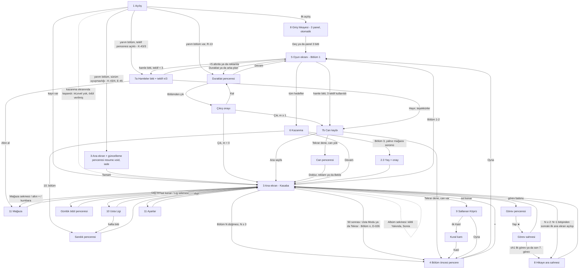

# UX akışları — Minik Usta

Sahip: design-lead · Durum: Faz 1 revizyonu (2026-10-04; orkestratör kararları R-01…R-24 işlendi); Faz 2 boşlukları 1 ve 3 (2026-10-06) · Kaynak:
`docs/BRIEF.md` §4, §8, §10, §11 · Görsel tarifler: `docs/ART_DIRECTION.md` · Animasyonlar: `docs/JUICE.md` · Metinler:
`docs/STORY.md` · Ölçüler: `src/theme/tokens.json` · Sayılar (fiyat, ödül, tavan): `config/economy.json`,
`config/events.json` — bu belgedeki sayılar **örnektir**, ekran değeri her zaman config'ten okunur.

**Kapsam etiketleri** (BUSINESS §12.1): **[MVP]** web MVP'de var · **[MVP-lite]** sade sürüm · **[Sonra]** MVP'de yok,
yeri ayrılmış · **[Mağaza]** yalnız Capacitor/mağaza sürümü. Etiketsiz satırlar MVP'dir.

---

## 0. Ölçü sistemi

### 0.1 Tasarım çözünürlüğü ve telefona eşleme

- Tasarım tuvali **1080×1920 px** (dikey). Tüm wireframe koordinatları bu tuvalde, sol üst (0, 0).
- **Telefona eşleme:** 375 pt genişlikte 1 pt = 2,88 px; 390 pt'de 1 pt = 2,77 px. Yani 1080 px genişlik = telefonun
  tam genişliği. Örnek: 120 px hücre = 41,7 pt (375) / 43,3 pt (390); 172 px güçlendirici yuvası = 60 / 62 pt.
- **44 pt kuralı — her genişlikte 128 px (karar 2026-10-06):** en küçük dokunma hedefi **her ekran genişliğinde 128
  px** tasarım pikselidir; token `touch.minTargetPx = 128`, genişliğe göre değişmez. Karşılığı 375 pt'de 44,4 pt, 390
  pt'de 46,2 pt, **360 dp'de 42,7 dp** (TECH §14.1 profili 360×800); 360'taki 42,7 dp bilerek kabul edilir. Gerekçe:
  44 pt Apple'ın iOS sayısıdır ve 375/390 pt'de sağlanır; 360 dp Android/web profilidir ve orada Android'in kendi
  önerisi 48 dp = 144 px'tir. 132 px'e çıkmak (360'ta tam 44 dp) yalnız 1,3 dp kazandırır, 48 dp'yi yine karşılamaz,
  buna karşılık 96 / 112 px görsellerin payını büyütür (Usta Serisi şeridinin payı tahta kenarına taşar). Bunun yerine
  **sık dokunulan hedefler 144 px tabanındadır** (360 dp'de ≥ 48 dp, 375 pt'de ≥ 50 pt). Kapalı liste: birincil,
  ikincil ve nötr düğmeler, eşit çift düğmeler, pencere seçenekleri (920×152), güçlendirici yuvaları (172), blok
  hücresi + pay (180), Bölüm düğmesi (176), alt navigasyon sekmeleri (176), sayısal tuşlar (§2.3). Listede olmayan her
  hedef 128 px tabanındadır (duraklat, kapat, üst çubuk öğeleri, ayar dişlisi, açık/kapalı anahtarları, Usta Serisi
  şeridi, Vinç döndürme okları, Boya Fırçası renk seçicisi, ara sahne "Geç", metin düğme). WCAG 2.5.8 (AA, 24 CSS px)
  her profilde sağlanır (360'ta 42,7 CSS px). Görseli daha küçük olan öğeler (blok hücresi 120 px) görünmez **dokunma
  payı** (`touch.hitSlopPx = 30`, 0,25 hücre) ile 180 px'e çıkar; birden çok bloğun payı aynı noktayı kapsarsa dokunuş
  merkezine en yakın hücreye gider.
- **Ölçekleme — FIT ve EXPAND (R-06; EXPAND önerisi P-4, proje sahibine soruldu):** Brif FIT diyor: tuval 1080×1920
  sabit, uzun ekranda üst/alt bant (390×844'te toplam 151 pt) arka plan rengiyle dolar. Öneri EXPAND: genişlik 1080
  sabit, yükseklik `H` ekran oranına göre **1920–2400 px** (Phaser `Scale.EXPAND`). Düzen **iki kipte de aynı çapa
  sözleşmesiyle** çalışır (`tokens.layout._doc`):
  - **Üst grup** (`layout.top.*`, y üstten): duraklat, panorama, hedefler, hamle sayacı, ana ekran üst çubuğu.
  - **Alt grup** (`layout.bottom.*`, y alttan, `*BottomPx`): Tuna köşesi, güçlendirici çubuğu, alt navigasyon,
    "Bölüm N" düğmesi.
  - **Tahta grubu** (`layout.board.*`): vinç alanı + tahta + durum şeridi; y değerleri 1920 içindir, `H > 1920` iken
    `(H − 1920) × board.expandShare (0,5)` kadar aşağı kayar. FIT'te `H = 1920` → kayma 0.
  - **Pencereler** alttan çapalanır: panel alt kenarı `y = H − layout.popup.panelBottomPx` (296); seçenek düğmeleri
    panelin alt kenarından `optionsBottomInsetPx` (64) yukarıda alttan üste dizilir (`layout.popup.*`). FIT'te 3 alt
    alta seçenek y 1056–1560 (rahat bölge, §0.2), tek düğme 1408–1560 (birincil y ≥ 1400); EXPAND'de panel alt kenarla
    birlikte aşağı iner ve seçenekler yine alt %45'te kalır. Dikey ortalama kullanılmaz: ortalanan kısa ya da çok
    seçenekli pencerede ilk düğme esneme bölgesine (y < 1056) çıkıyordu. En uzun pencere (bölüm öncesi, h 1280) FIT'te
    y 344'ten başlar.
  - Arka plan katmanları 1080×2400 çizilir (ASSET_LIST §6); fazladan yükseklik gökyüzü ve yakın katmanla dolar.
  Bu belgedeki wireframe'ler `H = 1920`'yi gösterir; 2337 px'te (390×844, EXPAND) tahta 208 px aşağı kayar ve başparmak
  bölgesine yaklaşır. Ekran görüntüleri iki profilde de incelenir (`ios67` 1290×2796, `android` 1080×1920; TECH §12).
- Güvenli alan (çentik): `index.html` oyun kabını `env(safe-area-inset-*)` ile içeri alıyor; tasarım tuvali zaten güvenli
  alanın içindedir. Ek olarak üstte 24 px, altta 24 px kenar boşluğu.

### 0.2 Başparmak bölgesi

```
 y=0    ┌──────────────────────────────┐
        │  ZOR ERİŞİM  (üst %30)       │  duraklat, geç, kapat (×) — bilinçli olarak zor:
 y=576  ├──────────────────────────────┤  yanlışlıkla basılmasın
        │  ESNEME  (%30–%55)           │  tahtanın üst satırları, vinç alanı (imza "yukarı" hareketi)
 y=1056 ├──────────────────────────────┤
        │  RAHAT  (alt %45)            │  Oyna, Devam, güçlendiriciler, alt navigasyon,
        │                              │  pencere birincil düğmeleri, +5 hamle, bloklar (alt satırlar)
 y=1920 └──────────────────────────────┘
```

Kural: her ekranın **birincil eylemi y ≥ 1400** (alt %27) ve en az 144 px yüksekliktedir (sık hedef tabanı, §0.1). Kapat/Geç/Duraklat gibi
geri dönüşü olan ikincil eylemler üst köşelerde durabilir. Tahta istisnadır: imza hareket "yukarı" gerektirir;
blok parmağın 1,2 hücre üstünde göründüğü için parmak bloğun altında, daha rahat bölgede kalır.

### 0.3 Ortak kalıplar

| Kalıp | Tarif |
| ----- | ----- |
| Birincil düğme | yeşil, en az 560×160 px, 3B dudak 12 px, metin `font.size.button` (56 px) beyaz + kontur |
| İkincil düğme | turuncu, 400×144 px |
| Nötr düğme | dolgulu krem (`ui.neutral` / `neutralLip`), yazı `ui.ink`; ikincil düğmeyle **aynı boyda** kullanılır. "Hayır, teşekkürler", "Reklam izle", "Çık" gibi seçenekler bu kalıptır |
| Eşit çift düğme | iki seçenek yan yana, **eşit boy 440×152** (aralarında 40 px, toplam 920 = `layout.popup` genişliği); biri yeşil ya da turuncu, öbürü krem. Birincil düğmenin "en az 560×160" kuralının **bilinçli istisnasıdır** (eşitlik kuralı, R-15); yükseklik ≥ 128 px ve rahat bölge (y ≥ 1056) şartı geçerlidir. Kullanım: çıkış onayı (Kal / Çık), günlük ödül (Topla / Reklam ×2), kural kartı (Katıl / Şimdi değil), Usta Modu / Tekrar turu kartı (Başla / Şimdi değil) |
| Görsel + pay (dokunma alanı) | Kısa kenarı 128 px'ten küçük **her** dokunulabilir öğe görünmez pay ile en az 128 px'e tamamlanır (`touch.minTargetPx`; her genişlikte 128 px, §0.1); pay iki yana eşit eklenir (112 px → her yanda 8 px; 96 px → 16 px; 88 px → 20 px). Pay komşu hedefin payıyla çakışırsa dokunuş merkezine en yakın hedefe gider (blok payı kuralıyla aynı). Bu belgedeki "+ pay" notları bu kuraldır |
| Metin düğme | dolgusuz, `ui.inkSoft`, alt çizgi yok, dokunma alanı ≥ 128 px yükseklik. **Satın alma ya da reklam penceresinde reddetme seçeneği olarak kullanılmaz** (R-15) |
| Fiyat etiketi (`PriceLabel`) | Altınla fiyatlanan **her** düğmede iki satır: üstte altın simgesi (`icon_coin` görüntüsü, 1 em; wireframe'lerdeki "●" bu simgedir, fontta karakter olarak yoktur) + "900" (`font.size.button`), altta gerçek para karşılığı yerel para biriminde: TR "≈ 81 TL", EN "≈ $1.79" (`font.size.caption`; asla altından büyük değil; mağaza sürümünde para birimi mağaza yerel ayarından). 2. satırın rengi zemine göre: **renkli düğmede (turuncu, yeşil) `ui.ink`** (turuncu üstünde 6,5:1, yeşil üstünde 5,3:1), krem zeminde `ui.inkSoft` (6,5:1). Bu satır R-15'in görünür olmasını istediği bilgidir; 4,5:1 altına inmez. Karşılık `config/economy.json`'daki referans fiyattan (Avuç paketi birim fiyatı) hesaplanır; web MVP'de yanında "test sürümü" etiketi (E9). Tek bileşen, bütün pencerelerde aynı (E2) |
| Teklif penceresi kuralı (R-15) | Seçenekler **eşit boyutlu** (920×152, alt alta, `layout.popup.*`); hiyerarşi yalnız renkle (turuncu / krem / krem). Döngüsel dikkat animasyonu, geri sayım, "son şans", kayıp vurgusu, kalan oyuncu sayısı yok. × kapat her zaman var ve "Hayır" ile aynı sonucu verir |
| Bot satırı (R-14) | Avatar = blok renklerinden birinde kask + küçük alet simgesi (`chr_bridge_helmet_bot_*`), ad `npc.apprentice.*` (STORY §7.4) + küçük "çırak" rozeti (`ui.botBadge`). Bayrak, çevrimiçi ışığı, alt çizgili kullanıcı adı yok. Oyuncu satırı "Sen" + Tuna kaskı |
| Kapat (×) | kırmızı daire Ø 112 px görsel + 16 px pay = 144 px hedef; pencerenin sağ üst köşesine 40 px taşar |
| Pencere | krem panel, kenar 12 px `panelEdge`, köşe 48 px, arkada `ui.overlay` %55; açılış 220 ms (JUICE) |
| Rozet | Ø 56 px kırmızı (#E8473B) daire, beyaz sayı ya da "!" |
| Kilitli öğe | %55 gri (`ui.disabled`) + asma kilit 64 px + açılış bölümü ("Bölüm 15"); dokununca 1,2 s ipucu balonu `common.unlockAt` ("15. bölümde açılır"; JUICE #73). **Adedi olan kilitli öğe** (açılış bölümünden önce ödül ya da paketle gelen güçlendirici, META §4): sağ üst köşede **gri adet rozeti** Ø 56 px, `ui.badgeLocked` dolgu + beyaz sayı (7,1:1; kırmızı `ui.badge` değil). Adet 0 ise rozet yok. Kilitliyken "+" gösterilmez (durum önceliği: kilitli > adet 0) |
| Yükleniyor | bloklardan dönen mini vinç döngüsü (96 px) + 0,4 s gecikmeyle görünür (kısa yüklemede titreşim olmasın) |
| Hata | krem panel + Kepçe "kafası karışık" + kısa metin + "Tekrar dene"; kırmızı çarpı ve suçlayıcı dil yok |
| Boş durum | Kepçe kazıyor illüstrasyonu + tek satır açıklama + (varsa) eyleme götüren düğme |
| Geri | Android geri tuşu / tarayıcı geri = en üstteki pencereyi kapat; oyun ekranında = Duraklat penceresi |
| Animasyon sırasında girdi (R-12) | Oyuncu animasyon sürerken yeni blok **tutabilir**: tutma anında tahtayı değiştiren bekleyen animasyonlar son karesine atlar (parçacık ve ses kendi hızında sürer), sürükleme gerçek durumdan başlar. Girdi yalnız **dilim kayması (600 ms), kamyon teslimatı (700 ms) ve Kamyon Yardımı (600–900 ms, varyanta göre: zincir/ıslaklık 600, malzeme teslimatı 700, yeniden diziliş 900; JUICE #21)** sırasında kilitlidir; bu sırada dokunuş diziyi 3× hızlandırır. Ayrıntı: JUICE §0 kural 3 |

---

## 1. Açılış (Splash / yükleme)

```
y    0 ┌────────────────────────────────────┐
       │            gökyüzü #7FD3F7          │
  300  │      ▣ ▣   bloklar yukarıdan       │  oyun adı logosu (`app.title`) 8 bloktan inşa olur
  420  │   ┌──────────────────────────┐     │  logo kutusu 880×360, merkez (540, 560)
       │   │   L i f t  &  L a n d    │     │
  740  │   └──────────────────────────┘     │
  900  │        ☺ Tuna      🐕 Kepçe          │  Tuna kaskını düzeltir, Kepçe havlar (840×520 sahne)
 1420  │   ══════════════════════════      │  zemin çizgisi
 1560  │   ⌐▀▀▀▀▀▀▀▀▀▀▀▀▀▀▀▀▀▀▀▀▀▀▀▀▀▀▀¬     │  yükleme: vinç kolu 840 px; kanca bloğu soldan sağa taşır
 1640  │   [▣]──────────────▶               │  blok konumu = yükleme yüzdesi
 1840  │          Sürüm 0.1.0  (34 px)      │  `app.version`
 1920  └────────────────────────────────────┘
```

| Öğe | Konum / boyut | Not |
| --- | ------------- | --- |
| Logo | 880×360, merkez (540, 560) | 8 blok (W Y G R O C B P) düşer ve oyun adı yazısının arkasında kutuları oluşturur; yazı Baloo 2 800, 120 px. **Ad marka sabitinden** (`app.title` i18n) gelir; çalışma değeri "Lift & Land" (D-068 aday sırası 1, STORY §0-10, §7.6) marka araması bitene kadar yer tutucudur. Ad **büyük harfe çevrilmez**, yazıldığı biçimde çizilir (TR yerelinde `upper` "LİFT" yazardı; ART §8). Düzen 8–12 harflik adlara ölçeklenir: blok sayısı = harf grubu sayısı (en çok 8), yazı 880 px'e sığmazsa 120 → 96 px |
| Tuna + Kepçe sahnesi | 840×520, merkez (540, 1160) | Tuna kaskını düzeltir (0,6 s), Kepçe havlar (0,4 s). **[MVP-lite]**: karakter animasyonu Sonra; MVP'de durağan poz |
| Yükleme vinci | 840×200, y 1540–1740 | taşınan blok x = 120 + 720 × yüzde |
| Sürüm | merkez (540, 1840), 34 px `ui.inkSoft` | `app.version` "Sürüm {version}" (`package.json` sürümü) |

Durumlar:

- **Yükleniyor:** varsayılan. Animasyon en az 1,5 s (logo tamamlansın), yükleme bitince en fazla 0,3 s bekleyip geçer.
- **Hata (kayıt bozuk / doku üretimi başarısız):** vinç durur, panel `error.boot` "Bir şeyler takıldı. Yeniden deneyelim mi?" +
  `common.retry` "Tekrar dene" (y 1600). Kayıt bozuksa yedek kayıt yüklenir (code-lead), oyuncuya teknik ayrıntı gösterilmez.
- **Boş / kilitli:** yok.
- **Geri dönen oyuncu:** splash → Ana ekran (FTUE değilse).
- **Yarım kalan bölüm (R-13):** kayıtta `inLevel` varsa splash → doğrudan **oyun ekranı**, bölüm kaldığı hamleden
  kurulur ve **Duraklat penceresi açık** gelir (başlık `resume.title` "Kaldığın yerden devam", birincil `common.continue`
  "Devam"; üstte 1,5 s şerit `resume.strip` "Bölüm {n} · hamlelerin kayıtlı", JUICE #87). Can gitmez, seri
  bozulmaz; G-H sayacı ve animasyonlar sıfırdan başlar. Ayrıntı §5.1. **Üç istisna (GDD K-43 madde 3–4, D-022):**
  (a) `inLevel.outcomeWindow = 'outOfMoves'` ise Duraklat penceresi **açılmaz**; tahta kurulur ve doğrudan §7
  Pencere 1 **aynı teklif numarasıyla** ("Teklif n/3", aynı fiyat basamağı; reklam düğmesi §7 kuralıyla, yalnız 1.
  teklifte) açılır; kaçış yolu yoktur (× = "Hayır, teşekkürler"). (b) Kazanma ekranındayken kapanmışsa ödüller kazanma
  anında verilmiştir ve `inLevel` silinmiştir: splash → **Ana ekran**; kazanma ekranı yeniden gösterilmez, ödül tekrar
  verilmez (TECH §11.1 tek davranış). Kazanmayla dolan bölüm / Usta Sandığı penceresi açılmadan kapanmışsa ana ekran
  açılışında §3.1 sandık penceresi bir kez açılır. (c) **Güncellemeyle geçersiz kalan deneme (K-43 madde 4, E-45):**
  `inLevel.levelHash` ya da `rulesVersion` uygulamadakinden farklıysa oyun ekranı **açılmaz**, tahta kurulmaz; deneme
  oynanmamış sayılır ve iade açılış kaydında yapılmıştır (TECH §11.1 `voidAttempt`). Splash → **Ana ekran** (normal
  giriş; Bölüm 1–2'de o anki FTUE düzeniyle) + tek düğmeli **güncelleme penceresi** (aşağıda). Pencere ana ekranın bu
  açılışında her şeyden önce gelir; bekleyen ara sahne (§8) ve sandık penceresi "Tamam"dan sonra kendi kurallarıyla
  oynar. Oyuncu aynı bölümü Bölüm düğmesiyle yeniden başlatır (seri bonusu tüketilmemiştir, §4'te yine görünür).
  Elenme, kayıp, "deneme yandı" ya da suçlama dili yok; kırmızı yok, `tut.ctx.resume` gösterilmez.

  ```
         │  OYUN GÜNCELLENDİ                  │  resume.void.title (h1); × yok, geri tuşu = "Tamam"
         │  Bölüm 18 baştan başlayacak.        │  resume.void.body (body): "Bölüm {n} baştan başlayacak.
         │  Harcadıkların geri verildi.        │    Harcadıkların geri verildi."
         │    ♥ 1    🔨 1    ● 1.350           │  iade satırı: yalnız > 0 kalemler, 96 px ikon + adet (aşağıda)
         │  Köprüdeki yerin korundu.           │  resume.void.bridge (caption, ui.inkSoft); yalnız Köprü denemesinde
         │  ┌──────────────────────────────┐  │
         │  │            TAMAM             │  │  common.ok; birincil yeşil 920×152, y 1408–1560 (§0.1)
         │  └──────────────────────────────┘  │
  ```

  İade satırı (TECH §11.1 iade listesinin görünür hali; sıra sabit): `icon_life` + "1" (ayrılan can; sınırsız can
  süresinde can ayrılmadıysa yok) · oyun öncesi ve bölüm içi güçlendirici ikonları + adet (aynı güçlendirici
  toplanır; Altın Mala yok, Mala Başlangıcı `icon_trowel_start`) · `{coin}{n}` (`offerSpendCoins` > 0 ise). Reklamla
  alınan +5 ve ömür ilk teklif hediyesi geri verilmediği için satırda görünmez; hakkında metin de yazılmaz. "Tamam" →
  satırdaki ikonlar üst çubuğa uçar (JUICE #74; altın > 0 ise sikke dalgası) ve pencere kapanır (JUICE #87 (c)).
  Pencere bir kez gösterilir: içeriği `voidAttempt` ile aynı atomik kayıtta bekleyen bildirim olarak yazılır, "Tamam"la
  silinir; "Tamam"dan önce uygulama kapanırsa sonraki açılışta aynı içerikle yeniden gelir (iade tekrar yapılmaz).
- **Ses:** ses kilidi açılmadan istenen sesler **atılır**, kuyruğa alınmaz (TECH §11.6); açılış sesleri süstür.

---

## 2. İlk oturum (FTUE)

Akış: **Açılış → 3 panelli giriş hikayesi (otomatik ilerler, atlanabilir) → doğrudan Bölüm 1 → Kazanma → Ana ekran →
ilk yıldızı harcama → ilk ara sahne → Bölüm 2 düğmesi.** (Sıra brif FTUE'sidir, R-09.) İlk oturumda bölüm öncesi
pencere **gösterilmez** (Bölüm 1–2); Bölüm 3'ten itibaren gösterilir (3–11 arası pencere sade: seri göstergesi yok; oyun öncesi
güçlendiriciler 12 / 16 / 20'de açıldığı için üç yuva **kilitli yuva** durumundadır, sandık ya da günlük ödülden gelen
adet gri rozetle görünür, §4). Pencere atlansa da can bölüm başında **ayrılır** ve kazanınca iade edilir (META §2); üst
çubukta bu ayırma gösterilmez.

### 2.1 "≤ 10 saniye ve ≤ 3 dokunuş" kanıtı

Ölçüm başlangıcı: uygulamanın ilk karesi (Capacitor'da native splash bitişi; web'de `DOMContentLoaded`). Bitiş: Bölüm 1
tahtasının etkileşime açıldığı kare.

| # | Adım | Süre (s) | Gerekli dokunuş | Kümülatif süre | Not |
| - | ---- | -------- | --------------- | -------------- | --- |
| 1 | Açılış animasyonu + yükleme | 2,0 (en az 1,5) | 0 | 2,0 | **Kritik yol yalnız:** font 38 KB (`document.fonts.load` bitmeden metin oluşturulmaz) + 3 giriş paneli (≤ 300 KB WebP/SVG yer tutucu). Doku pişirme, `level_001` derlemesi ve ses ön-çizimi panellerin **arkasında** yapılır (code-lead önerisi); diğer 44 panel tembel yüklenir. Bütçe: orta telefonda ≤ 2,0 s. |
| 2 | Giriş paneli 1 (otomatik) | 1,8 | 0 | 3,8 | Her panel 1,8 s sonra kendiliğinden geçer; dokunmak hemen geçirir. |
| 3 | Giriş paneli 2 (otomatik) | 1,8 | 0 | 5,6 | |
| 4 | Giriş paneli 3 (otomatik) | 1,8 | 0 | 7,4 | |
| 5 | Geçiş (panel → tahta, 0,4 s) + Bölüm 1 tahtasının ilk yükleme düşüşü (0,4 s, §5.1 "ilk yükleme"; etkileşim düşüş bitince açılır) | 0,8 | 0 | **8,2** | Usta Dede balonu ve el animasyonu tahtayla aynı anda gelir. |

- **Dokunuş:** gerekli dokunuş **0**. Oyuncu panelleri dokunarak hızlandırırsa en fazla 3 dokunuş (her panel 1) ya da
  "Geç" (`common.skip`) ile **1 dokunuş**; her durumda ≤ 3. ✓
- **Süre:** dokunmadan 8,2 s; panelleri dokunarak geçen oyuncu ~4–5 s. Yükleme bütçesi 2,0 s'yi 1,8 s aşsa bile 10 s
  içinde kalır (açılış animasyonu yüklemeyi örter; paneller yükleme bitmeden başlamaz). ✓
- **Ses kilidi:** tarayıcılar sesi ilk kullanıcı dokunuşuna kadar engeller. İlk dokunuş (panel ya da blok) sesi açar;
  dokunmadan geçen oyuncu ilk bloğu tuttuğunda sesi duyar. Ayrı bir "Başlamak için dokun" ekranı **yok**.
- **Varsayım:** web sürümünde ilk ziyaret ağ indirmesi bu ölçümün dışındadır (paket boyutu bütçesi code-lead'in;
  öneri ≤ 1,5 MB gzip ilk yük). Kurulu uygulama ve tekrar ziyaret için yukarıdaki tablo geçerlidir.
- **Ölçüm kapısı:** iddia `npm run perf`'te otomatik doğrulanır (soğuk başlangıç, 4× CPU yavaşlatma; web ilk ziyaret
  için ayrıca "Fast 4G"); gezinme başlangıcı → `window.__levelInteractive` ≤ 10 s. Phaser paket ayrıştırması (0,3–0,8 s,
  tahmin) 1,8 s'lik payın içindedir; aşılırsa önce panel süresi 1,8 → 1,5 s'ye iner.

### 2.2 FTUE adımları (Bölüm 1 sonrası)

| # | Ekran | Ne olur | Vurgu / el | Dokunuş |
| - | ----- | ------- | ---------- | ------- |
| 6 | Kazanma | Kısa kazanma gösterisi (≤ 3 s), yıldız ana ekrana uçar | "Devam" (`common.continue`) düğmesi nabız | 1 (Devam) |
| 7 | Ana ekran | İlk açılış: alt nav ve kenar ikonları gizli (yalnız üst çubuk, görev balonu, "Bölüm 2"). Yıldız sayacı 1'i gösterir | görev balonu (ünlemli) spot ışığında, el dokunma animasyonu | 1 (görev balonu) |
| 8 | Görev penceresi | `town.ch1.t1.name` ("Ağaç basamakları") + maliyet (★ META'dan) | "Yap ★1" düğmesi | 1 |
| 9 | Görev sahnesi | Ağaç ev basamakları yükselir (≤ 2 s), `town.ch1.t1.scene` balonu | — | 0 |
| 10 | İlk ara sahne (Bölüm 1 başlangıç) | 4 panel (STORY: `story.ch1.start`) | dokununca ilerler, "Geç" | 1–4 |
| 11 | Ana ekran | Alt navigasyon **Bölüm 5'te**, kenar ikonları açıldıkça belirir (bkz. §3) | "Bölüm 2" düğmesi nabız | 1 |

İlk oturumun "önce oyun, sonra meta" sırası: ilk meta dokunuşu, ilk kazanmadan sonradır.

### 2.3 Yaş ve onay ekranı **[Mağaza]** (R-23, BUSINESS S12)

Web MVP'de yok; akıştaki yeri şimdiden ayrılır. Konum: **Bölüm 3 Kazanma "Devam" → Yaş → Onay (CMP) → Ana ekran.**
Hiçbir reklam/analitik SDK bu adımdan önce başlamaz (code-lead `ConsentService`). FTUE ölçümü (Bölüm 1'e ≤ 10 s, ≤ 3
dokunuş) etkilenmez.

```
y  200 │   Doğum yılın                      │  h1, ortada; karakter, ödül, ipucu yok
  420  │   ┌──┐┌──┐┌──┐┌──┐                 │  4 haneli boş alan (varsayılan yok, kaydırma çarkı yok)
  560  │   └──┘└──┘└──┘└──┘                 │
  900  │   [1][2][3]                        │  sayısal tuş takımı, her tuş 160×144 (sık hedef, §0.1), aralık 24, alt yarıda
       │   [4][5][6]   [7][8][9]   [⌫][0]   │
 1640  │   ┌──────────── DEVAM ───────────┐ │  birincil; 4 hane girilince etkin
```

Nötr metin; "18" ya da yaş eşiği ipucu yok. Geçersiz yıl (gelecekte ya da 120 yıldan eski) → alan 2 px titrer +
"Yılı kontrol eder misin?" (suçlayıcı değil).

---

## 3. Ana ekran (Kasaba)

```
y    0 ┌────────────────────────────────────┐
   40  │ [♥ 5  29:12] [● 1.250 (+)] [★ 3]   │  üst çubuk h 112: can 300, altın 360, yıldız 240
  152  ├────────────────────────────────────┤
       │ ┌──┐                         ┌──┐ │  sol kenar: etkinlik ikonları 152×152, x 24
  420  │ │Kö│ 5s 12d                   │Gü│ │  (Sallanan Köprü + kalan süre rozeti)
  600  │ └──┘                         └──┘ │  sağ kenar: günlük ödül, kumbara, sandık, x 904
       │ ┌──┐   ~~ aktif yapı ~~      ┌──┐ │
  780  │ │Li│   (yarı inşa, paralaks) │Ku│ │  (Usta Ligi + sıra rozeti "#12")
  960  │ └──┘        ┌───────┐       └──┘ │
       │             │  (!)  │ görev    ┌──┐ │  görev balonu 200×200, yapı üstünde
 1140  │             │ ★1    │ balonu   │Sa│ │
       │             └───────┘          └──┘ │
 1320  │                                    │
 1440  │      [ZOR]  etiketi (varsa)        │  etiket 240×80, düğmenin sol üstüne taşar
 1480  │   ┌────────────────────────────┐   │
       │   │        BÖLÜM 12            │   │  birincil düğme 720×176, merkez (540, 1568)
 1656  │   └────────────────────────────┘   │
 1720  ├──────┬──────┬────────┬──────┬──────┤
       │Mağaza│ Lig  │  ANA   │Takım │Albüm │  alt nav h 176: 5 sekme × 216 px
       │  🛒  │  🏆  │  🏠    │ 🔒   │ 🔒   │  ortadaki seçili sekme 24 px yükselir; Takım ve Albüm kilitli "Yakında"
 1896  └──────┴──────┴────────┴──────┴──────┘
```

| Öğe | Konum / boyut | Davranış |
| --- | ------------- | -------- |
| Can | (24, 40) 300×112 görsel + üstte/altta 8 px pay → 128 px | Kalp + sayı + yenilenme sayacı (dolu ise "Dolu"); sınırsız can süresinde kalp yerine `icon_life_unlimited` (çizilmiş sonsuzluk işareti; ∞ karakteri metne yazılmaz, ART §8) + geri sayım. Dokun → Can penceresi (§3.1). |
| Altın | (348, 40) 360×112 görsel + üstte/altta 8 px pay → 128 px | Sikke + sayı + yeşil (+) 80 px. Dokun → Mağaza. |
| Yıldız | (732, 40) 240×112 görsel + üstte/altta 8 px pay → 128 px | Yıldız + sayı. Dokun → görev penceresi. |
| Ayarlar | (996, 52) 72×88 görsel + pay → 128 px | Dişli. Dokun → Ayarlar. |
| Sol kenar | x 24, 152×152, y 420 / 780 | Sallanan Köprü (Bölüm 15), Usta Ligi (Bölüm 25). Açılmadan önce gizli. |
| Sağ kenar | x 904, 152×152, y 420 / 780 / 1140 | Günlük ödül (2. gün; §3.1), Kumbara (20; dokun → Mağaza kumbara kartı), Bölüm sandığı (ilerleme halkası Bölüm 1'den görünür; 10 bölümde dolar; §3.1). |
| Görev balonu | 200×200, aktif yapının üstünde | Ünlem + yıldız maliyeti; yetecek yıldız varsa zıplar (2 s'de bir). |
| Bölüm düğmesi | 720×176, `layout.bottom.playButtonBottomPx` 264 | "BÖLÜM 12". Zor: kırmızı "ZOR" etiketi; Çok Zor: mor "ÇOK ZOR" etiketi + düğme kenarında ince ikaz şeridi. |
| Alt navigasyon | `layout.bottom.navBottomPx` 24, h 176, 5 × 216 | Mağaza · Lig · **Ana Sayfa** · Takım (kilitli, "Yakında") · Albüm (**[Sonra]** kilitli, "Yakında"; R-19). Bölüm 5'ten önce gizli. |

Durumlar:

- **Boş:** görev yok (bütün hikaye bölümlerinin görevleri bitti; yalnız Hikaye 5 sonunda oluşur) → görev balonu yerine
  "Yeni yapılar yolda" rozeti.
- **Yükleniyor:** kasaba sahnesi hazır değilse (ilk geçişte ≤ 300 ms) gökyüzü + düğme hemen görünür, yapı belirerek gelir.
- **Hata:** etkinlik verisi üretilemezse ikon gri + "!" rozeti; dokununca "Etkinlik şu an hazır değil. Biraz sonra bak."
- **Kilitli:** kilitli kenar ikonları gösterilmez (sürpriz açılış); alt nav'da Takım ve Albüm kalıcı kilitli ("Yakında").
- **Başlangıç sahnesi bekleniyor (N ≥ 2, META §1):** `story.ch(N−1).end` oynadı, `story.chN.start` henüz oynamadı →
  kasaba tamamlanmış N−1 yapısını gösterir, **görev balonu yok** (Bölüm düğmesi ve kenar ikonları normal). Ana ekranın
  bir sonraki açılışında (ekran geçişi ya da soğuk açılış) önce `story.chN.start` oynar, sonra N'nin ilk görev balonu
  belirir (§8).
- **Can yok:** Bölüm düğmesi gri değil (oyuncu yine dokunabilir) → Can penceresi (§3.1).
- **Güncellemeyle geçersiz deneme dönüşü (K-43 madde 4, E-45):** açılışta yarım bölüm sürüm uyuşmazlığıyla
  kapandıysa ana ekran normal düzeniyle gelir ve önce `resume.void` güncelleme penceresi açılır (§1 (c)); Bölüm
  düğmesi aynı bölümü gösterir.
- **İçerik sonu (Bölüm 50 bitti; D-026, META §8.5, `economy.json → masterMode.variant`):** iki düzen de MVP'dir ve
  50'den sonra **Bölüm düğmesi hep oynanabilir kalır** (Köprü ve Lig ilerlemesi durmaz; pasif düğme yok). Her iki
  düzende düğmenin üstünde "Yeni bölümler yolda" bandı (`home.moreSoon`) kalır; "Devamı yolda…" paneli `story.ch5.end`
  sahnesinin son panelidir (STORY §4.5), ayrı bir ekran değildir.
  - **`variant: master` (önerilen, onay bekliyor, R-17):** düğme "Usta Modu" (`master.button`). İlk dokunuşta bir kez
    giriş kartı: `master.card.title` + `master.card.body` "Bildiğin bölümler, daha az hamle." + `master.card.chest` +
    eşit boy "Başla" (yeşil) / "Şimdi değil" (krem). Sonraki dokunuşlar sıradaki bölümü açar (11…50, sonra yeniden 11).
  - **`variant: replay` (proje sahibi Usta Modu için "Sonra" derse, D-026 yedeği):** düğme `replay.button` "Tekrar ·
    Bölüm {n}" (sıradaki bölüm: 11…50, sonra yeniden 11; ZOR / ÇOK ZOR etiketi özgün zorluktan). İlk dokunuşta bir kez
    giriş kartı: `replay.card.title` + `replay.card.body` "Bildiğin bölümler. Köprü ve Lig sürüyor." +
    `master.card.chest` (Usta Sandığı bu düzende de verilir, META §8.5) + eşit boy "Başla" / "Şimdi değil". Hamle =
    özgün bütçe; yıldız yok; ödül yalnız kazanma tabanı (Bonus İnşaat ve mala altını yok; kazanma ekranı §6); galibiyet
    serisine, Köprü'ye ve Lig'e sayılır.

### 3.1 Ana ekran pencereleri

**Can penceresi** (can 0 iken Bölüm düğmesi ya da kalbe dokunma):

```
       │  CAN DOLDUR                (×)     │
       │  ♥ 0   Sonraki can: 12:40           │  geri sayım (nötr, kırmızı değil)
       │ ┌──────────────────────────────────┐│
       │ │ Tam can (5)      ● 900           ││  920×152, turuncu; PriceLabel
       │ │                  ≈ 81 TL         ││
       │ └──────────────────────────────────┘│
       │ ┌──────────────────────────────────┐│
       │ │ ▶ Reklam izle · +1 can (bugün 2/2)││  920×152, krem; tavan dolunca gri + "Yarın tekrar"
       │ └──────────────────────────────────┘│
       │ ┌──────────────────────────────────┐│
       │ │ Bekle                            ││  920×152, krem; pencereyi kapatır
       │ └──────────────────────────────────┘│
```

Altın yetmezse "Tam can" düğmesi "Altın al" olur → Mağaza (eksik altını karşılayan en küçük paket vurgulu, §11).
Ödüllü reklam **[MVP yer tutucu]**: MVP'de sahte reklam (2 s yer tutucu), mağaza sürümünde gerçek SDK. Reklam
yüklenemezse düğme gri "Şu an reklam yok"; **gizlenmez** (BUSINESS §4.3).

**Günlük ödül penceresi** (sağ kenar ikonu; 2. gün açılır):

```
       │  GÜNLÜK HEDİYE                (×)  │
       │  ┌──┐┌──┐┌──┐┌──┐┌──┐┌──┐┌────┐    │  7 kutu 112×160 + 7. gün 160×160; içerik ikonları
       │  │✓ ││✓ ││▣ ││  ││  ││  ││ ★  │    │  hepsi ÖNCEDEN görünür
       │  └──┘└──┘└──┘└──┘└──┘└──┘└────┘    │  bugünkü kutu (3) vurgulu, alınanlar ✓
       │  Bir gün gelmezsen ilerlemen        │  body, ui.inkSoft — E10
       │  kaybolmaz.                         │
       │  [   TOPLA   ]  [▶ Reklam·altın ×2] │  eşit çift 440×152; reklam günde 1, tavanda gri "Yarın tekrar"; altınsız günde yok
```

**×2 reklam yalnız altını ikiye katlar** (META §8.1). Bugünkü ödülde altın yoksa (döngünün 2., 4. ve 6. günü: yalnız
güçlendirici) ×2 düğmesi **gösterilmez**; "Topla" tek başına birincil düğme olur (920×152, `layout.popup`) ve günlük
reklam hakkı **tüketilmez**. Altınlı günlerde düğme metni `daily.double` "Reklam · altın ×2" (7. gün: yalnız 200 altın
ikiye katlanır, Vinç ve sınırsız can değişmez). Bu durum "reklam yok / tavan" griliğinden ayrıdır: orada düğme görünür
kalır (BUSINESS §4.3), burada izlenecek bir değer olmadığı için hiç sunulmaz.

Kaçırılan gün döngüyü **sıfırlamaz, durdurur**: sıradaki kutu "bekliyor" (küçük saat simgesi) olarak kalır; sıfırlama
animasyonu, "Seriyi kaybetme!" uyarısı ve geri sayım yok. Ödüller `config/economy.json`'dan. Toplama → JUICE #74.

**Bölüm sandığı / lig sandığı açılışı** (E1; kumar algısı yok):

```
       │  BÖLÜM SANDIĞI                     │
       │   İçinde: ● 200  🔨1  🧪1          │  içerik ikonları kapalı sandığın ÜSTÜNDE baştan görünür (10. bölüm, META §8.2)
       │        ┌────────────┐               │
       │        │  sandık    │               │  ahşap alet sandığı 400×320
       │        └────────────┘               │
       │   [          AÇ          ]          │  birincil
```

Açılış = kapak kalkar (400 ms) → ikonlar **gösterilen sırayla** üst çubuğa uçar (120 ms arayla). Dönen çark, slot,
yavaşlayan kart, "neredeyse" animasyonu ve rastgele seçim görseli **yok**; içerik sabittir ve açılmadan önce bellidir.
Lig sandığı ve Usta Sandığı (Usta Modu, her 10 galibiyet; META §8.5) aynı pencereyi kullanır (Lig sonuç penceresinden /
kazanma ekranından açılır).

**Sınırsız can ödülde** (günlük ödül 7. gün, bölüm / lig sandığı; META §8): içerik satırında `icon_life_unlimited` +
süre `common.minutes` "{n} dk" (ör. "30 dk"); açılmadan önce diğer içerikle birlikte görünür (E1). Toplanınca ikon
üst çubuktaki kalbe uçar (JUICE #74) ve kalp süre boyunca `icon_life_unlimited` olur.

**Kilitli güçlendirici ödülde ve pakette** (META §4, BUSINESS E1): günlük ödül kutuları, bölüm / lig sandığı içeriği ve
mağazanın başlangıç paketi kartı, açılış bölümü henüz gelmemiş güçlendiriciyi de **gösterir**. İkon tam renkli kalır
(içerik açmadan önce görünür), sağ alt köşesinde 40 px asma kilit (`icon_lock`) ve altında `font.size.caption`
"Bölüm N" etiketi; dokununca `common.unlockAt` balonu. Toplanınca envantere eklenir, kaybolmaz ve yuvasında gri adet
rozetiyle görünür (§0.3, §4, §5.1). Örnekler: Bölüm 10 sandığındaki Termos (açılış 12); günlük ödül döngüsünün 2. günündeki Çekiç (8);
Bölüm 5'te açılan başlangıç paketindeki Çekiç (8), Vinç (10), Termos (12).

---

## 4. Bölüm öncesi pencere

```
y  344 ┌────────────────────────────────────┐ (×) 144 px hedef, köşe (1000, 344)
       │  ┌──────────────────────────────┐  │  panel 960×1280, x 60–1020; y 344–1624 (alttan çapa, §0.1)
  404  │  │      BÖLÜM 12      [ZOR]     │  │  başlık h1 88 px
  524  │  ├──────────────────────────────┤  │
       │  │   ┌──────────┐  ┌───┐ ┌───┐ │  │  hedefler: yapı resmi 280×280 + ek hedefler 160×160
       │  │   │ Tezgâh   │  │▦×6│ │✦×5│ │  │
  844  │  │   └──────────┘  └───┘ └───┘ │  │
  904  │  │  Galibiyet serisi: ▰▰▱ (2)   │  │  seri göstergesi 760×100 (Bölüm 15+)
 1024  │  │  ┌────┐  ┌────┐  ┌────┐      │  │  3 oyun öncesi güçlendirici yuvası 200×200
       │  │  │ 🧪 │  │ 🪣 │  │ ▤↑ │      │  │  seçilince yeşil çerçeve + ✓
 1224  │  │  └────┘  └────┘  └────┘      │  │
 1424  │  │  ┌────────────────────────┐  │  │
       │  │  │         OYNA           │  │  │  birincil 640×176, merkez (540, 1512)
 1600  │  │  └────────────────────────┘  │  │
 1624  └──┴──────────────────────────────┴──┘
```

| Öğe | Not |
| --- | --- |
| Başlık | "BÖLÜM 12" + zorluk etiketi (Kolay/Normal etiketsiz). |
| Hedef kutusu | Yapı parçasının küçük resmi (panoramadan render, adıyla: "Tezgâh"), ek hedefler sayaçlı ikon. |
| Galibiyet serisi | 3 basamaklı gösterge; her basamağın bonusu altında (META §5): "Altın Mala ×N" (`icon_gold_trowel` + sayı) ve kademe 2–3'te "+N hamle" çipi (`ui_moves_chip`: hamle sayacı minyatürü + sayı; kademe 2 → +2, kademe 3 → +3). Seçili basamak vurgulu. **Termos ikonu burada kullanılmaz**; Termos ayrı oyun öncesi güçlendiricidir (+3 hamle, aşağıdaki yuva) ve seri bonusuyla toplanır (K-40). Bölüm 15 öncesi gizli. |
| Güçlendirici yuvaları | Termos (12), Mala Başlangıcı (16), Açık Kepenk (20). Adet rozeti; 0 ise "+" (altınla al). Dokun = seç/bırak. |
| Oyna | Seçili güçlendiriciler harcanır, oyun ekranına geçiş. İlk hamleden önce bölümden çıkılırsa iade edilir (K-40, K-43). |

Durumlar: **kilitli yuva** (açılış bölümü yazılı asma kilit, §0.3 "Kilitli öğe"; seçilemez, dokununca `common.unlockAt`
balonu. Açılıştan önce kazanılmış adet varsa (META §4) köşede **gri adet rozeti**: ör. Bölüm 10 sandığından 1 Termos →
Bölüm 11 penceresinde Termos yuvası asma kilit + "Bölüm 12" + gri "1". Açılış bölümünde ücretsiz denemeler bu adede
eklenir (1 + 3 = 4), kilit kalkar, rozet normal adet rozetine döner) · **adet 0** ("+" → mini satın alma penceresi: güçlendirici
ikonu + tek satır açıklama + `PriceLabel`'lı "Al" ve eşit boyda krem "Hayır, teşekkürler"; yalnız oyuncu "+"ya dokununca açılır,
kendiliğinden asla; altın yetmezse "Altın al" → Mağaza) · **seçilemez yuva** (Açık Kepenk, bölümde Kepenk W4 ya da
Kilitli W7 yoksa: gri, "Bu bölümde kepenk yok"; K-40) · **can yok** (Oyna yerine "Can bekleniyor 12:40" + "Doldur" →
Can penceresi) · **yükleniyor** (yok; bölüm verisi yereldir) · **hata** (bölüm JSON doğrulaması başarısız → "Bu bölüm
hazırlanamadı" + Ana ekran; analytics olayı).

---

## 5. Oyun ekranı

### 5.1 Düzen

```
y    0 ┌────────────────────────────────────┐
   40  │[II] ┌─panorama──────────────┐ ┌───┐│  duraklat 128×128 (24,40)
       │     │ ▣▣ [▣▣] ░░ ░? ░░      │ │ 24 ││  panorama 592×110 (168,40)
  152  │     ├─hedefler──────────────┤ │hml││  hamle sayacı 280×224 (776,40)
       │     │ 🏠  ▦ 4/6   ✦ 2/5     │ │   ││  hedefler 592×104 (168,160)
  264  │     └───────────────────────┘ └───┘│
  288  │ · · · · · · · · · · · · · · · · · ·│  VİNÇ ALANI y=9  (288–408)
       │ · · · · · · · · · · · · · · · · · ·│  VİNÇ ALANI y=8  (408–528)
  528  │┌──────────────────────┐┃┌────────┐ │  ─ ─ ─ ─ kesik sınır çizgisi
       ││ ■ ■ ■ ■ ■ ■          │┃│ ▒  ▒   │ │  satır 7
       ││ ■ ■ ■ ■ ■ ■          │┃│ ▒  ▒   │ │  saha x 30–750 (6×120)
       ││ ■ ■ ■ ■ ■ ■          │ │ ▒  ▒   │ │  duvar x 750–810 (60), geçit = boşluk
       ││ ■ ■ ■ ■ ■ ■          │┃│ ▒  ▒   │ │  şantiye x 810–1050 (2×120)
       ││ ■ ■ ■ ■ ■ ■          │┃│ ▒  ▒   │ │
       ││ ■ ■ ■ ■ ■ ■          │┃│ ▒  ▒   │ │
       ││ ■ ■ ■ ■ ■ ■          │┃│ ▒  ▒   │ │
 1488  │└──────────────────────┘┃└────────┘ │  satır 0
 1504  │ Usta Serisi ●●●○ [mala]  🚚 Kamyonda:3│  durum şeridi h 96
 1600  ├────────────────────────────────────┤
       │ ☺🐕     ┌────┐┌────┐┌────┐┌────┐   │  Tuna+Kepçe 280×296 (16,1600)
       │ Tuna    │ 🔨 ││ 🪝 ││ 🖌 ││ ↶  │   │  güçlendirici yuvaları 172×172, x 314–1056
       │ Kepçe   │ 2  ││ 1  ││ 🔒 ││ +  │   │  y 1660–1832
 1896  └─────────┴────┘└────┘└────┘└────┘───┘
```

Tahta: hücre `c` = `layout.grid.cellPx` 120 px; satır y (0 = en alt) → ekran üst kenarı
`boardBottomY − 120·(y+1)` (`boardBottomY` = 1488 + EXPAND kayması); sütun x (0–5) → `yardX + 120·x`, şantiye sütunu
x (6–7) → `buildX + 120·(x−6)`. Duvar 60 px'lik görsel bir şerittir; mantıkta sütun 5 ile 6 arasındaki sıfır genişlikli
sınırdır (R-03). Vinç alanı y=8–9 tahtanın üstünde, aynı sütun ızgarası. Tahta genişliği 1020 px (ekranın %94'ü).
Durum şeridi tahta grubuna aittir (tahtayla birlikte kayar); Tuna köşesi ve güçlendirici çubuğu alt gruba çapalıdır.

| Öğe | Davranış |
| --- | -------- |
| Duraklat | Duraklat penceresi: başlık `pause.title` "Mola" (devam açılışında `resume.title`, §1), Devam (`common.continue`, birincil), Ses / Müzik / Titreşim anahtarları (`settings.sound` / `.music` / `.haptics`, durum `common.on` / `.off`), "Bölümden çık" (`pause.exit`) → **çıkış onayı** (aşağıda). |
| Panorama | Planın tamamının küçük önizlemesi; dilimler 2 sütunluk sütunlar halinde, aktif dilim beyaz çerçeveli, tamamlananlar tam renkli, **gelecek dilimler plan renkleriyle %30 opak** (`alpha.panoramaFuture`; planları okunur; döner platform gibi ileriyi planlatan bölümler buna dayanır). **Hücre boyu (Faz 2 tur 2):** bölümün en yüksek dilimine göre `min(24, ⌊(110 − 2·pay) / satır⌋)` px, en az 12 px; bütün dilimler aynı ölçekte, kutu içinde dikeyde ortalı (8 satırlık planda 12 px kalır; Bölüm 1–5'in 3–5 satırlık planlarında 18–24 px). 24 px'in altında sembol okunmadığı için semboller dokununca açılan büyük önizlemede tam opak çizilir; `?` hücreleri panoramada da `?` etiketiyle görünür, açılınca rengini alır (K-06). Taslakta `▣▣` tamamlanan, `[▣▣]` aktif, `░░` %30 opak gelecek dilim, `░?` gizli hücreli dilim. Dokun → 1,5 s büyük önizleme **[MVP-lite]**: oyun durumunu değiştirmez, hamle harcanmaz (K-06). |
| Hedefler | `build` için yapı ikonu + dilim sayacı ("2/4"), `clear` / `collect` sayaçları; sayaç metni `common.count` "{n}/{max}". Hedef tamamlanınca ✓ ve yeşil. |
| Hamle sayacı | Baloo 2 800, 120 px; altında etiket `hud.moves` "Hamle" (`font.size.small`). Son 5 hamlede kırmızı nabız (JUICE). |
| Usta Serisi | 4 boncuk; dolunca Altın Mala ikonu parlar ve "dokun, kullan" durumuna geçer (seçim: §5.2). Dokunma hedefi: 96 px şerit + üstte/altta 16 px pay → 128 px (§0.3). Etiket `hud.streak` "Usta Serisi"; renk körü modunda sayıyla da ("3/4", `common.count`). |
| Kamyon göstergesi | Kuyrukta blok varsa görünür: `truck.queue` "Kamyonda: 3" (K-26; sayı = kuyruktaki **blok** sayısı, hücre ya da parti değil); 0 iken gizli, "Kamyonda: 0" hiç yazılmaz. Geri sekip yer bulamayan blok bu çipe uçar (K-17 adım 3). |
| Tuna + Kepçe | Etkileşimsiz tepki karakterleri (doğruda sevinç, hatalıda yüz buruşturma, komboda dans). Dokunulursa tek bir el sallama (işlevsiz). **[MVP-lite]**: MVP'de yalnız ifade değişimi; dans ve boşta göz kırpma Sonra. |
| Güçlendiriciler | Çekiç (8), Vinç (10), Boya Fırçası (22), Geri Al (13). Adet rozeti; 0 → "+" mini satın alma (§4'teki pencere; yalnız oyuncu dokununca açılır, bölüm duraklar). Kilitli → asma kilit + bölüm no; açılıştan önce kazanılmış adet varsa gri adet rozeti (§0.3, §4; ör. günlük ödül döngüsünün 2. gününden gelen Çekiç, Bölüm 8'e kadar); dokununca `common.unlockAt` balonu, kullanılamaz. Ön koşulu sağlanmayan yuva gri (§5.2). |
| Harç maliyeti önizlemesi | **Şantiyeye yapışmış** harçlı blok (Y8) sürüklenirken hamle sayacının altında "−2" çipi (K-07, OBSTACLES Y8: yapışmış bloğun iptal olmayan her hamlesi 2). Sahadaki, henüz yapışmamış harçlı blokta çip yok (maliyet 1). Bırakma iptal öngörüsündeyse (§5.3) çip %40 soluklaşır (iptal = 0 hamle). |

**Çıkış onayı (R-13, K-43):**

```
       │  BÖLÜMDEN ÇIK?                     │  exit.title (h1, upper)
       │  m = 0 : Henüz hamle yapmadın; can gitmez.        │  exit.free
       │          Oyun öncesi güçlendiricilerin geri verilir. │  exit.refund (yalnız oyun öncesi güçlendirici varsa)
       │  m ≥ 1 : Çıkarsan 1 can gider.                     │  exit.cost
       │          Galibiyet serin sıfırlanır.               │  exit.streak (yalnız s > 0)
       │  Köprüde (m ≥ 1) ek satır: Köprüden düşersin.       │  exit.bridge
       │  [   KAL   ]   [   ÇIK   ]                         │  exit.stay / exit.leave; eşit çift düğme 440×152 (§0.3); "Kal" yeşil, "Çık" krem
```

Satırlar body, `ui.ink`; görünme koşulları ve sıra STORY §7.5 notundadır. `m = 0`'da seri ve can satırı yoktur (K-43
madde 2: cezasız çıkış); bölüm içi güçlendiriciler `m = 0`'da da iade edilmez, satırda geçmez.

Geri tuşu ve × = "Kal". Uygulamanın kapanması, arama ya da sistem tarafından öldürülmesi **kayıp değildir**: her hamle
sonunda hamle günlüğü kaydedilir; bir sonraki açılışta bölüm kaldığı yerden, Duraklat penceresi açık olarak sürer
("Kaldığın yerden devam"). İstisnalar (§1): "Hamleler bitti" penceresi açıkken kapandıysa Duraklat yerine aynı
teklifli Pencere 1 açılır; kazanma ekranındayken kapandıysa ana ekran gelir; güncellemeyle bölüm verisi ya da kural
sürümü değiştiyse (K-43 madde 4) bölüm açılmaz, ana ekranda `resume.void` penceresi iadeyi gösterir. Kayıp yalnız bu
onayla ya da teklif reddiyle olur.

Durumlar: **ilk yükleme** (tahta 400 ms içinde bloklar yukarıdan yerine düşer; etkileşim bu animasyon bitince açılır)
· **kilitlenme** (K-30 Kamyon Yardımı; nedene göre 3 varyant, JUICE #21) · **hamle bitti** (Kaybetme penceresi) ·
**duraklatma** (uygulama arka plana atılınca otomatik; durum kaydedilir) · **devam** (yarım kalan bölüm; yukarıda) ·
**hata** (beklenmeyen durum: oyun kaydı alınır; §0.3 "Hata" kalıbı `error.level` "Bir şeyler takıldı. Can gitmez." +
`error.restart` "Bölümü baştan başlat" teklif edilir, can gitmez) · **şantiye kapalı**
(aşağıda).

**Şantiye kapalı — "Yapı tamam!" (GDD E-27, K-07 satır 5, D-035):** bütün dilimler tamam ama bir `clear` hedefi eksikse
bölüm sürer ve şantiyeye bırakma iptaldir (0 hamle; TECH `siteClosed`). Oyuncu bunu hamle yakmadan görmelidir:

- **Kurdele:** son dilimin tamamlanma dizisi (JUICE #18) bitince duvarın ve şantiyenin üstüne altın kurdele gerilir
  (JUICE #89): 306×96 px, x 750–1056, y 960–1056 (tahta grubu; EXPAND'de tahtayla birlikte kayar), −6° eğik, uçları
  24 px V kesik; dolgu `ui.gold`, kenar 4 px `ui.goldDark`; metin `build.done` "Yapı tamam!" (STORY §7.5)
  `font.size.small` `ui.ink` (8,5:1); 282 px'e sığmazsa `font.size.caption`. Kurdele bölüm sonuna kadar kalır,
  dokunulmaz (dokunuş altındaki tahtaya geçer). Renk tek bilgi değildir: metin + kurdele biçimi.
- **Eksik hedef nabzı:** hedefler panelindeki eksik `clear` sayacı 3 kez nabız atar ve sahadaki kalan `clear`
  nesneleri bir kez parlar (JUICE #89). Kırmızı yok, geri sayım yok; nabız döngüsel değildir.
- **İptal öngörüsü:** blok şantiye sütunlarına (x ≥ 6) taşındığı her konumda §5.3 iptal öngörüsünü gösterir (%60 opak +
  "↩" rozeti); düşüş gölgesi (§5.4) çizilmez, çünkü düşüş olmayacak. Harç maliyeti çipi (§5.1 tablo) %40 soluklaşır.
- **Bırakınca:** blok kavisle başladığı yere döner (JUICE #8, 0 hamle), kurdele bir kez sallanır ve eksik sayaç bir
  kez nabız atar (JUICE #90). Usta Serisi ve hamle sayacı değişmez.
- Bölüm tasarımı bu durumdan kaçınır (LEVELS §5 kontrol listesi); sunum yine de her bölümde hazırdır.

### 5.2 Güçlendirici kullanım akışı

1. Yuvaya dokun → yuva yükselir, tahta üstünde ince açıklama şeridi (`booster.hint.<hammer|crane|brush|trowel>`, ör.
   "Kırmak istediğine dokun."; Altın Mala'da Usta Serisi şeridine dokununca `booster.hint.trowel`) + "Vazgeç"
   (`common.cancel`, ×).
   Seçilebilir hedefler 1,2 s'de bir parlar, seçilemeyenler %50 soluklaşır.
2. Hedef seçimi ve ön koşullar (GDD K-33, K-36…K-40; hedef kümeleri çekirdekten gelir, ör. `eligibleTrowelCells`):

| Güçlendirici | Seçilebilir hedef | Gri / seçilemez durum | Not |
| ------------ | ----------------- | --------------------- | --- |
| Çekiç (K-36) | saha bloğu, kasa, torba, moloz, yapışmış harçlı blok | kilitli (yerleşmiş) bloklar, kuyruktaki bloklar, duvar/geçit | Zincirli bloğa vurunca **yalnız zincir** kırılır (önizleme: zincir parlar) |
| Vinç (K-37) | zincirsiz, ıslak olmayan saha bloğu / moloz / harçlı blok | zincirli ve ıslak bloklar soluk + küçük kilit/damla rozeti | Hedef: sahada boş yer **ya da** şantiyede yalnız **doğru** konum (K-34 dahil). Taşırken gölge kuralı: geçersiz hedefte gölge gri, bırakınca blok geri döner ve vinç harcanmaz. Döndürme: blok üstünde 2 ok, 112 px görsel + her yanda 8 px pay → 128 px (§0.3). I5/Q9 şantiye üstünde gri |
| Boya Fırçası (K-38) | saha bloğu, yapışmış harçlı blok | moloz | Renk seçici yalnız **bu bölümün plan renklerini** gösterir (2–5 düğme, 112 px + sembol, her yanda 8 px pay → 128 px hedef, düğmeler arası ≥ 16 px; alt yarıda) |
| Geri Al (K-39) | — (anında) | son eylem sürükleme değilse, Geri Al'dan sonra yeni hamle yapılmadıysa (derinlik 1), kayıp penceresi açıkken: yuva gri, dokununca "Geri alınacak hamle yok" balonu | Etkinken yuva ikonunda küçük nabız yok (sakin) |
| Altın Mala (K-33) | aktif dilimde **K-34'ü sağlayan** boş, `.` olmayan plan hücreleri = inşa cephesi (§5.5) | aktif dilimin cephe dışındaki plan hücreleri ve `.` hücreleri seçim açıkken %50 opak (Faz 2 tur 2b; yerleşmiş bloklar, saha ve HUD değişmez; azaltılmış harekette de, çünkü bilgidir); seçim kapanınca (kullanım, Vazgeç ya da ×) %100'e döner | Geçerli hücreler altın kesik konturla nabız atar. Geçersiz hücreye dokunma: hücre 2 px titrer, mala harcanmaz |
| Açık Kepenk (K-40, oyun öncesi) | — | bölümde W4/W7 yok → bölüm öncesi pencerede gri "Bu bölümde kepenk yok" | Etkiyi yalnız Kepenk ve Kilitli geçitlerin üstündeki bayrak gösterir (JUICE #67) |

3. Uygulama animasyonu (JUICE) → adet −1. Vazgeçilirse ya da geçersiz hedefe dokunulursa adet düşmez.
4. Güçlendiriciler hamle harcamaz; Çekiç, Vinç, Boya Fırçası ve Altın Mala hamle sayacını ve Usta Serisi'nin boncuk
   sayacını değiştirmez (görsel geri bildirim de yok; Altın Mala kullanılınca yalnız mala yuvasındaki adet 1 azalır). **İstisna
   Geri Al:** son sürükleme hamlesini tümüyle geri aldığı için hamle sayacını harcanan kadar (+1 / +2 / +3) ve Usta
   Serisi'ni (o hamlede kazanılan Altın Mala dahil) hamle öncesi değerine döndürür (GDD K-39, K-33; JUICE #64).

### 5.3 Sürükleme hissi (tasarım ilkesi 4)

| Parametre | Değer | Token |
| --------- | ----- | ----- |
| Sürükleme başlangıcı | parmak 8 px hareket **ya da** 100 ms basılı. Eşik altında bırakma = **dokunma** (hamle yok, iptal değil). K-07 bu eşiği sayı olarak içermez; kural testi token değerini okur (code-lead-2). Yol araması tutma anında yapılır, görsel kaldırma eşik aşılınca başlar | `drag.startThresholdPx`, `drag.holdMs` |
| Kaldırma | ölçek 1,00 → 1,08 (80 ms, easeOutBack), gölge belirir (`shadow.lifted`; vinç alanında `shadow.crane`) | `drag.liftScale` |
| Parmak ofseti | blok, tutulan hücresinin merkezi parmağın **1,2 hücre (144 px) üstünde** olacak şekilde 90 ms'de yukarı kayar | `drag.fingerOffsetCells` |
| Takip | blok her karede parmak + ofset konumuna **yumuşatmasız** gider (tek kare gecikme şartı). Mantıksal konum hücreye yuvarlanır, görsel konum süreklidir. | — |
| Eğim | yatay hıza göre ±4° (en fazla), 120 ms'de sönümlenir | `drag.tiltMaxDeg` |
| Yapışkan takip (K-08) | parmak ulaşılamaz yere giderse blok en yakın ulaşılabilir konumda kalır; ayrılık > 0,5 hücre ve > 150 ms ise bloktan parmağa noktalı **ip** (beyaz %60, 6 px) çıkar ve blok parmağa doğru 3° yaslanır | `drag.tetherDelayMs` |
| Çarpma | yapışkan takip bir engele dayandığında blok o yöne 6 px esneyip geri gelir (JUICE: "takip engele çarptı") | — |
| Vinç alanı tavanı (K-05, W2) | boyu > `10 − height` olan blok (duvar 8 → boy > 2, duvar 7 → boy > 3) duvar tepesinde takılırsa (`blockedByWallHeight`) vinç alanının kesik sınır çizgisi ve sağ kenardaki açık yükseklik işareti (`10 − height` çentik, ART §5) 400 ms parlar + çarpma esnemesi; ilk kez olunca bağlamsal öğretici `tut.ctx.tootall` | — |
| İptal öngörüsü (K-05, K-07) | bırakma iptal olacak bir konumdaysa (saha üstünde havada, duvar sınırını kesiyor, **şantiye kapalıyken şantiye üstünde** — K-07 satır 5, E-27, §5.1 "Yapı tamam!") blok %60 opak olur ve üstünde 44 px "↩" rozeti görünür; bırakınca kavisle döner (hamle yok) | — |
| Bırakma (sahada) | hücreye 90 ms easeOutQuad oturma, ölçek 1,08 → 1,00 | — |
| Bırakma (şantiye üstü) | düşüş (K-11) | JUICE |
| Bırakma (geçerli değil) | başlangıç yerine 220 ms kavisle dönüş, hamle harcanmaz (K-07) | — |
| Tıklama (sürüklemeden) | blok 1 hücrelik zıplama (120 ms) + hafif haptik; hiçbir şey olmaz | — |
| Taşınamayan blok | dokununca 2 px sağ-sol titreme (3 döngü, 180 ms) + engelin (zincir, ıslak beton, üstünde blok) 300 ms vurgusu; hamle harcanmaz | — |
| Çoklu dokunuş | ikinci parmak yok sayılır (`activePointers: 2` ama sürükleme tek parmak) | — |

### 5.4 Düşüş gölgesi (K-18)

Blok şantiyenin üstündeyken (duvar üstünden ya da vinç alanından geçmiş) iniş konumu **her zaman** gösterilir; rüzgâr
(W8) ve balon (S8) dahil gerçek sonuç hesaplanır.

| Durum | Kolay / Normal | Zor / Çok Zor |
| ----- | -------------- | ------------- |
| Gölge gövdesi | bloğun hücreleri, iniş hücrelerinde: blok rengi %25 + 6 px kontur | aynı |
| Doğru yerleşim | **düz** 6 px kontur `color.ghost.valid` #5CF59A + dış parlama 8 px %40 (`stroke.ghostGlowPx`, `alpha.ghostGlow`) + sağ üstte Ø 44 px beyaz rozet içinde ✓ | **kesik** 5 px beyaz %60 kontur, rozet yok |
| Hatalı — moloz (`debris`, S4) | **kesik** 8 px kontur `color.ghost.invalid` + rozet "!"; gölgenin bütün hücrelerinde 45° tarama (moloz şantiyede hiçbir yere doğru inmez) + molozun kendisi (kırık beton dokusu) 2 Hz nabızla vurgulanır | **kesik** 5 px beyaz %60 kontur (nötr, K-18) |
| Hatalı — renk uyuşmuyor (`color`) | **kesik** 8 px kontur `color.ghost.invalid` #FF4A3D (16/10), 2 Hz nabız + rozet "!" ; uyuşmayan hücrelerde **45° tarama** | **kesik** 5 px beyaz %60 kontur (doğrudan ayırt edilemez) |
| Hatalı — pencere (`window`, `.`) ya da plan dışı (`outside`) | aynı kesik kırmızı + rozet "!"; `.` / plan dışı hücrelerde 45° tarama | aynı nötr |
| Hatalı — **altta boş plan hücresi** (`support`, K-34) | kesik kırmızı kontur + rozet **"↓"** (ünlem değil); gölgenin altında kalan **eksik destek hücreleri** (`missingSupport`: doğru dolu olmayan plan hücreleri ve içinde moloz ya da yapışmış harçlı blok duran `.` hücreleri; GDD K-34 kanca 2) `color.ghost.support` #FFC21A **yatay tarama** (6 px çizgi, 20 px aralık, `alpha.supportHatch`) + 2 Hz nabız; tarama renk uyuşmazlığının 45° taramasından desen olarak ayrıdır | nötr kontur; eksik destek gösterilmez (geri sekme ya da harç yapışmasından sonra gösterilir, §5.5) |
| Gölge açılmamış `?` hücresine değiyor (K-18) | **bütün zorluklarda nötr**: kesik 5 px beyaz %60 kontur, rozet yok, "doğru" tık sesi (JUICE #7) çalmaz | aynı |
| Düşüş yolu | bloktan gölgeye dikey noktalı çizgi (beyaz %35, 8/12) | aynı |
| Rüzgâr sapması | düşüş yolu 1 sütun kayan kavis + uçta küçük rüzgâr oku | aynı |
| Cam kırılacak | gölge rozetinde çatlak cam işareti (Ø 44, beyaz) — fizik bilgisi olduğu için **bütün zorluklarda**, `?` nötr durumunda da | aynı |
| Balon (S8) | gölge yukarıda, **tavan kirişinin** (ART §4) hemen altında + ip simgesi; balon tavanın üstünden bırakılırsa da gölge kirişin altında (blok iner) | aynı |
| Hafif yerçekimi (G-L) | önce yönlendirmesiz iniş; yönlendirmeden sonra gölge **yeni inişe** 80 ms'de kayar | aynı |
| Ray (K-12) | blok raydayken gölge yok; blok bulunduğu yerde kalacağı için kontur doğrudan bloğun üstünde gösterilir (doğru/hatalı ve K-34 kuralı aynı) | aynı |
| Şantiye kapalı (E-27) | düşüş olmayacağı için gölge yok; yerine iptal öngörüsü (%60 opak + "↩", §5.3) ve "Yapı tamam!" kurdelesi (§5.1). Tek istisna budur: "gölge her zaman görünür" ilkesi düşüşün olduğu her durum içindir | aynı |

Gölge yalnız **birincil nedeni** (çekirdeğin `verdict.reasons[0]`, sıra GDD K-34 kanca 2: `debris` → `outside` → `window` → `color` → `support`) gösterir; satırlar bu nedenlerle birebirdir. Şekil ayrı bir neden değildir: blok sınırlarının plandaki parça çizgisine uyması gerekmez (K-16).

Renk körlüğü: doğru/hatalı yalnız renkle değil **çizgi deseni** (düz/kesik), **rozet** (✓ / ! / ↓) ve **nabız** ile
ayrışır; iki rengin açıklık farkı da büyüktür (L\* 87 / 58). Eksik destek taraması yatay, renk taraması 45°'dir.

### 5.5 Alttan Üste (K-34) görünürlüğü — R-01

Kural: bir bloğun altında doldurulması gereken boş plan hücresi kalamaz. Oyuncunun "renk doğru, neden olmadı?" diye
takılmaması için dört katman:

1. **İnşa cephesi (bütün zorluklarda, her an):** her şantiye sütununda doldurulabilir en alt boş plan hücresi (altındaki
   bütün hücreler doğru dolu ya da **boş** `.`; sütun tamamsa ya da altındaki bir `.` hücresinde yanlış nesne — moloz,
   yapışmış harçlı blok — duruyorsa o sütunda cephe yok, GDD K-34 kanca 1, E-43) **düz** 6 px kontur (`plan.frontStrokePx`, `color.board.buildFront`) ve
   `plan.frontLighten` (+%15) açıklıkla çizilir (açıklık yalnız hücre dolgusunda, sembol değişmez; çerçeveler
   `plan_<c>_front` + `plan_front`, ART §4); diğer boş hücreler normal kesik konturda kalır. Oyuncu her sütunda
   "sıradaki kat"ı görür. Bu renk bilgisi değil (kural bilgisi); Zor bölümde ve `?` hücrelerinde de gösterilir.
   Altın Mala'nın seçilebilir hücreleri bu kümeyle aynıdır (tek görsel dil).
2. **Gölgede neden (Kolay/Normal):** §5.4 "altta boş plan hücresi" satırı: rozet "↓" + eksik destek hücrelerinde sarı
   yatay tarama.
3. **Geri sekme ya da harç yapışmasından sonra (bütün zorluklar):** K-34 yüzünden geri seken bloktan (`bounce`) ya da
   K-34 yüzünden yerinde yapışan harçlı bloktan (Y8, `mortarStuck.reason = support`) sonra eksik destek hücreleri
   600 ms (`duration.supportFlash`) aynı yatay taramayla yanıp söner (JUICE #13 / #14 → #84). Zor bölümde gölge gizli
   olsa da neden geriye dönük olarak öğrenilir; harcın ilk göründüğü Bölüm 35 de Zor'dur.
4. **İlk karşılaşmada Usta Dede (bir kez):** K-34 ilk kez bozulduğunda bağlamsal öğretici `tut.ctx.support`
   (yumuşak; vurgu = eksik destek hücreleri + inşa cephesi; GDD K-34 kanca). Bölüm 4'ün 2. adımı (LEVELS) aynı satırı
   yumuşak adım olarak gösterir; orada görülürse bağlamsal tetik bir daha çıkmaz. Bölüm 3'ün 1. adımı sırayı ("önce
   temel") doğal olarak öğretir (§13.2).

### 5.6 Hafif yerçekiminde yönlendirme girdisi (G-L) — R-10

- **Girdi:** blok hafif yerçekimiyle düşerken (ya da balon yükselirken) **tahtanın herhangi bir yerine dokunmak**
  (dokunma = eşik altında bırakma, §5.3). **Dokunulan taraf = kayma yönü:** dokunuşun x'i düşen bloğun merkezinin
  sağındaysa sağa, solundaysa sola 1 sütun. Şantiye 2 sütunlu olduğu için sahaya ya da duvar sınırına yakın dokunuş
  "sol" sayılır; o yönde sütun yoksa hiçbir şey olmaz (çip 2 px titrer).
- **Kaydırma (swipe):** blok tutmayan bir noktadan (boş hücre, şantiye, vinç alanı) başlayan yatay kaydırma da
  yönlendirmedir; yön = kaydırma yönü (yatay yol ≥ `drag.steerSwipeMinPx` 48 px ve yataylık > dikeylik). Dokunma ile
  aynı hakkı kullanır (düşüş başına 1). GDD K-19 madde 2'deki "kaydırma da aynı yönü verir" seçeneğinin tanımı budur.
- **Tutma ile ayrım:** bir **bloğun üstünde** başlayıp sürükleme eşiğini aşan dokunuş yönlendirme değil **blok
  tutmadır**; R-12 gereği düşüş son karesine atlar (yönlendirmesiz iner) ve yeni sürükleme başlar. Böylece "sıradaki
  bloğu tutmak" yanlışlıkla yönlendirme sayılmaz (product-lead endişesi; GDD E-40).
- **Kural sınırları (GDD K-19, product-lead):** düşüş/yükseliş başına en çok 1 yönlendirme, 1 sütun; 2 genişlikli
  blokta yok (çip görünmez, dokunuş yok sayılır).
- **Görsel:** düşen bloğun üstünde 72 px "↔" çipi (`hud.steerChipPx`); yönlendirme kullanılınca çip söner; gölge yeni
  inişe kayar (§5.4). Öğretici: Bölüm 23 (§13.2).

### 5.7 Ağır yerçekimi zaman çubuğu (G-H) ve erişilebilirlik ayarı — R-11

- Şantiye üstündeki blokta dolan **halka sayaç** (Ø 96, bloğun sağ üstünde): 700 ms (varsayılan) ya da **1400 ms**
  (Ayarlar › Erişilebilirlik › "Zaman baskısını azalt" açıkken; K-19). Son %30'da turuncu (`hud.heavyRingWarnAt`), son
  300 ms'de hafif haptik tık. Süre dolunca blok o anki konumdan bırakılır (JUICE #45).
- "Animasyonları azalt" süreyi değiştirmez (oyun kuralı); halka her durumda görünür.
- Bölüm 15 öğreticisinin 2. balonu ayarı tanıtır (`tut.l15.setting`). Bot zorluk ölçümü 700 ms ile yapılır.

---

## 6. Kazanma

```
y    0 ┌────────────────────────────────────┐
  160  │      ✨  KAZANDIN!  ✨               │  başlık display 120 px, `win.title` (upper)
  360  │  ┌──────────────────────────────┐  │
       │  │   tamamlanan yapı parçası    │  │  yapı 720×720, son kez parlar
       │  │   (kurdele kesilir)          │  │  Bay Kurdele makasla kurdeleyi keser
 1080  │  └──────────────────────────────┘  │
 1140  │   Bonus İnşaat · kalan 7 hamle  ● 21 │  `win.bonus` + `common.coins`; kalan hamleler tek tek altına dönüşür (örnek: 3/hamle)
 1200  │   Altın Mala ×1   ● 10              │  `win.trowel` + `common.coins`; kalan mala başına (yalnız mala varsa)
 1260  │   ★ +1      ● +61                   │  ödül satırı: ikon + `common.plus`; kazanma 30 + 21 + 10 (Normal örneği)
 1420  │   ☺🐕 dans                           │
 1600  │   ┌────────────────────────────┐   │
       │   │          DEVAM             │   │  `common.continue`; birincil 640×176, merkez (540, 1688)
 1776  │   └────────────────────────────┘   │
 1920  └────────────────────────────────────┘
```

Sıra: dilimler son kez parlar (400 ms, `duration.winGlow`) → kurdele kesilir (600 ms, `winRibbon`) → konfeti + "KAZANDIN!" (1,5 s, `winConfetti`; toplam `duration.win` 2500 ms, JUICE #55) → Bonus İnşaat (META'ya göre en çok 10 hamle
altın verir; bu 10 hamle canlandırılır, hamle başına 120 ms = en fazla 1,2 s; fazla hamleler sayaçta yalnız söner;
dokununca ×3 hızlanır) → kalan Altın Mala satırı → ödüller → "Devam" (Bonus
İnşaat bitince ya da dokununca belirir). "Devam" → Ana ekran; yıldız üst çubuktaki sayaca uçar. Bölüm sandığı dolduysa
(her 10 bölüm) önce sandık penceresi (§3.1) açılır. **Bütün altın değerleri `config/economy.json`'dan** (META §3.1);
wireframe sayıları örnektir.

Durumlar: **etkinlik ilerlemesi** (Sallanan Köprü aktifse "Tahta 4/7" satırı eklenir; 7. tahtada ve `finisherExtras`
varsa altında `bridge.extra.got` satırı ve ikonlar üst çubuğa uçar, JUICE #74; Lig puanı "+2 puan" çarpanlı sonuçtur,
bonus uygulandıysa yanında "×2" / "+1" çipi, §10).
**Usta Modu** (MVP, onay bekliyor; META §8.5): yıldız satırı yok; Bonus İnşaat ve Altın Mala satırları **normal**
oynar, miktarlar (kazanma tabanı, hamle başı, mala başı) bölümün **özgün** zorluk etiketinden hesaplanır (META §8.5,
§9). **Tekrar turu** (`masterMode.variant: replay`, D-026 yedeği, yalnız Usta Modu "Sonra" kararında; BUSINESS §9.2):
yıldız satırı, Bonus İnşaat satırı ve kalan Altın Mala satırı **yok**; ödül satırında yalnız kazanma tabanı (özgün
zorluktan); etkinlik satırları (Köprü tahtası, Lig puanı) ve Usta Sandığı ilerlemesi normal. **Boş / hata / kilitli:**
yok.

Kazanma ekranında "Tekrar" düğmesi **yoktur**: ekranın tek birincil eylemi "Devam"dır (§0.2); bir bölümü yeniden oynamak
Usta Modu / Tekrar turunun işidir (§3, `replay.button`). Metinler STORY §7.6 (`win.*`, `common.*`).

**Faz 2 dikey dilimi (TECH §14.1 #12; Ana ekran Faz 4'te):** kazanmada "Devam" ve kayıp Pencere 2'de "Ana sayfa" **asgari
ana ekrana** gider: oyun ekranıyla aynı arka plan + üstte `app.title` (logo yer tutucusu, 0,6× ölçek) + Bölüm
düğmesi `home.play` "BÖLÜM N" (§3 ölçüleri: 720×176, `layout.bottom.playButtonBottomPx`). Üst çubuk, kasaba, görev
balonu, kenar ikonları ve alt navigasyon yoktur; yıldız uçuşu ve ödül sayaçları oynamaz (sayaçlar kayıtta güncellenir).
Bölüm 5 kazanılınca düğme `home.moreSoon` "Yeni bölümler yolda" bandıyla Bölüm 1'i açar (1–5 döngüsü; §3 "İçerik sonu"
kuralının dilimdeki karşılığı, pasif düğme yok). Bölüm 1–2 FTUE kuralı geçerlidir: Bölüm 1 kazanılınca "Devam" asgari
ana ekrana gelir ve "BÖLÜM 2" düğmesi nabız atar (§2.2 adım 11).

---

## 7. Kaybetme

**Pencere 1 — "Hamleler bitti!"** (R-15; BUSINESS §4.3, §4.5)

```
y  456 ┌────────────────────────────────────┐ (×)  = "Hayır, teşekkürler"
       │        HAMLELER BİTTİ!             │  h1
  596  │   ┌──────────────┐                 │
       │   │ kalan hedef  │  Kalan: 2 hücre  │  nötr bilgi: "Kalan: 2 hücre", "Kasa ×1"
  896  │   └──────────────┘   ☺ Tuna        │  Tuna "kararlı" ifade, balon YOK
  976  │   Teklif 1/3                        │  small, ui.inkSoft — eskalasyon ve sınır görünür
 1056  │  ┌──────────────────────────────┐  │  ← rahat bölge sınırı (§0.2)
       │  │ +5 hamle          ● 900      │  │  920×152 turuncu; PriceLabel 2. satır:
       │  │                ≈ 81 TL        │  │  TR "≈ 81 TL" / EN "≈ $1.79"
 1208  │  └──────────────────────────────┘  │
 1232  │  ┌──────────────────────────────┐  │
       │  │ ▶ Reklam izle · +5 hamle      │  │  920×152 krem; yalnız 1. teklifte; `lose.ad`
       │  │                  bugün 1/3    │  │  2. satır `lose.adToday` (PriceLabel 2. satırının yeri ve renk kuralı, §0.3)
 1384  │  └──────────────────────────────┘  │
 1408  │  ┌──────────────────────────────┐  │
       │  │ Hayır, teşekkürler            │  │  920×152 krem — metin düğme DEĞİL
 1560  │  └──────────────────────────────┘  │  optionsBottomInsetPx 64
 1624  └────────────────────────────────────┘  panel alt kenarı = H − panelBottomPx (296)
```

- **Eşit seçenekler:** üç düğme aynı boy (920×152), alt alta, rahat bölgede (FIT'te y 1056–1560, `layout.popup`
  alttan çapası, §0.1; EXPAND'de daha aşağıda); hiyerarşi yalnız renkle. 2. ve 3. teklifte iki düğme kalır: alttan
  dizildikleri için 1232–1560'ta, panel üst kenarı aynı oranda iner. Giriş
  animasyonu üçünde aynı; "+5" çipi pencere açılırken **bir kez** zıplar, sonra durur (JUICE #52).
- **Ömür ilk teklifi (META §3.2):** oyuncunun hayatındaki ilk "Hamleler bitti" penceresinde turuncu düğme fiyatsızdır:
  `lose.offer.gift` "+5 hamle · Usta Dede'den hediye" (PriceLabel yok, reklam düğmesi yok, "Teklif 1/3" görünür; teklif
  1'e sayılır). Sonraki bütün denemelerde normal eskalasyon.
- **Eskalasyon:** 1. teklif ● 900 (+ reklam alternatifi) · 2. teklif ● 1.350 ("Teklif 2/3") · 3. teklif ● 1.800
  ("Teklif 3/3 · son teklif"). 2. ve 3. teklifte reklam düğmesi yoktur, iki seçenek kalır (eşit boy). Reklamla alınan +5
  de sınıra sayılır; fiyat basamağı uzatma sırasına bağlıdır. 3. uzatmadan sonra hamle biterse Pencere 1 açılmaz,
  doğrudan Pencere 2. Fiyatlar ve sınır `config/economy.json`'dan.
- **Baskı yok:** "Az kaldı!" balonu, geri sayım, kalp/seri kaybı uyarısı, ödül havuzu, "kalan oyuncu" sayısı bu
  pencerede **gösterilmez**. Seri sıfırlanması yalnız Pencere 2'de bildirilir (entrepreneur-2, META §5).

**Pencere 2 — can kaybı:** `lose.life` "Bir can gitti." + kalp kırılmaz, **söner** (gri, 400 ms) + `lose.streak`
"Galibiyet serin sıfırlandı." satırı (seri > 0 ise) + `lose.retry` "Tekrar dene" (birincil) + `common.home` "Ana sayfa"
(metin düğme; Faz 2'de asgari ana ekrana, §6). Sallanan Köprü'de: Tuna simitle kıyıya yüzer
(STORY) + `bridge.fell`; kalan oyuncu sayısı ve havuz **gösterilmez**.

Durumlar:
- **Altın yetmez:** turuncu düğme "Altın al · eksik ● 350" olur → Mağaza **kayıp bağlamıyla** açılır: eksik altını
  karşılayan en küçük paket (çoğunlukla Avuç 1.000) çerçeveyle vurgulanır; pahalı paket önseçilmez, sayfa otomatik
  kaydırılmaz. Dönüşte pencere aynı teklifle açık kalır.
- **Reklam tavanı / reklam yok:** reklam düğmesi gri, 2. satır `ads.tomorrow` "Yarın tekrar" ya da `ads.none` "Şu an reklam
  yok" (`lose.adToday` yerine); gizlenmez.
- **Köprü:** pencere normal Pencere 1 ile aynıdır; yalnız nötr "Kalan: n hücre" bilgisi (`lose.left`). Kural satırı
  (eski `lose.bridge` dahil), "kalan oyuncu" sayacı ve baskı metni **yok** (R-15, BUSINESS §4.5-3/-4, P-4); kural
  yalnız giriş kural kartında (`bridge.rule_card.lose` / `.continue`) ve (i) panelinde yazar. **Köprü harcama tavanı**
  (tur başına ● 4.050, `events.json → wobblyBridge.bridgeSpendCapCoins`): `tur harcaması + bu teklifin fiyatı > 4.050`
  ise turuncu düğme gri + `lose.bridgeCap` (META §6.1, GDD K-29; tavan henüz dolmamış olsa da, ör. tur harcaması
  3.150 + 3. teklif 1.800 = 4.950 > 4.050 → gri). Reklam alternatifi tavandan bağımsız kalır.
- **Can 0:** Tekrar dene → Can penceresi (§3.1).

---

## 8. Hikaye ara sahnesi

```
y    0 ┌────────────────────────────────────┐
   40  │                         [ GEÇ ▶▶ ] │  Geç 240×128 (816,40) — bilinçli olarak üst köşede
  200  │  ┌──────────────────────────────┐  │
       │  │                              │  │  panel 1000×1000, 18 px koyu kontur, köşe 24
       │  │       çizgi roman paneli     │  │  panel giriş: 280 ms kayma + hafif dönme
       │  │                              │  │
 1200  │  └──────────────────────────────┘  │
 1240  │   ╭─────────────────────────────╮  │  konuşma balonu: maks. 900×360, body 44 px
       │   │ Tuna: "Dede, bu tabela      │  │  konuşan karakterin yüz ikonu 120 px balonun solunda
       │   │  bizim mi?"                 │  │
 1600  │   ╰────────────────────────────╯   │
 1760  │         ● ● ○ ○   (panel noktaları) │  ilerleme noktaları
 1840  │            dokun ▸                   │  1,5 s dokunulmazsa "dokun" ipucu belirir
 1920  └────────────────────────────────────┘
```

- Dokunuş (Geç dışında herhangi bir yer) → balon tamamlanmamışsa metni tamamlar; tamamlanmışsa sonraki panel.
- Metin daktilo hızı `text.typewriterCps` (40 karakter/s); "animasyonları azalt" açıkken anında. Karakter "bla" sesleri
  **[Sonra]** (JUICE #81).
- FTUE giriş sahnesi (3 panel) **otomatik** ilerler (her panel 1,8 s); diğer sahneler dokununca ilerler.
- Tetikleyiciler (R-09; kural META §1, STORY §3; `economy.json` `town.cutscenes`):
  - prolog FTUE'de (Bölüm 1'den önce);
  - `story.ch1.start`: Hikaye Bölümü 1'in **1. görevi** yapılınca, görev mini sahnesinden sonra (FTUE adım 10);
  - `story.chN.start` (N ≥ 2): `story.ch(N−1).end` kapandıktan sonra ana ekran **bir sonraki kez açıldığında**.
    "Açılma" = ana ekrana başka bir ekrandan (bölüm sonucu, mağaza, etkinlik, ayarlar) geçiş ya da uygulamanın soğuk
    açılışı; **bitiş sahnesinin kapanıp oyuncuyu ana ekranda bırakması açılış sayılmaz**. Bu sahne oynayana kadar
    N'nin görev balonu çıkmaz (§3 "Başlangıç sahnesi bekleniyor");
  - `story.chN.end`: o hikaye bölümünün son (7.) görevi yapılınca (N = 5: büyük final).
  - Bir eylem en çok bir ara sahne oynatır; N−1 bitişi ile N başlangıcı arka arkaya oynamaz. Örnek (META §1): 7. görev
    → `story.ch1.end` → ana ekran (ch2 balonu yok) → Bölüm 12 → sonuç ekranından ana ekrana dönüş → `story.ch2.start`
    → kasaba Mahalle Fırını'nı gösterir, "Fırın temeli" balonu çıkar.
- Yapı kartı yalnız `story.ch1.end` Panel 4'tedir ve **yalnız gösterilir**; diğer bitiş sahneleri (`story.ch2.end` …
  `story.ch5.end`) STORY §4'teki son panelleriyle kapanır (ch5: "Devamı yolda…", §3). "Albüme eklendi" animasyonu yok
  (R-19, Albüm Sonra).
- Bellek: yalnız gösterilen ve sıradaki panel yüklüdür; geçilen panel boşaltılır (code-lead).

Durumlar: **yükleniyor** (panel görseli hazır değilse yer tutucu SVG ile oynar — sahne asla bekletmez) · **hata**
(sahne verisi yoksa atlanır, analytics) · **kilitli** (yok; Albüm Sonra).

---

## 9. Sallanan Köprü

```
y    0 ┌────────────────────────────────────┐
   40  │ [←]   SALLANAN KÖPRÜ (i)  ⏱ 5s 12d │  geri 128×128; başlık h2; (i) = kural kartı; geri sayım
  200  │   Ödül havuzu: ● 6.500              │  `prizePoolCoins` (config; LiveOps teması değiştirebilir)
  260  │   Karşıya geçene ek ödül: 🪣×1      │  yalnız `finisherExtras` ≠ null: `bridge.rule_card.extra` (caption)
  320  │   Köprüde kalan: 47 / 100           │  canlı sayaç (yalnız bu ekranda; kayıp penceresinde YOK)
  420  │   Rakiplerin: Renkli Tepe çırakları  │  caption, ui.inkSoft — bot etiketi her zaman görünür
  480  │  ┌──────────────────────────────┐  │
       │  │ kıyı ═╤═╤═╤═╤═╤═╤═╤═ kıyı    │  │  7 tahtalı köprü 1000×520, sallanır
       │  │      1 2 3 4 5 6 7  ⛿ ödül    │  │  oyuncunun kaskı (Tuna) büyük, çırak kaskları küçük
       │  │  ~~~~ nehir, simitli düşenler~ │  │  çırak kaskına dokun → "Çırak Fındık · çırak" balonu
 1000  │  └──────────────────────────────┘  │
 1060  │   Sen: 3. tahtadasın (Tuna kaskı)    │
 1560  │   ┌────────────────────────────┐   │
       │   │  KATIL / OYNA · BÖLÜM 18   │   │  birincil 720×176; `bridge.rule_card.join` / `bridge.play`
 1736  │   └────────────────────────────┘   │
 1920  └────────────────────────────────────┘
```

**Kural kartı (R-14, R-15):** ilk "Katıl"a basınca **bir kez** açılır (sonra (i) ile her zaman). İçerik
(`bridge.rule_card.*`, STORY §7.2): {n} bölümü art arda kazan (`planks`) · kaybedersen elenirsin · +{n} hamleyle devam
edebilirsin (`outOfMoves.extraMoves`) · ödül havuzu ve süre · **ek ödül** satırı (`bridge.rule_card.extra`, yalnız
`finisherExtras` ≠ null; ikonlar içerikle birlikte önceden görünür, BUSINESS E1; açılış bölümü gelmemiş güçlendirici §3.1 kilit işaretiyle) · **günlük
sınır** satırı (`bridge.rule_card.daily`, yalnız `maxBridgesPerDay` ≠ null) · "Rakiplerin bilgisayarın yönettiği
Renkli Tepe çıraklarıdır." Katılmadan önce kart o anki config değerlerini, katıldıktan sonra (i) turun katılım anında
(`t_0`) donmuş değerlerini gösterir (META §6.1 LiveOps teması). Düğmeler eşit boy: "Katıl" (yeşil) / "Şimdi değil"
(krem).

Durumlar: **katılmadı** (birincil "Katıl"; köprü boş, 100 kask kıyıda) · **aktif** (`bridge.play` "Oyna · Bölüm {n}",
`{n}` = sıradaki bölüm; sayıya ek bağlanmaz, STORY §0-9) · **elendi** (oyuncunun kaskı simitle kıyıda; "Bir sonraki köprü: 3s 20d") · **süre doldu** (7 tahtaya ulaşılmadı: "Süre doldu.
Bir sonraki köprüde görüşürüz." — elenme dili değil) · **bitirdi, bekliyor** (karşı kıyıdasın; `bridge.finished`
"Karşı kıyıdasın! Payın köprü kapanınca kesinleşir (şu an {coin}{share})." + köprü kapanışına geri sayım; "Topla" yok;
`finisherExtras` varsa altında `bridge.extra.got` satırı — ek ödül 7. tahtada, kazanma ekranında verilmiştir, §6) ·
**ödeme** (köprü kapandı: pay animasyonu + `bridge.payout` + "Topla") · **bekleme** (yeni köprüye geri sayım, gri
köprü) · **günlük sınır doldu** (yalnız `maxBridgesPerDay` ≠ null ve bugün o kadar tura katıldıysa; sayım katılım anına
göre, yerel takvim günü: köprü gri, kasklar kıyıda, `bridge.dailyLimit` "Bugünün köprüleri bitti. Sonraki köprü:
{time}" — `{time}` = yerel gece yarısı ile bir sonraki köprünün açılışından geç olanına geri sayım; birincil düğmenin
yerinde düğme değil bu metin durur (dokunulamaz, "bekleme" durumundaki gibi); ana ekran kenar ikonunda aynı geri
sayım rozeti. Elenme ya da suçlama dili yok) ·
**kilitli** (Bölüm 15 öncesi; ana ekranda görünmez, derin bağlantıdan gelinirse `common.unlockAt` "15. bölümde
açılır") ·
**hata** (bot simülasyonu üretilemezse "Köprü bakımda" + Ana ekran).

---

## 10. Usta Ligi

```
y    0 ┌────────────────────────────────────┐
   40  │ [←]   USTA LİGİ (i)      ⏱ 3g 4s    │  (i) = kural kartı (puan, çizgiler, çıraklar)
  200  │   ┌─────┐  GÜMÜŞ MALA ligi          │  lig rozeti 200×200
       │   │ 🏆  │  İlk 20 terfi, son 20 düşer│  `league.header_lines.*` (lige göre; çizgi kuralı aşağıda)
       │   └─────┘  Rakiplerin: Renkli Tepe çırakları │  caption, ui.inkSoft
  460  │  ┌ Hafta sonu bonusu: Zor/Çok Zor ┐  │  LiveOps bandı 1000×120 (yalnız çarpan varken; aşağıda)
       │  └ bölümlerde ×2 puan · Şimdi geçerli┘  │  2. satır caption: "Bonus çıraklara da uygulanır."
  600  │  ┌──────────────────────────────┐  │  liste 1000×1060 (bant yokken y 460'tan 1000×1200), satır 120 px
       │  │ 1 ⛑ Fındık [çırak]  42 puan 🎁│  │  bot satırı (§0.3): kask avatar + ad + "çırak" rozeti
       │  │ 2 ⛑ Kiremit [çırak] 40 puan 🎁│  │  sağda ödül bandı ikonu: 1–3 sandık, 4–20 küçük kese,
       │  │ …                             │  │  21–50 tek sikke, 51+ yok (META §7.2)
       │  │ 20 …          ▲ TERFİ ÇİZGİSİ │  │  yeşil kesik çizgi 6 px
       │  │ …                             │  │
       │  │ 81 …          ▼ DÜŞME ÇİZGİSİ │  │  turuncu kesik çizgi 6 px (kırmızı değil)
 1660  │  └──────────────────────────────┘  │
 1680  │  ┃12 ⛑ Sen      18 puan ┃ (yapışık)│  oyuncu satırı alta yapışık 1000×136, vurgulu (Tuna kaskı)
 1840  │ Puan: Kolay 1 · Normal 1 · Zor 2 · Çok Zor 3 │  `league.points_line`, caption; sayılar `pointsPerWin`
 1920  └────────────────────────────────────┘
```

**LiveOps bandı (META §7.1, BUSINESS §7; E8):** `pointsMultiplier` ≠ 1 ya da `weekendMultiplier` ≠ null iken (LiveOps
penceresi `[startUtc, endUtc)` içinde) listenin üstünde 1000×120 krem bant (`ui.panelInset`, solda 12 px `ui.gold`
şerit, köşe 24): 1. satır `font.size.small` `ui.ink` — `league.bonus.all` "Puan bonusu: her galibiyet ×{n}" ve/veya
`league.bonus.weekend.factor` / `.add` ("Hafta sonu bonusu: Zor/Çok Zor bölümlerde ×2 puan", "… her bölümde +1 puan");
iki bonus birlikteyse " · " ile tek satırda, sığmazsa bant 1000×160 ve iki satır. Sağda çip: hafta sonu çarpanı UTC
Cumartesi 00:00 → Pazartesi 00:00 içindeyse `league.bonus.now` "Şimdi geçerli" (`ui.primary` dolgu, beyaz değil
`ui.ink` yazı), değilse `league.bonus.starts` "Başlıyor: {time}"; yalnız `pointsMultiplier` varsa çip hep "Şimdi geçerli".
2. satır `font.size.caption` `ui.inkSoft` (zeminde 5,8:1): `league.bonus.fair` "Bonus çıraklara da uygulanır." (çarpan botlara da
uygulanır, E8 — oyuncu sıralamanın neden hızlandığını görür). Bant yokken liste y 460'tan başlar. Alt satır
(`league.points_line`) hep **çarpansız taban** puanı gösterir; kural kartındaki `league.rule_card.points` de öyle.
Kazanma ekranındaki "+N puan" satırı (§6) çarpanlı sonucu (`floor((pts · factor + addPoints) · pointsMultiplier)`)
gösterir ve bonus uygulandıysa yanında küçük "×2" / "+1" çipi taşır. Metinler ve sayılar config'ten; sabit yazılmaz.

Çizgi kuralı: `tier = bronze` iken **düşme çizgisi yok**; `tier = diamond` iken **terfi çizgisi yok**. Başlık satırı
(`league.header_lines.*`) ve kural kartının çizgi satırı (`league.rule_card.lines.*`) aynı seçimi yapar: Bronz `.bronze`
("İlk 20 terfi eder" / "Hafta bitince ilk 20 yükselir. Bu ligde düşme yok."), Elmas `.diamond` ("Son 20 düşer" /
"Hafta bitince son 20 bir alt lige iner."), Gümüş ve Altın `.both`; sayılar `promoteTop` / `demoteBottom`. Satırda bayrak,
çevrimiçi ışığı, kullanıcı adı biçimi yok (R-14). Bot satırına dokunma → "Çırak Fındık · bilgisayarın yönettiği çırak"
balonu (1,2 s). Kural kartı ilk girişte bir kez açılır (`league.rule_card.*`).

Durumlar: **kilitli** (Bölüm 25) · **katılım bekliyor** (yeni haftanın ilk galibiyetinde gruba girilir: "İlk galibiyetinle
lige katıl") · **hafta bitti** (sonuç penceresi: terfi/kal/düş + ödül sandığı → §3.1 sandık penceresi) · **boş liste**
(yok; grup her zaman oyuncu + 99 çırak) · **yükleniyor** (liste iskeleti 6 gri satır) · **hata** ("Lig tablosu
hazırlanamadı" + Tekrar dene).

---

## 11. Mağaza ve Ayarlar

**Mağaza**

```
y    0 ┌────────────────────────────────────┐
   40  │ [←]  MAĞAZA         [● 1.250]       │
  200  │  ┌──────────────────────────────┐  │  başlangıç paketi kartı 1000×420 (bir kez, geri sayım YOK)
       │  │ Başlangıç Paketi              │  │  ● 2.500 + 🔨2 + 🪝1 + 🧪2 (ikonlarla)
       │  │ ● 2.500 🔨2 🪝1 🧪2   $1,99    │  │  "test sürümü" rozeti (MVP sahte satın alma, E9); kilitli güçlendirici ikonunda asma kilit + "Bölüm N" (§3.1)
  620  │  └──────────────────────────────┘  │
  680  │  ┌──────┐ ┌──────┐ ┌──────┐       │  altın paketleri 3 sütun × 2 satır, kart 312×360
       │  │Avuç  │ │Kova  │ │El Ar.│       │  her kartta: ad, altın, fiyat, değer etiketi
       │  │●1.000│ │●2.750│ │●6.000│       │
       │  │$1,99 │ │$4,99 │ │$9,99 │       │
       │  │  —   │ │ +%9  │ │ +%19 │       │  `shop.value` "+%{n}", BUSINESS §5.2 kuralı (USD örneği); "en popüler / en iyi değer" YOK
       │  └──────┘ └──────┘ └──────┘       │
       │  ┌──────┐ ┌──────┐ ┌──────┐       │  Kamyon ●13.000 $19,99 +%29 · Vinç Dolusu ●35.000 $49,99 +%39
 1460  │  └──────┘ └──────┘ └──────┘       │  · Şantiye ●75.000 $99,99 +%49
 1500  │  ┌──────────────────────────────┐  │  kumbara kartı (Bölüm 20+) 1000×240
       │  │ 🧱 Kumbarada ● 1.350 / 2.000  │  │  doluluk çubuğu; "Kırma eşiği: ● 1.000"
       │  │ [ KIR · $1,99 ]               │  │  eşik altında gri; fiyat her zaman görünür
 1740  │  └──────────────────────────────┘  │
 1920  └────────────────────────────────────┘
```

Miktarlar ve fiyatlar **`config/economy.json`'dan** (BUSINESS §5.2–§5.3 ile aynı; wireframe değerleri örnektir). TR
dilinde fiyat TL ("89,99 TL"), EN'de USD; mağaza sürümünde fiyat metni mağazadan gelir, gelene kadar "…".
**Değer etiketi** (`shop.value` "+%{n}") BUSINESS §5.2 kuralıyla hesaplanır: taban paket (`priceDisplay.referenceSku`)
ile karşılaştırma, oyuncuya **gösterilen para biriminin** fiyatlarıyla, **aşağı yuvarlanır**; taban paket ve `n < 1`
çıkan paket "—". Değer config'e ya da i18n'e sabit yazılmaz; tel çerçevedeki "+%" değerleri USD örneğidir.
Satın alma onayı (MVP): "Bu bir deneme satın alımıdır, ücret alınmaz."

- **Kumbara kartı:** içerik, kapasite, kırma eşiği ve fiyat her zaman görünür. Eşik altında "Kır" gri. **Dolu** halinde
  yalnız küçük "Dolu" rozeti; "dolmak üzere", "hemen kır" bildirimi ya da geri sayım yok.
- **Bağlamlı açılış:** Mağaza kayıp penceresinden ("Altın al") ya da mini satın almadan açılırsa eksik altını karşılayan
  **en küçük** paket ince çerçeveyle vurgulanır ve üstünde "Eksik ● 350 için yeterli" satırı çıkar (`shop.covers`); önseçim, otomatik
  kaydırma ve pahalı paket vurgusu yok.

Durumlar: **yükleniyor** (mağaza ürünleri yereldir; Capacitor'da mağaza fiyatları gelene kadar fiyat yerine "…") ·
**hata** ("Satın alma tamamlanamadı. Hesabından para çekilmedi." + Tamam) · **boş** (başlangıç paketi alındıysa kart
gizlenir) · **kilitli** (kumbara Bölüm 20; mağaza Bölüm 5).

**Ayarlar**

```
y    0 ┌────────────────────────────────────┐
   40  │ [←]  AYARLAR                         │
  200  │  Ses              [■■■■□] / [AÇIK]  │  her satır 1000×152, anahtar 176×96 (görsel) + pay
  352  │  Müzik            [AÇIK]            │  [Sonra] müzik gelince
  504  │  Titreşim         [AÇIK]            │
  656  │  Dil              [Türkçe ▾]        │  TR / EN
       │  — Erişilebilirlik —                │  grup başlığı (small)
  848  │  Renk körü modu   [KAPALI]          │  ART_DIRECTION §10
 1000  │  Animasyonları azalt [KAPALI]       │  JUICE "azaltılmış hareket" sütunu
 1152  │  Zaman baskısını azalt [KAPALI]     │  R-11: ağır yerçekiminde 700 → 1400 ms (§5.7)
 1304  │  Sol el modu      [KAPALI]          │  [Sonra] (gri, "Yakında")
       │  — Hesap —                          │
 1496  │  Gizlilik  ›                        │  [Mağaza] politika bağlantısı + onay tercihlerini yeniden aç
 1648  │  Harcama limiti  ›                  │  [Mağaza] E7
 1800  │  Destek  ›  ·  Lisanslar  ›         │  e-posta / SSS · OFL (Baloo 2), ZzFX vb. [MVP]
 1952  │  Kaydı sıfırla  ›                   │  2 adım onay [MVP]
 2104  │  Sürüm 0.1.0 · Oyuncu kimliği 7F3A…  │  caption [MVP]
       └────────────────────────────────────┘  liste dikey kaydırılır (ekrandan uzun)
```

- "Animasyonları azalt" ilk açılışta işletim sisteminin `prefers-reduced-motion` ayarından başlar.
- Web MVP'de **[Mağaza]** satırları gösterilmez; yerleri liste düzeninde ayrılmıştır.
- "Kaydı sıfırla": 1. pencere "Tüm ilerleme silinecek." → 2. pencere "Emin misin? Geri alınamaz." + 3 s bekleyen
  "Sıfırla" düğmesi.
- Durumlar: **hata** (ayar kaydedilemedi → anahtar eski hâline döner, 1,5 s bilgi balonu) · **boş / kilitli / yükleniyor**
  yok.

---

## 12. Ekranlar arası akış



Menü derinliği: Ana ekrandan her yere en fazla 2 dokunuş; oyun ekranına 1 (Bölüm 1–2) ya da 2 dokunuş.

---

## 13. Öğreticiler (yeni mekanik sırasıyla)

### 13.1 Öğretici dili

- **El:** Tuna'nın sarı iş eldiveni (140×160 px, `ui` konturu). Hareketler: `tap` (eldiven 0,9× basılır, 1,0× kalkar,
  halka dalgası), `drag(yol)` (yol boyunca 1,2 s, arkasında beyaz %60 noktalı iz; 0,4 s bekle; tekrarla), `hold` (basılı
  0,6 s). El, oyuncunun gerçek dokunuşunu engellemez; oyuncu ilk doğru dokunuşu yapınca el kaybolur.
- **Spot ışığı:** ekran `ui.overlay` %60 ile kararır; hedef(ler) yuvarlak dikdörtgen deliklerle açılır (12 px pay,
  6 px beyaz nabızlı kenar, 1,2 s). Maske/Filter kullanılmaz: delik çevresinde 4 dikdörtgen + 4 çeyrek daire köşe
  görüntüsü (code-lead). **Zorunlu adımda** delik dışındaki dokunuşlar yok sayılır; **tek istisna Duraklat** (128 px
  dokunma alanı, Faz 2 tur 2b): her adımda dokunulur, Mola penceresi, ses/müzik/titreşim ve "Bölümden çık" öğretici
  boyunca erişilir. Duraklat karartmanın altında kalır (ek delik açılmaz, dikkat hedefte kalır). **Yumuşak adımda**
  karartma %30 ve her yer dokunulabilir. **Birleşen delik (Faz 2 tur 2):** pay yüzünden çakışan iki delik tek kutuya
  birleşirse kutunun hiçbir vurguya ait olmayan kısmı (ör. Bölüm 1 adım 1'de `crane` + `piece:0` kutusundaki satır 7'nin öbür blokları)
  aynı karartmayla kapanır (köşesiz dikdörtgenler); oyuncu yalnız vurgulanan şeyi aydınlık görür. **Sürüklenen blok**
  ve ona bağlı gölge görünümü (ray konturu, rozet, düşüş gölgesi, iptal öngörüsü) sürükleme boyunca karartmanın
  **üstünde** çizilir; oyuncunun elindeki blok ve hamlenin sonucu hiçbir adımda karanlıkta kalmaz. Sıra (alttan üste):
  karartma → el → Usta Dede balonu → sürüklenen blok ve gölgesi → pencereler.
- **Usta Dede balonu:** ekranın üst yarısında (hedefi kapatmayacak yerde), büst 200 px + balon maks. 760×280,
  `font.size.body`. **Yerleşim (Faz 2 tur 2b; kısa ekranlar 390×763, 360×740 dahil):** balon = büst + 16 px + kutu,
  solda (x = `layout.marginPx`); adım başında ve ekran yeniden boyutlanınca aşağıdaki adaylardan seçilir.
  - **Yasak alanlar** (balon değmez): spot ışığı delikleri (12 px pay dahil); **elin yolu** (adımın el yolu
    noktalarını birleştiren hücre şeritleri; dokunma elinde hedef hücre; eldiven balonun altında kalır, örtülürse ders
    görünmez); **şantiye sütunu** (duvarın sol kenarından, `grid.wallX` = 750, sağa; vinç alanının üst kenarından
    satır 0'ın alt kenarına kadar: bırakılan bloğun gölgesi, düşüş yolu ve inişi burada); Duraklat dokunma alanı; **alt yarı**
    (balonun alt kenarı `H / 2`'yi geçmez); **yumuşak adımda** sahadaki bloklar ve engeller (dokunulabilirler; zorunlu
    adımda vurgusuz bloklar karanlık ve tepkisiz olduğu için üstleri yasak değildir).
  - **Ceza alanları** (değebilir, en son tercih): hedefler paneli, hamle sayacı, panorama (vurgulu değilse; vurguluysa
    delik).
  - **Kutu genişliği:** geniş kutu ≤ 760 px (Bölüm 1–5 satırları TR/EN ≤ 2 satır → balon yüksekliği büst = 200 px);
    dar kutu, sağ kenar duvarın 16 px solunda (x ≤ 734 → kutu ≤ 494 px; Bölüm 1–5 satırları ≤ 3 satır → ≤ 229 px).
    Kutuya 3 satırdan fazla düşen metin o aday için geçersizdir (280 px tavanı).
  - **Adaylar (sırayla):**
    1. **HUD altı bandı**, geniş kutu: y = üst grup alt kenarı + 16 (`top.groupBottomY` + 16 = 280). Yalnız balon vinç
       alanına girmeden sığıyorsa (bant 390×844'te 216 px, 360×800'de 248 px; 390×763'te 104, 360×740'ta 158 px → sığmaz).
    2. **Saha bandı**, dar kutu: y satır 7'nin üst kenarından başlar; balon bir yasak alana değdikçe o alanın alt
       kenarı + 16'ya iner; alt kenar `H / 2`'yi geçerse aday yoktur. Zorunlu adımın adayıdır (ör. Bölüm 1 adım 1: balon
       satır 6–5'in sol yarısında, karanlık blokların üstünde).
    3. **Vinç bandı**, dar kutu: y = vinç alanının üst kenarı (`board.crane.y`). Vinç vurgulu ya da elin yolu vinçten
       geçiyorsa yasağa değer, düşer. Sürüklenen blok balonun üstünde çizildiği için oyuncu taşıdığı bloğu görür.
    4. **HUD'a taşan bant**, geniş kutu: alt kenar vinç alanının 16 px üstünde (y = `board.crane.y` − 16 − yükseklik);
       hedefler panelinin ve hamle sayacının alt kısmını örter (ceza). Duraklat'a değerse balon Duraklat'ın sağından
       başlar (x = 168) ve kutu sağ kenar boşluğuna (x ≤ 1056) sığacak kadar daralır.
    5. **Durum şeridinin üstü** (alt yarı), dar kutu: alt kenar durum şeridinin 24 px üstünde. Son çare.
  - **Seçim:** yasak ve ceza alanlarının hiçbirine değmeyen ilk aday; yoksa yasak alana değmeyenler arasından ceza
    alanıyla en az kesişen (eşitlikte sıradaki ilk); hepsi yasak alana değiyorsa yasak kesişimi en küçük olan. Yasak
    alan cezadan her zaman ağır basar (ağırlıklı toplam değil, önce yasak sonra ceza karşılaştırılır).
  - **Beklenen sonuç** (Bölüm 1–5, hesap 2026-10-07): 390×844 ve 360×800'de her adım aday 1. 390×763, 360×740, 412×846
    ve 375×667'de zorunlu adımlar (B1·1, B3·2, B4·3) aday 2; el yolu vinçten geçmeyen yumuşak adımlar (B2·1, B3·3,
    B4·1, B4·2, B5·1, B5·2) aday 3; el yolu vinçten geçen ya da blok vinçteyken başlayan yumuşak adımlar (B1·2, B1·3,
    B2·2, B2·3, B3·1; B2·2 ve B2·3 aynı el yolunu kullanır: `c` (4,7) → vinç → x=6) aday 4. Hiçbir adımda balon delik, el yolu, şantiye sütunu, Duraklat
    ya da alt yarıya değmez; kısa ekranda yumuşak adımların bir kısmında hedefler/hamle panelinin alt kenarı örtülür
    (kabul: saha blokları ve inşa alanı her zaman açık kalır). **B1·2 dile bağlıdır (Faz 2 tur 3):** adım `overWall`'da,
    blok (5,7) düğümündeyken açılır; paylı delik vinç bandındaki dar kutunun alt kenarına ancak 3 satırlık kutuda (TR,
    229 px) 1 px değer → 3 satırda aday 4, 2 satırda aday 3. Faz 2 tur 4 çekiminde (390×763, 360×740, Baloo 2) TR
    metni dar kutuda 2 satıra sığıyor → TR'de de aday 3 (balon alt kenarı delikten 28 px yukarıda). Kurallar bu
    tablodan önce gelir.

  Metin kimliği **tek küme** `tut.l{bölüm}.{konu}` (R-08; küçük harf); bağlamsal satırlar
  `tut.ctx.*`, meta satırlar `tut.meta.*`. Ekranda görünen metnin tek kaynağı `STORY.md` §6 (TR ≤ 8 kelime). Terim
  **"blok"** ("parça" değil); öğretici ve ipucu metninde **renk adı geçmez** (renk körü oyuncu). OBSTACLES'taki
  metinler engel bilgi kartıdır (`obs.{id}.desc`, product-lead).
- **Tahta sadeliği:** her öğretici bölümde tahta, yeni mekaniği gösteren tek bir net hamle içerir (bölüm tasarımı
  product-lead'in; öğretici adım verisi `LevelData.tutorial`). **Adımlar LEVELS §2 el çözümünün hamle sırasını izler**;
  zorunlu (Z) adım asla çözüm sırasını bozan bir hamle istemez.
- **İş bölümü (R-08, LEVELS §0):** adım sayısı, Z/Y, `highlight` parça indeksleri, `textKey` ve `done` koşulu
  **LEVELS `tutorial[]` verisidir** (product-lead); Bölüm 1–10 satırları aşağıda o veriyle birebirdir, fark çıkarsa
  LEVELS geçerlidir. El yolunun biçimi, spot ışığı, vurgu animasyonu ve metnin kendisi (STORY §6) design-lead'indir.
- **Adım alanları** (code-lead şeması): `step`, `mode` (`required` = Z / `soft` = Y), `highlight[]`, `hand`
  (`tap` / `drag` + yol / `hold`), `textKey`, `done` (olay + sayı ya da `timeoutMs`), isteğe bağlı `startOn` (GDD §14.1
  madde 5). Adım, önceki adım bitince (varsa `startOn` olayıyla) başlar. **`pre:` vurgulu adım her zaman 1. adımdır:**
  bölüm öncesi pencere tahtadan önce açılır; oyun içi adımlar ondan sonra sıralanır (Bölüm 12, 16, 20).
- **Vurgu kimlikleri** (`highlight` alanı için söz dağarcığı): `piece:<i>` (**JSON'daki parti-0 sırası = LEVELS
  tablosundaki satır sırası**, 0 tabanlı; partilerden gelen bloklar `piece:k<parti>_<i>`), `cell:x,y`, `gap:<i>`,
  `wall`, `crane`, `build`, `front` (inşa cephesi, §5.5), `panorama`, `goals`, `moves`, `truck`, `streak`,
  `booster:<hammer|crane|brush|undo>`, `pre:<thermos|trowel|shutter>`, `obstacle:<i>` (`obstacles[]` dizi sırası: kasa,
  torba, vida, anahtar), `debris:<i>` (`build.debris[]` dizi sırası, 0 tabanlı; moloz `obstacles[]`'ta değildir,
  OBSTACLES S4), `fan`. Aşağıdaki tabloda
  `piece:<i>` yanında LEVELS kimliği parantez içinde verilir, ör. `piece:1 (a)`.

### 13.2 Öğretici tablosu

Z = zorunlu adım, Y = yumuşak adım. "Tamam koşulu" gerçekleşince sonraki adım. Satırlar 50 bölümlük plandaki ilk görünüş
sırasıyla.

**Z satırı kuralı (GDD §14.1 madde 4a, LEVELS §5):** her Z adımının vurgusu en az bir tutulabilir `piece:` ya da
`debris:` içerir; spot ışığı o bloğu açık bırakır. Vurgusunda blok olmayan Z adımı çalışma anı güvencesiyle (madde 4b)
başlar başlamaz atlanır, bu yüzden yazılmaz. Bölüm başında var olmayan bir şeyi (düşen blok, "↔" çipi, teslim edilecek
blok) gösteren anlatım ya ayrı bir Y adımıdır ya da `startOn`'lu adımdır (madde 5). 11–50'de `piece:<i>` indeksi Faz 3
blockout'ında LEVELS `tutorial[]`'a yazılır; parti bloğuysa `piece:k<parti>_<i>` + `startOn`.

| Bölüm | Mekanik | Adım | Vurgu | El animasyonu | Usta Dede satırı | Tamam koşulu |
| ----- | ------- | ---- | ----- | ------------- | ---------------- | ------------ |
| 1 | Kaldır–taşı–indir | 1 Z | `piece:0 (a)` + `crane` | drag: a (4,7) → biraz yukarı → sağa, duvarın üstünden → x=6 üstü (yay biçimli yol) | `tut.l1.lift` | `overWall` ×1 |
| 1 | Düşme | 2 Y | `piece:0 (a)` + `build` | el yok (`a` oyuncunun parmağında; adım `overWall` sinyaliyle, `a` havadayken başlar); sütun 6 hedef hücreleri nabız atar | `tut.l1.drop` | `placementCorrect` ×1 |
| 1 | Plan eşleşmesi | 3 Y | `piece:1 (b)` + `cell:6,1`, `cell:6,2` | drag: b (2,6) duvar üstünden x=6 | `tut.l1.match` | `placementCorrect` ×1 |
| 2 | Renk örüntüsü | 1 Y | `panorama` + `build` | el yok; plan şeritleri alttan üste 1,2 s'de bir sırayla parlar | `tut.l2.pattern` | `placementCorrect` ×1 |
| 2 | Düşüş gölgesi — `c` sırası gelmeden: "!" | 2 Y | `piece:2 (c)` + `piece:1 (b)` + `build` | hold: c (4,7) (sol üst hücresi) → Vinç Alanı (4,8) → duvar üstünden x=6 (6,8), orada tutulur; gölge rozeti "!" (gösterim; metin `b`'nin hamlesi boyunca ekranda, vurgulu `b`'nin gölgesi ✓; LEVELS §2 Bölüm 2) | `tut.l2.shadow` | `placementCorrect` ×1 (`b` (6,2)'ye yerleşince) |
| 2 | Düşüş gölgesi — aynı `c` sırası gelince: ✓ | 3 Y | `piece:2 (c)` + `build` | drag: c (4,7) → Vinç Alanı (4,8) → duvar üstünden x=6 (6,8); `b`'den sonra aynı yerde gölge rozeti ✓ | `tut.l1.match` | `placementCorrect` ×1 (`c` (6,3)'e yerleşince; kazanış) |
| 3 | Önce temel (K-34 sırası) | 1 Y | `piece:0 (a)` + `cell:6,0`, `cell:7,1` | drag: a (0,6) → duvar üstü → x=6 | `tut.l1.match` | `placementCorrect` ×1 |
| 3 | Sabit geçit + ray (W1) | 2 Z | `gap:0` + `piece:1 (f)` | drag: f (4,2) → yatay sağa, geçitten → (6,2) | `tut.l3.gap` | `placementCorrect` ×1 (LEVELS §2 Bölüm 3; raya oturan `f` doğru yerleşimdir) |
| 3 | Ray tutar | 3 Y | `piece:1 (f)` (rayda) | tap raydaki bloğa (kelepçeler parlar) | `tut.l3.rail` | `placementCorrect` ×1 |
| 4 | Plan boşluğu (S2) | 1 Y | `cell:7,2` (`.`) | hücre üzerinde tap | `tut.l4.window` | `placementCorrect` ×1 (LEVELS §2 Bölüm 4) |
| 4 | Pencerenin altı (K-34) | 2 Y | `front` (inşa cephesi) | el yok; cephe hücreleri nabız atar | `tut.ctx.support` | `placementCorrect` ×1 (LEVELS §2 Bölüm 4) |
| 4 | Pencerenin üstü (ray) | 3 Z | `gap:0` + `piece:2 (p)` + `cell:6,3`, `cell:7,3` | drag: p (4,3) → yatay sağa, geçitten → (6,3) | `tut.l4.above` | `gapPass` ×1 |
| 5 | Kayan şantiye (S1) | 1 Y | `panorama` | panoramada sağa ok: aktif dilimin sağından sıradaki dilime beyaz ok (64×40, 4 px `ui.ink` kontur), dilimler arası boşlukta 1,2 s'de bir 16 px sağa kayar; azaltılmış harekette sabit. Sunum verisidir (bölüm JSON'unda `hand` yok; `panorama` vurgulu adımda bölümün ≥ 2 dilimi varsa çizilir) | `tut.l5.segments` | `segmentDone` ×1 |
| 5 | Kamyon | 2 Y | `truck` | yok (kamyon animasyonu kendisi) | `tut.l5.truck` | `deliveryDone` ×1 |
| 6 | Yüksek duvar (W2) | 1 Z | `piece:0 (A)` + `crane` + `wall` | drag: A (0,7) → en üste (y ≥ 8) → sağa → x=6 | `tut.l6.crane` | `overWall` ×1 |
| 7 | Kazı (K-10) | 1 Z | `piece:0 (b)` + `piece:3 (f)` + `cell:0,6` | drag: b (2,6) → sahada (0,6) | `tut.l7.dig` | `yardMove` ×1, `at: [0, 6]` (`b` (0,6)'ya yerleşti; (1,6)'ya bırakılırsa adım sürer) |
| 7 | Kazı sonrası | 2 Y | `piece:3 (f)` | tap f (artık alınabilir) | `tut.l7.free` | `timeoutMs` 2000 |
| 8 | Ağır malzeme (Y5) | 1 Y | `piece:0 (Q)` | tap Q (ağırlık rozeti parlar); iki yol da açık: kenara çek ya da kır | `tut.l8.heavy` | `timeoutMs` 2500 |
| 8 | Çekiç açıldı | 2 Y | `booster:hammer` + `piece:0 (Q)` | tap yuva, tap Q (3 ücretsiz deneme eklenir; kullanım isteğe bağlı) | `tut.l8.hammer` | `timeoutMs` 4000 |
| 9 | Önce temel | 1 Y | `piece:3 (W)` + `build` | drag: W (4,6) → duvar üstü → x=6 | `tut.l1.match` | `placementCorrect` ×1 |
| 9 | Dar geçit (W3) + asılı basamak | 2 Z | `gap:0` + `piece:5 (Y)` | drag: Y (4,5) → boşluktan aşağı (4,3) → sağa, dar geçitten → (6,3). Adım açılırken dar yarık ve geçide sığmayan 2 sıralık `D` 0,8 s yan yana parlar (D itilirse yapışkan takip geçit ağzında durur, "sığmaz" dersi) | `tut.l9.narrow` | `gapPass` ×1 |
| 10 | Vinç açıldı | 1 Y | `booster:crane` | tap yuva (2 ücretsiz deneme eklenir; Zor bölüm, kullanım serbest) | `tut.l10.crane` | `timeoutMs` 3000 |
| 11 | Ahşap kasa (Y1) | 1 Y | `obstacle:0` + komşu blok | drag komşu bloğu → kasa çatlar | `tut.l11.crate` | ilk kasa katı kırıldı |
| 12 | Termos açıldı | 1 Y | `pre:thermos` (bölüm öncesi pencerede; tahtadan önce açıldığı için 1. adım) | tap yuvaya | `tut.l12.thermos` | yuva seçildi ya da pencere kapandı (Oyna / ×) |
| 12 | Temizleme hedefi | 2 Y | `goals` (kasa sayacı) | goals üstünde tap | `tut.l12.clear` | — (2 s) |
| 13 | Kepenk (W4) | 1 Y | `gap:0` + sayaç rozeti | tap rozete | `tut.l13.shutter` | 1 hamle yapıldı |
| 13 | Geri Al açıldı | 2 Y | `booster:undo` | tap | `tut.l13.undo` | `timeoutMs` 3000 (Bölüm 10 Vinç adımı gibi; bağlamsal tetiği yok) |
| 14 | Saha yerçekimi (Y6) | 1 Z | `piece:<i>` (alttaki blok) + üstündeki sütunun blokları | drag alttaki bloğu çıkar → üsttekiler düşer | `tut.l14.gravity` | zincirleme düşüş oldu |
| 15 | Ağır yerçekimi (G-H) | 1 Y | `build` + halka sayaç (700 ms) | drag: hızlıca şantiye üstüne | `tut.l15.heavyfall` | ilk iniş |
| 15 | Erişilebilirlik ayarı | 2 Y | — (balon yalnız) | yok | `tut.l15.setting` | — (2,5 s) |
| 15 | Galibiyet serisi + Sallanan Köprü | — | Ana ekranda kenar ikonu | tap | `tut.meta.bridge` | ekran açıldı |
| 16 | Mala Başlangıcı açıldı | 1 Y | `pre:trowel` (bölüm öncesi pencerede; 1. adım) | tap yuvaya | `tut.l16.trowel` | yuva seçildi ya da pencere kapandı (Oyna / ×) |
| 16 | Kayar kapı (W5) | 2 Y | `gap:0` + ▲▼ rozeti | 1 hamle bekle, kapının kayışı gösterilir | `tut.l16.slider` | 1 hamle yapıldı |
| 17 | Moloz (S4) | 1 Z | `debris:0` (moloz) + saha boşluğu | drag molozu sahaya | `tut.l17.debris` | moloz taşındı |
| 18 | Çimento torbası (Y2) | 1 Y | torba + komşu blok | drag komşu → torba yırtılır | `tut.l18.bag` | torba gitti |
| 19 | Altın vida (Y7) | 1 Y | vida ışıltısı + üstündeki blok | drag üstteki bloğu kaldır | `tut.l19.screw` | ilk vida toplandı |
| 20 | Açık Kepenk açıldı | 1 Y | `pre:shutter` | tap | `tut.l20.openshutter` | — |
| 20 | Kumbara | — | Ana ekran sağ kenar | tap | `tut.meta.piggy` | — |
| 21 | Cam blok (S3) | 1 Y | cam blok + gölgedeki çatlak rozeti | hold: blok yükseğe kaldırılınca çatlak rozeti belirir | `tut.l21.glass` | ilk cam blok sağlam indi |
| 22 | Boya kapısı (W6) | 1 Z | `gap:0` (renkli damla) + `piece:<i>` (boyanacak blok) | drag: blok geçide girer, boyanır, **sahaya geri çekilir** (yol boya düğümünden geçer, K-12 `via`) | `tut.l22.paint` | blok boyandı ve sahada |
| 22 | Boyalıyı duvar üstünden | 2 Y | boyanan blok + `crane` | drag: duvar üstünden şantiyeye | `tut.l22.over` | 1 doğru yerleşim |
| 22 | Boya Fırçası açıldı | 3 Y | `booster:brush` | tap yuva → blok → renk | `tut.l22.brush` | kullanıldı ya da atlandı |
| 23 | Hafif yerçekimi (G-L) | 1 Z | `piece:<i>` (çözümün ilk **1 genişlikli** bloğu; 2 genişlikli blok yönlendirilemez, K-19) + `crane` + `build` | drag: blok duvarın üstünden şantiyeye (yay biçimli yol, Bölüm 1 adım 1 gibi) | `tut.l23.light` | `overWall` ×1 (adım 2 blok parmaktayken başlar) |
| 23 | Yönlendirme | 2 Y | `build`; düşüş başlayınca düşen bloğun "↔" çipi (§5.6) ve yan sütun nabız atar | blok parmaktayken el yok; düşüş başlayınca bloğun **yan sütun tarafına** tap (§5.6) → 1 sütun kayar; yönlendirilmeden inerse adım sürer, sonraki 1 genişlikli düşüşte el yeniden gösterilir | `tut.l23.steer` | `steered` ×1 |
| 24 | Zincir (Y3) | 1 Y | zincirli blok + komşusu | drag komşu → zincir kopar | `tut.l24.chain` | zincir koptu |
| 25 | Usta Ligi açıldı | — | Ana ekran sol kenar | tap | `tut.meta.league` | — |
| 26 | Kilitli geçit (W7) | 1 Y | `gap:0` (kilit) + anahtarın köşe ışıltısı | drag anahtarın üstündeki bloğu kaldır | `tut.l26.key` | anahtar alındı, kilit açıldı |
| 27 | Gizli plan — tekrar (S7) | 1 Y | `?` hücresi + aynı dilimde `period` satır aşağıdaki açık hücre | el ve ok: açık hücreden `?` hücresine **dikey** kopya oku (aynı dilim, K-32; panorama kullanılmaz) | `tut.l27.repeat` | ilk `?` doğru dolduruldu |
| 28 | Islak beton (Y4) | 1 Y | ıslak blok sayacı | tap sayaç | `tut.l28.wet` | 1 hamle |
| 29 | Gizli plan — ayna (S7) | 1 Y | `panorama` (1. ve 2. dilim) | ayna çizgisi + simetrik ok | `tut.l29.mirror` | ilk `?` doğru dolduruldu |
| 31 | Döner platform (S5) | 1 Y | `build` + dönme sayacı (4) | dönen dilimler üstünde kavis oku | `tut.l31.carousel` | ilk dönüş |
| 32 | Rüzgâr fanı (W8) | 1 Z | `piece:<i>` (çözümün ilk **1 genişlikli** bloğu; rüzgâr yalnız ince bloğu iter, W8) + `fan` + `build`; gölgedeki sapma oku | drag: blok duvarın üstünden şantiyeye → hold: şantiye üstünde (d ≥ 1) tutulur, gölge rüzgârla 1 sütun kayar, bırak | `tut.l32.wind` | rüzgârlı iniş |
| 35 | Harçlı blok (Y8) | 1 Y | `piece:k<p>_<i>` (ilk teslim edilen harçlı blok; harçlı bloklar bölüm başında sahada yok, 2. ve 3. partide gelir); adım bu blok teslim edilince başlar (`startOn: { event: deliveryDone, flag: mortar }`, GDD §14.1 madde 5) | tap mala rozetine | `tut.l35.mortar` | — (2,5 s) |
| 37 | Asansör iskele (S6) | 1 Y | `build` çerçevesi + geçit | 1 hamle bekle, çerçeve 1 satır kayar | `tut.l37.elevator` | 1 hamle |
| 38 | Balonlu blok (S8) | 1 Z | `piece:<i>` (balonlu blok) + `build` (tavan kirişi, plan tepesi) | drag şantiyeye, bırak → kirişe kadar yükselir | `tut.l38.balloon` | balonlu blok yerleşti |

**Bağlamsal öğreticiler** **[MVP]** (bölüm değil, ilk gerçekleştiği an; bir kez):

| Tetik | Vurgu | Satır |
| ----- | ----- | ----- |
| Usta Serisi ilk kez 3/4 | `streak` | `tut.ctx.streak` |
| Altın Mala ilk kez kazanıldı | `streak` → `front` hücreleri | `tut.ctx.goldtrowel`. **Faz 2 tur 3:** oyuncu mala seçimini açınca (§5.2; aynı talimatı `booster.hint.trowel` şeridi verir) satır ekrandaysa kapanır, kuyruktaysa düşer; iki durumda da görülmüş sayılır. Seçim açıkken bu satır gösterilmez (aynı talimat iki kez görünmesin) |
| İlk hatalı yerleşim — renk (`color`) | geri seken blok + uyuşmayan hücreler | `tut.ctx.bounce.color` |
| İlk hatalı yerleşim — pencere (`.`) | geri seken blok + `.` hücreleri | `tut.ctx.bounce.window` |
| İlk hatalı yerleşim — plan dışı | geri seken blok + plan dışı hücreler | `tut.ctx.bounce.offplan` |
| İlk K-34 hatası (altta boş plan hücresi; geri sekme ya da harç yapışması) — R-01 | eksik destek hücreleri + `front` | `tut.ctx.support` |
| İlk kez blok vinç alanına sığmadı (K-05, `blockedByWallHeight`) | vinç alanı sınırı + açık yükseklik işareti (`10 − height` çentik) | `tut.ctx.tootall` |
| Son 5 hamle ilk kez | `moves` | `tut.ctx.lastmoves` |
| Kamyon kuyruğu ilk kez (K-26) | `truck` | `tut.ctx.queue` |
| İlk Kamyon Yardımı (K-30) | saha / kamyon | `tut.ctx.truckhelp.free` (D1, zincir/ıslaklık kalktı ve D1 çözüldü; JUICE #21a) · `tut.ctx.truckhelp.material` (D2, #21b) · `tut.ctx.reshuffle` (D3 ya da D1'de kaldırılacak zincir/ıslaklık yoksa veya sonrasında hâlâ D1 ise saha yeniden dizildi; #21c) |
| İlk taşınamayan bloğa dokunma | blok | `tut.ctx.blocked` |
| Bölüm sandığı ilk dolum (10) | sandık | `tut.meta.chest` |
| Günlük ödül ilk gün (2. gün) | sağ kenar | `tut.meta.daily` |
| İlk yarım kalan bölüm dönüşü (R-13) | Duraklat penceresi (dönüş teklif penceresine açıldıysa ya da deneme güncellemeyle geçersiz sayıldıysa (§1 (c)) satır gösterilmez, sonraki Duraklat'lı dönüşe kalır) | `tut.ctx.resume` |
| Mağaza açılışı (5) | alt nav | `tut.meta.shop` |

Oyun içi bağlamsal satırların anahtarı `tut.ctx.*`'dir, meta satırlarınki `tut.meta.*` (GDD §14.1 madde 1–2;
`seenContextTips` `tut.ctx.*` için tutulur; `tut.l*` anahtarı bağlamsal tetik olamaz). Moloz (`debris`) geri sekmesi ve
Geri Al için bağlamsal satır yoktur: S4 ilk kez Bölüm 17'de gelir ve o bölümün Z adımı
`tut.l17.debris`'i zaten gösterir (sonraki moloz geri sekmelerinde gölgenin moloz tarifi, §5.4, yeter); Geri Al Bölüm 13
adım 2'de öğretilir.

---

## 14. Erişilebilirlik özeti

- Dokunma hedefi her genişlikte ≥ 128 px (`touch.minTargetPx`; 44,4 pt @375, 46,2 pt @390, 42,7 dp @360 — kabul, §0.1);
  sık dokunulan hedefler ≥ 144 px (≥ 48 dp @360); bloklarda 30 px dokunma payı (`touch.hitSlopPx`).
- Renk asla tek taşıyıcı değil: blok sembolleri, geçit siluetleri, gölge çizgi deseni + rozet (✓ / ! / ↓), eksik
  destek için ayrı tarama yönü; öğretici ve ipucu metinlerinde renk adı yok (R-08).
- Animasyonları azalt: JUICE "azaltılmış hareket" sütunu = **solma varyantları** (R-12); ekran sallama yok,
  parçacıklar ≤ %20; haptik yalnız "Titreşim" anahtarına bağlıdır.
- Metin en küçük 34 px (≈ 12 pt); kontrast ≥ 4,5:1 (krem üstünde koyu metin 12,5:1).
- Süre baskısı yalnız ağır yerçekiminde (700 ms, K-19); "Zaman baskısını azalt" ayarı 1400 ms yapar (R-11, §5.7).
  "Animasyonları azalt" süreyi değiştirmez (oyun kuralı); halka sayaç her zaman gösterilir. G-L yönlendirme penceresi
  düşüş süresidir (hafif düşüş sabit 4,5 hücre/s, öngörülebilir).
- Bölüm kesintiye dayanıklı: uygulama kapansa da bölüm kaldığı yerden sürer (R-13).
- Sol el modu **[Sonra]** (P-6): Tuna köşesi ile güçlendirici çubuğu yer değiştirir; tahta aynalanmaz (saha solda
  kalır, kurallar yönlüdür).
